# 软件说明书（中期 / 结项共用主文档）

> 使用说明 
> - 本文档作为**中期检查**与**最终软件说明书**的共用主文档。  
> - **中期阶段**：先完成标注为“中期必填”的内容；标注为“结项补全”的内容可暂留空。  
> - **结项阶段**：在中期版本基础上继续补全，整理后导出为最终doc/docx。  
> - 过程性图片请单独存放在`assets/`目录，正文中使用相对路径引用。  
> - 过程考核以Git中的md增量记录为主，最终排版稿以导出的doc/docx为准。  

---

## 基本信息

**项目名称：** 校园二手交易系统 
**学    院：** 计算机学院  
**小组序号：** 19  
**成员姓名：** 蔺钊宇/龙昊天/罗琨/毛纳/王敬尧 
**指导老师：** 尹兆远  
**当前版本：** 中期版 / 结项版  
**更新日期：** 2026年5月___日  

---

## 一、项目概述

### 1. 项目背景

#### 1.1 项目来源：

&emsp;&emsp;本项目的选题来源于高校校园中普遍存在的资源浪费与交易效率低下的实际问题。毕业季期间，由于搬运成本高、处理时间短，大量具有较高使用价值的课本教辅、小型电器（如台灯、电风扇）、生活用品被当作废品处理甚至直接丢弃，造成了极大的资源浪费。每年入学的学弟学妹或在校生，往往需要支付全价购买新的教材和生活设施。虽然校内存在零散的“跳蚤市场”或微信群，但由于信息碎片化、缺乏统一的管理平台，导致供需双方难以精准匹配，交易效率低下。
&emsp;&emsp;通用的二手平台（如闲鱼、转转）因缺乏校园身份背书，学生在交易时往往存在安全顾虑，因此，本小组决定设计并实现一套面向校园场景的二手交易系统。

#### 1.2 应用场景：

&emsp;&emsp;本系统主要应用于高校校园内部，面向在校本科生及研究生。具体使用场景包括：

（1）**毕业季闲置处理：** 毕业生在离校前集中发布教材、生活用品等物品信息，快速找到买家，减少直接丢弃造成的浪费。
（2）**日常二手交易：** 在校生可以在任何时间发布或购买二手物品，如教材、考试资料、体育用品、电子产品等，形成常态化的校园循环交易网络。

#### 1.3 现实意义：

（1）**资源节约：** 本系统通过数字化的物品发布与撮合机制，将闲置资源精准导流至有需求的学生手中，减少了因信息不畅导致的物品浪费，提高了校内资源的整体周转效率。
（2）**校园管理：** 系统可以减轻毕业季校园垃圾处理的压力，同时通过规范的线上交易流程和物品审核机制，提升校内二手交易的安全性和秩序。


### 2. 系统目标

#### 2.1 主要目标

**（1）构建统一的校园二手交易渠道**

- 为在校生提供一个集中的物品发布、浏览、搜索与购买平台，改变当前依赖微信群、线下摆摊等零散交易方式的现状。
- 支持物品按分类（教材、生活用品、电子产品等）筛选及关键词检索，提高供需匹配效率。
- 每个物品详情页提供图文展示及留言功能，方便买卖双方沟通，降低信息不对称。

**（2）实现交易流程的自动化与规范化**

- 用户可进行模拟充值，购买时系统自动校验余额并完成扣款，交易记录自动写入数据库。
- 管理员可对违规物品进行下架处理，对异常用户进行禁用，维护平台基本秩序。
- 订单生成后，买卖双方可追溯交易详情，减少售后纠纷。

**（3）提升校园资源利用率并增强环保意识**

- 通过平台撮合，将毕业季等场景下闲置的教材、电器、生活用品引流至有需求的学生手中，减少直接丢弃造成的资源浪费。
- 激励学生更积极地参与二手循环交易，在校内营造低碳环保的氛围。
- 为学校提供一定程度上的垃圾减量支持，降低毕业季清理压力。

**（4）为小组提供完整的软件开发实践案例**

- 采用 Spring Boot + MySQL + HTML/CSS/JS 技术栈，按 MVC 三层架构组织代码，锻炼后端业务逻辑开发、数据库设计及前端交互能力。
- 使用 Git 进行版本管理，GitHub 托管代码，规范 commit 记录，模拟真实团队开发流程。
- 最终产出包括可运行的系统、项目文档（计划书、需求分析、设计说明、测试报告、软件说明书）及过程性材料。

#### 2.2 预期效果

| 维度 | 预期效果 |
| :--- | :--- |
| 用户侧 | 能够方便地发布、查找、购买二手物品 |
| 管理侧 | 能够监管用户与物品，配置商店内容 |
| 资源侧 | 减少校园闲置物品浪费，提高教材及生活用品的循环利用率 |
| 技术侧 | 完成一个前后端完整、数据库规范、文档齐全的课程项目 |


### 3. 开发环境

#### 3.1 主要开发工具

（1）前端开发：VS Code
（2）后端开发：IntelliJ IDEA
（3）版本管理：Git + GitHub

#### 3.2 运行环境

校园局域网环境，支持Chrome, Edge, Firefox等主流浏览器

#### 3.3 数据库

MySQL

---

## 二、需求分析 

### 1. 功能需求

系统共分为两个角色：
|角色|	编号|	说明|
|---|---|---|
|管理员 (Admin)|	role=1|	管理平台全部数据，拥有系统管理后台的所有操作权限|
|普通用户 (User)|	role=2|	使用系统的核心交易功能，发布商品、购买商品、评论互动等|

#### 1.1 主要功能

#### （1）普通用户功能

|功能模块|	功能描述|
|---|---|
|用户注册与登录|	用户通过账号、用户名、密码注册，登录后获取 JWT Token 进行后续操作。密码经前端双重 MD5 加密后传输和存储。|
|商品发布|	填写商品名称、价格、选择分类、设置新旧程度、库存、是否支持砍价，上传多张图片，编辑富文本描述，发布到平台。|
|商品浏览与搜索|1、按分类标签、砍价状态、发布时间范围筛选商品 <br> 2、支持按商品名称搜索 <br> 3、支持按商品类别下拉筛选。|
|商品详情查看|	点击商品进入详情页，支持多张封面图轮播切换，展示价格、分类、卖家信息、互动数据（浏览数/收藏数/想要数）、商品描述。|
|收藏与取消收藏|1、对感兴趣的商品进行收藏操作（记录互动type=1），支持一键取消收藏 <br> 2、在"我的收藏"页面集中查看已收藏的全部商品。|
|"我想要"标记|	对商品标记"我想要"（记录互动type=3），触发系统向卖家发送消息通知："用户【XXX】对你的【XXX】感兴趣!"。|
|浏览记录追踪|	用户每次查看商品详情时自动记录浏览行为（互动type=2），在"我的足迹"页面查看历史浏览记录，支持一键清空。|
|下单购买|	在商品详情页点击"立即购买"，弹窗中填写购买数量和备注，系统校验库存充足后扣减库存并生成订单。|
|确认交易（支付）|	在"购物订单"中对未支付的订单执行"下单"（确认支付），更新交易状态和交易时间。|
|申请退款|	对已支付的订单申请退款，系统标记退款状态（refund_status=true），等待卖家确认。|
|评论互动|	在商品详情页评论区发表评论或回复评论（支持嵌套回复），支持对评论进行点赞。被禁言用户无法发表评论。|
|消息通知|	查看系统发送的消息通知（如被收藏、被"想要"等），支持"全部标为已读"操作。|
|个人信息管理|	修改个人头像（上传图片）、昵称、邮箱。|
|修改密码|	输入旧密码验证身份后设置新密码，需两次密码输入一致。|
|我的商品|	查看、编辑、删除自己发布的所有商品。|
|我的订单|	分为"购物订单"（作为买家的购买记录）和"我的订单"（作为卖家的卖出记录）两个视图。|

#### （2）管理员功能
|功能模块|功能描述|
|---|---|
|仪表盘|查看系统核心统计数据（用户总数、商品总数、订单总数、消息总数、互动总数、评论总数），以及商品上架趋势折线图。|
|用户管理|1、查看全部用户列表（含头像、名称、账号、邮箱、角色、封号状态、禁言状态、注册时间）<br> 2、按登录状态、禁言状态、注册时间范围、用户名筛选 <br> 3、新增用户、编辑用户信息、切换封号状态、删除用户|
|商品管理| 1、查看全平台商品列表，按类别、商品名、发布时间范围筛选 <br> 2、查看商品详情（含封面图和富文本描述） <br> 3、删除商品|
|订单管理| 1、查看全平台所有订单记录，按交易状态、退款状态、订单号、下单时间筛选 <br> 2、查看订单详情（支付/退款状态） <br> 3、删除订单|
|商品类别管理|1、查看、新增、编辑、启用/禁用、删除商品类别 <br> 2、启用状态影响前端商品列表中的分类筛选显示|
|评论管理|查看全平台所有评论列表；删除违规评论。|
|消息管理|查看全平台所有系统通知消息；删除消息。|
|互动管理| 1、查看全平台所有用户互动行为记录（收藏/浏览/想要） <br> 2、删除记录|
|操作日志管理|查看全平台所有操作日志；删除日志。
#### 1.2 业务流程

**物品发布与购买**

```text
用户登录 → 填写商品信息并发布 → 商品进入在售列表 → 
买家浏览/搜索 → 查看商品详情 → （可选收藏/"我想要"）→
点击"立即购买" → 填写数量和备注 → 系统校验库存 → 
扣减库存 → 生成订单（初始交易状态=未支付）→ 
买家在"购物订单"中点击"下单"（确认支付）→ 交易完成 → 
（可选）买家申请退款 → 卖家确认退款 → 退款完成
```

### 2. 非功能需求

#### 2.1 性能要求

- 在校园局域网环境下，页面跳转及主要操作（登录、发布、搜索、下单）的响应时间应小于2秒。
- 系统应支持至少50人同时在线使用，无明显卡顿或请求超时。
- 数据库查询（如搜索物品）在数据量达到1000条时，响应时间不超过1秒。

#### 2.2 安全要求

- 用户密码不得以明文形式存储，需进行加密处理。
- 系统需具备基础权限控制：未登录用户只能浏览物品列表，无法进行购买、发布、留言等操作。
- 防止常见Web漏洞：对用户输入进行过滤，防止SQL注入；对页面输出进行转义，防止XSS攻击。
- 订单金额扣减需使用数据库事务保证一致性，避免超扣或重复扣款。

#### 2.3 兼容性要求

- 前端界面应适配主流分辨率（1920×1080、1366×768）。
- 支持以下浏览器的最新版本：
  - Google Chrome
  - Microsoft Edge
  - Mozilla Firefox
- 暂不考虑移动端适配，以PC端Web页面为主。

---

## 三、系统设计

### 1. 系统架构

&emsp;&emsp;本系统采用 MVC（Model-View-Controller）三层架构，将系统分为表现层、业务逻辑层和数据访问层，确保各层职责清晰，便于小组成员分工并行开发。

**架构分层说明：**

| 层级 | 技术选型 | 职责 |
| :--- | :--- | :--- |
| 表现层 (View) | HTML5 + CSS3 + JavaScript | 负责用户界面展示，接收用户操作，发送 HTTP 请求，渲染后端返回的数据 |
| 控制层 (Controller) | Spring Boot (Controller) | 接收前端请求，调用业务逻辑层进行处理，返回响应数据 |
| 业务逻辑层 (Service) | Spring Boot (Service) | 处理核心业务逻辑，如金额扣减、权限校验等 |
| 数据访问层 (DAO) | MyBatis / JPA | 封装数据库操作，与 MySQL 进行数据交互 |
| 数据库层 | MySQL | 存储用户、物品、订单等数据 |

**系统架构图：**


> 上图展示了从用户浏览器到数据库的完整请求处理流程：
> 1. 用户在浏览器进行操作 → 2. 请求发送至 Controller → 3. Controller 调用 Service 层执行业务逻辑 → 4. Service 调用 DAO 层操作数据库 → 5. 返回结果逐层回传 → 6. 前端更新页面显示

### 2. 模块设计

系统主要划分为以下六个核心模块：

#### （1）二手交易模块

| 项目 | 内容 |
| :--- | :--- |
| 功能 | 物品发布、分类浏览、关键词搜索、详情查看、购买下单 |
| 主要流程 | 用户登录 → 填写物品信息并发布 → 物品进入在售列表 → 买家搜索/浏览 → 查看详情 → 确认购买 → 系统校验余额 → 扣款成功 → 生成订单 |
| 关键设计 | 购买前需校验物品状态是否为“在售”；购买后自动将物品状态改为“已售”，防止重复购买 |

#### （2）资产与账户模块

| 项目 | 内容 |
| :--- | :--- |
| 功能 | 余额查询、模拟充值、购买结算、碳积分查询 |
| 主要流程 | 用户输入充值金额 → 系统增加账户余额 → 交易时校验余额 → 扣除相应金额 |
| 关键设计 | 充值记录和消费记录均写入数据库，便于后续追溯；余额变动使用数据库事务保证一致性 |

#### （3）留言板模块

| 项目 | 内容 |
| :--- | :--- |
| 功能 | 在物品详情页留言、查看留言、回复留言 |
| 主要流程 | 已登录用户输入留言内容 → 提交 → 留言保存并显示在留言板中 |
| 关键设计 | 只有登录用户才能留言，未登录用户只能查看已有留言；每条留言关联对应的物品ID和用户ID |

#### （4）状态管理模块

| 项目 | 内容 |
| :--- | :--- |
| 功能 | 物品状态（在售/已售/已下架）、订单状态（已完成/已取消） |
| 关键设计 | 物品购买成功后自动更新状态为“已售”；管理员可手动将违规物品状态设为“已下架” |

#### （5）系统管理后台模块

| 项目 | 内容 |
| :--- | :--- |
| 功能 | 用户管理、物品审核/监管、交易记录查看配置 |
| 关键设计 | 管理员具有独立的权限，可禁用违规用户账号，强制下架违规物品，查看全平台交易记录 |


### 3. 数据库设计

#### 3.1 E-R 图


#### 3.2 主要数据表设计

**（1）用户表 (User)**

存储系统用户的基本信息。

| 字段名 | 类型 | 约束 | 说明 |
| :--- | :--- | :--- | :--- |
| id | INT | PRIMARY KEY, AUTO_INCREMENT | 用户ID |
| user_account | VARCHAR(50) | NOT NULL, UNIQUE | 用户账号（学号） |
| user_name | VARCHAR(50) | NOT NULL | 用户姓名 |
| user_pwd | VARCHAR(100) | NOT NULL | 密码（加密存储） |
| user_avatar | VARCHAR(200) | | 头像URL |
| user_email | VARCHAR(100) | | 邮箱 |
| user_role | TINYINT | DEFAULT 0 | 角色（0:普通用户，1:管理员） |
| is_login | TINYINT | DEFAULT 0 | 是否在线 |
| is_word | TINYINT | DEFAULT 1 | 账号状态（1:正常，0:禁用） |
| create_time | DATETIME | DEFAULT CURRENT_TIMESTAMP | 注册时间 |

**（2）物品表 (Product)**

存储用户发布的二手物品信息。

| 字段名 | 类型 | 约束 | 说明 |
| :--- | :--- | :--- | :--- |
| id | INT | PRIMARY KEY, AUTO_INCREMENT | 物品ID |
| name | VARCHAR(100) | NOT NULL | 物品名称 |
| detail | TEXT | | 物品描述 |
| cover_list | VARCHAR(500) | | 图片路径列表 |
| old_level | TINYINT | DEFAULT 0 | 新旧程度 |
| price | DECIMAL(10,2) | NOT NULL | 价格 |
| is_bargain | TINYINT | DEFAULT 0 | 是否可议价（0:否，1:是） |
| inventory | INT | DEFAULT 1 | 库存数量 |
| create_time | DATETIME | DEFAULT CURRENT_TIMESTAMP | 发布时间 |
| user_id | INT | FOREIGN KEY $\to$ User(id) | 发布者ID |
| category_id | INT | FOREIGN KEY $\to$ Category(id) | 分类ID |

**（3）分类表 (Category)**

存储物品的分类信息。

| 字段名 | 类型 | 约束 | 说明 |
| :--- | :--- | :--- | :--- |
| id | INT | PRIMARY KEY, AUTO_INCREMENT | 分类ID |
| name | VARCHAR(50) | NOT NULL | 分类名称 |
| is_use | TINYINT | DEFAULT 1 | 是否启用（1:启用，0:禁用） |

**（4）订单表 (Order)**

存储交易订单信息。

| 字段名 | 类型 | 约束 | 说明 |
| :--- | :--- | :--- | :--- |
| id | INT | PRIMARY KEY, AUTO_INCREMENT | 订单ID |
| code | VARCHAR(50) | NOT NULL, UNIQUE | 订单编号 |
| detail | TEXT | | 订单详情 |
| buy_price | DECIMAL(10,2) | NOT NULL | 成交价格 |
| buy_number | INT | DEFAULT 1 | 购买数量 |
| trade_status | TINYINT | DEFAULT 0 | 交易状态 |
| trade_time | DATETIME | | 交易完成时间 |
| refund_status | TINYINT | DEFAULT 0 | 退款状态 |
| refund_time | DATETIME | | 退款时间 |
| is_refund_confirm | TINYINT | DEFAULT 0 | 是否确认退款 |
| create_time | DATETIME | DEFAULT CURRENT_TIMESTAMP | 下单时间 |
| user_id | INT | FOREIGN KEY $\to$ User(id) | 买家ID |
| product_id | INT | FOREIGN KEY $\to$ Product(id) | 物品ID |

**（5）留言表 (Message)**

存储用户在物品详情页的留言信息。

| 字段名 | 类型 | 约束 | 说明 |
| :--- | :--- | :--- | :--- |
| id | INT | PRIMARY KEY, AUTO_INCREMENT | 留言ID |
| content | VARCHAR(500) | NOT NULL | 留言内容 |
| is_read | TINYINT | DEFAULT 0 | 是否已读 |
| create_time | DATETIME | DEFAULT CURRENT_TIMESTAMP | 留言时间 |
| user_id | INT | FOREIGN KEY $\to$ User(id) | 留言者ID |
| product_id | INT | FOREIGN KEY $\to$ Product(id) | 所属物品ID |

**（6）评价表 (Evaluations)**

存储用户对交易的评价信息。

| 字段名 | 类型 | 约束 | 说明 |
| :--- | :--- | :--- | :--- |
| id | INT | PRIMARY KEY, AUTO_INCREMENT | 评价ID |
| parent_id | INT | DEFAULT 0 | 父评价ID（用于回复） |
| commenter_id | INT | FOREIGN KEY $\to$ User(id) | 评价者ID |
| replier_id | INT | FOREIGN KEY $\to$ User(id) | 回复者ID |
| content_type | TINYINT | | 内容类型 |
| content_id | INT | | 关联内容ID |
| content | TEXT | | 评价内容 |
| upvote_list | VARCHAR(500) | | 点赞用户列表 |
| create_time | DATETIME | DEFAULT CURRENT_TIMESTAMP | 评价时间 |

**（7）操作日志表 (Operation_Log)**

存储管理员的操作记录。

| 字段名 | 类型 | 约束 | 说明 |
| :--- | :--- | :--- | :--- |
| id | INT | PRIMARY KEY, AUTO_INCREMENT | 日志ID |
| detail | VARCHAR(500) | | 操作详情 |
| create_time | DATETIME | DEFAULT CURRENT_TIMESTAMP | 操作时间 |
| user_id | INT | FOREIGN KEY $\to$ User(id) | 操作者ID |

**（8）互动记录表 (Interactions)**

存储用户对物品的互动行为。

| 字段名 | 类型 | 约束 | 说明 |
| :--- | :--- | :--- | :--- |
| id | INT | PRIMARY KEY, AUTO_INCREMENT | 记录ID |
| type | TINYINT | | 互动类型（0:收藏，1:点赞） |
| create_time | DATETIME | DEFAULT CURRENT_TIMESTAMP | 互动时间 |
| user_id | INT | FOREIGN KEY $\to$  User(id) | 用户ID |
| product_id | INT | FOREIGN KEY $\to$ Product(id) | 物品ID |

---

## 四、系统实现 

### 1. 关键技术

#### 1.1 前端框架

&emsp;&emsp;前端采用原生 HTML5、CSS3 和 JavaScript 构建，便于小组成员快速上手。使用 CSS Flexbox 和 Grid 实现响应式布局，适配不同分辨率；通过原生 JavaScript 处理表单提交、异步请求（Ajax）、DOM 操作等；使用 fetch 或 XMLHttpRequest 调用后端 RESTful API，传递 JSON 格式数据。

#### 1.2 后端框架

&emsp;&emsp;本系统采用 Spring Boot 作为后端开发框架，Spring Boot 提供了自动配置功能，减少了传统 Spring 项目中繁琐的 XML 配置，能够快速搭建 Web 应用。

#### 1.3 数据库

&emsp;&emsp;本系统使用 MySQL 作为关系型数据库，存储用户信息、物品清单、订单记录、积分记录等数据。MySQL 开源免费，配置简单，适合课程项目开发。且MySQL 的 InnoDB 引擎支持事务，与 Spring 事务管理配合，确保金融相关操作的可靠性（如扣款与订单生成需同时成功或同时回滚）。

### 2. 界面展示
（提供主要功能界面截图并配文字说明）

### 3. 核心代码片段
（展示关键功能的代码并注释，例如数据库连接、核心算法）

> 中期要求：  
> - 可先填写已确定的关键技术；  
> - 可展示已完成页面或原型图；  
> - 核心代码片段可暂不完整。  
>
> 结项要求：  
> - 补全最终关键技术说明；  
> - 使用真实系统界面截图替换原型图；  
> - 展示关键功能的代码片段。  

---

## 五、系统测试 

### 1. 测试方案

#### 1.1 测试方法

&emsp;&emsp;本次测试采用**黑盒测试**方法，重点关注系统功能是否正确实现。测试人员基于需求文档编写测试用例，验证输入与输出是否符合预期。主要覆盖以下类型：

- **正常流程测试**：验证用户在正常操作下，功能是否按预期执行（如注册成功、购买成功）。
- **异常流程测试**：验证用户进行非法或错误操作时，系统是否能给出正确提示（如余额不足、重复注册、未登录购买）。
- **边界值测试**：验证系统在边界条件下的处理情况（如充值输入0或负数、搜索无结果）。

#### 1.2 测试范围

| 模块 | 测试范围 |
| :--- | :--- |
| 用户管理 | 注册、登录 |
| 物品管理 | 物品发布（含图片）、列表展示、分类筛选、关键词搜索、详情查看 |
| 交易功能 | 下单购买、购买已售物品处理、订单生成 |
| 留言功能 | 发布留言、查看留言、删除留言 |

### 2. 测试用例及测试结果

#### 2.2.1.1 登录功能

| 用例编号 | 用例标题 | 项目/模块 | 优先级 | 前置条件 | 测试步骤 | 测试数据 | 预期结果 | 实际结果 |
|---------|---------|----------|--------|---------|---------|---------|---------|---------|
| login_001 | 管理员成功登录 | 登录 | P0 | 数据库已导入初始数据 | 1. 打开登录页面<br>2. 输入账号和密码<br>3. 点击"立即登录" | 账号：admin<br>密码：123456 | 登录成功，跳转到管理员首页 | 成功。 <br>  |
| login_002 | 普通用户成功登录 | 登录 | P0 | 数据库存在普通用户 | 1. 打开登录页面<br>2. 输入账号和密码<br>3. 点击"立即登录" | 账号：zhangsan<br>密码：123456 | 登录成功，跳转到用户首页 | 成功。 <br>  |
| login_003 | 登录-账号不存在 | 登录 | P1 | 无 | 1. 打开登录页面<br>2. 输入不存在的账号<br>3. 输入任意密码<br>4. 点击"立即登录" | 账号：notexist<br>密码：123456 | 提示"账号不存在" | 成功。 <br>  |
| login_004 | 登录-密码错误 | 登录 | P1 | 数据库中用户admin存在 | 1. 打开登录页面<br>2. 输入正确账号<br>3. 输入错误密码<br>4. 点击"立即登录" | 账号：admin<br>密码：wrongpwd | 提示"密码错误" | 成功。 <br>  |
| login_005 | 登录-账号为空 | 登录 | P2 | 无 | 1. 打开登录页面<br>2. 账号输入框为空<br>3. 输入密码<br>4. 点击"立即登录" | 账号：<br>密码：123456 | 前端提示"账号或密码不能为空" | 成功。 <br>  |
| login_006 | 登录-密码为空 | 登录 | P2 | 无 | 1. 打开登录页面<br>2. 输入账号<br>3. 密码输入框为空<br>4. 点击"立即登录" | 账号：admin<br>密码： | 前端提示"账号或密码不能为空" | 成功。 <br>  |
| login_007 | 登录-被封号用户登录 | 登录 | P1 | 用户lisi(is_login=1)已存在 | 1. 打开登录页面<br>2. 输入被封号的账号和正确密码<br>3. 点击"立即登录" | 账号：lisi<br>密码：123456 | 提示"登录状态异常" | 成功。 <br>  |

#### 2.2.1.2 注册功能

| 用例编号 | 用例标题 | 项目/模块 | 优先级 | 前置条件 | 测试步骤 | 测试数据 | 预期结果 | 实际结果 |
|---------|---------|----------|--------|---------|---------|---------|---------|---------|
| register_001 | 用户注册-成功 | 注册 | P0 | 账号未被占用 | 1. 打开注册页面<br>2. 填写新账号、用户名、密码、确认密码<br>3. 点击"立即注册" | 新账号：test001<br>用户名：测试用户<br>密码：123456 | 注册成功，可跳转登录页 | 成功。 <br>  <br>  |
| register_002 | 注册-账号已存在 | 注册 | P1 | 账号admin已存在 | 1. 打开注册页面<br>2. 填写已存在的账号<br>3. 填写其他信息<br>4. 点击"立即注册" | 账号：admin<br>用户名：新用户<br>密码：123456 | 提示"账号不可用" | 成功。 <br>  |
| register_003 | 注册-表单字段为空 | 注册 | P2 | 无 | 1. 打开注册页面<br>2. 不填或漏填必填项<br>3. 点击"立即注册" | 账号/用户名/密码为空 | 前端提示"账户或密码或用户名不能为空" | 成功。 <br>  |

#### 2.2.1.3 商品浏览与搜索（普通用户）

| 用例编号 | 用例标题 | 项目/模块 | 优先级 | 前置条件 | 测试步骤 | 测试数据 | 预期结果 | 实际结果 |
|---------|---------|----------|--------|---------|---------|---------|---------|---------|
| product_001 | 首页浏览全部商品 | 商品浏览 | P0 | 数据库有商品数据 | 1. 普通用户登录进入首页<br>2. 查看商品列表 | 无 | 显示所有上架商品（封面、价格、名称、卖家信息、想要人数） | 成功。 |
| product_002 | 按商品分类筛选 | 商品浏览 | P1 | 分类数据存在且有对应商品 | 1. 进入商品列表页面<br>2. 点击某个分类标签 | 分类：手机 | 仅显示手机分类的商品 | 成功。 |
| product_003 | 按砍价状态筛选 | 商品浏览 | P2 | 存在支持/不支持砍价商品 | 1. 进入商品列表页面<br>2. 点击"支持砍价"或"不支持砍价"标签 | 筛选：支持砍价 | 仅显示支持砍价的商品 | 成功。 |
| product_004 | 按发布时间范围筛选 | 商品浏览 | P2 | 商品数据存在 | 1. 进入商品列表页面<br>2. 选择日期范围 | 日期：2024-12-10 至 2024-12-20 | 仅显示该时间范围内发布的商品 | 成功。 |
| product_005 | 按商品类别下拉筛选 | 商品浏览 | P1 | 商品类别数据存在 | 1. 进入商品列表页面<br>2. 在右侧下拉框选择商品类别 | 类别：手机 | 仅显示手机类别的商品 | 成功。 |
| product_006 | 搜索商品-按名称 | 商品搜索 | P0 | 商品数据存在 | 1. 进入搜索页<br>2. 输入商品名称关键字<br>3. 点击搜索 | 搜索词：iPhone | 显示包含"iPhone"的商品列表 | 成功。 |
| product_007 | 搜索商品-无结果 | 商品搜索 | P2 | 无匹配商品 | 1. 进入搜索页<br>2. 输入不存在的商品名<br>3. 点击搜索 | 搜索词：xxxxx | 显示"暂无商品信息" | 成功。 |

#### 2.2.1.4 商品详情与互动

| 用例编号 | 用例标题 | 项目/模块 | 优先级 | 前置条件 | 测试步骤 | 测试数据 | 预期结果 | 实际结果 |
|---------|---------|----------|--------|---------|---------|---------|---------|---------|
| detail_001 | 查看商品详情 | 商品详情 | P0 | 商品数据存在且用户已登录 | 1. 在商品列表点击某个商品<br>2. 查看详情页面 | 商品ID：1（iPhone 12） | 显示商品大图、价格、分类、卖家、新旧程度、库存、商品描述、互动数据（浏览/收藏/想要数） | 成功。 |
| detail_002 | 商品图片切换 | 商品详情 | P1 | 商品有多张图片 | 1. 进入商品详情页<br>2. 点击左右箭头或小图切换 | 商品有多张封面图 | 大图切换显示对应的图片 | 成功。 |
| collect_001 | 收藏商品 | 互动 | P0 | 用户已登录，商品非自己发布 | 1. 进入商品详情页<br>2. 点击"收藏"按钮 | 商品：苹果 | 按钮变为"取消收藏"，互动记录新增收藏 | 成功。 <br>  |
| collect_002 | 取消收藏 | 互动 | P1 | 用户已收藏该商品 | 1. 进入商品详情页<br>2. 点击"取消收藏"按钮 | 同上商品 | 按钮恢复为"收藏"，收藏记录被删除 | 成功。 <br>  <br>  |
| collect_003 | 查看我的收藏列表 | 互动 | P1 | 用户有收藏的商品 | 1. 点击"我的收藏"菜单<br>2. 查看收藏列表 | 无 | 显示当前用户收藏的全部商品 | 成功。 |
| like_001 | "我想要"商品-成功 | 互动 | P0 | 用户已登录，商品不是自己发布的 | 1. 进入商品详情页<br>2. 点击"我想要"按钮 | 商品：自热火锅，卖家为zhangsan | 提示"卖家已感受到你的热情，快下单吧!"，给商品发布者发送消息通知 | 成功。 |
| like_002 | "我想要"自己的商品 | 互动 | P1 | 用户浏览自己发布的商品 | 1. 进入自己发布的商品详情页<br>2. 点击"我想要"按钮 | 商品发布者为当前用户 | 提示"别自卖自夸!" | 成功。 |
| like_003 | "我想要"不能重复操作 | 互动 | P2 | 用户已对该商品点过"我想要" | 1. 再次点击"我想要"按钮 | 同一商品 | 提示"请勿重复操作" | 成功。 |
| view_001 | 商品浏览记录 | 互动 | P1 | 用户已登录 | 1. 浏览任意商品详情页<br>2. 在"我的足迹"页面查看 | 无 | 浏览过的商品出现在"我的足迹"列表中 | 成功。 |
| view_002 | 清空浏览记录 | 互动 | P2 | 用户有浏览记录 | 1. 进入"我的足迹"页面<br>2. 点击清空浏览记录 | 无 | 浏览记录全部清空 | 成功。 |

#### 2.2.1.5 商品发布与管理（普通用户）

| 用例编号 | 用例标题 | 项目/模块 | 优先级 | 前置条件 | 测试步骤 | 测试数据 | 预期结果 | 实际结果 |
|---------|---------|----------|--------|---------|---------|---------|---------|---------|
| publish_001 | 发布商品-成功 | 商品管理 | P0 | 用户已登录 | 1. 点击"发布商品"<br>2. 填写商品信息（名称、价格、分类、新旧程度、库存、是否砍价、详情描述）<br>3. 上传商品图片<br>4. 点击"发布商品" | 名称：测试手机<br>价格：999<br>分类：手机<br>新旧：9<br>库存：5<br>支持砍价 | 发布成功，商品出现在商品列表和"我的商品"中 | 成功。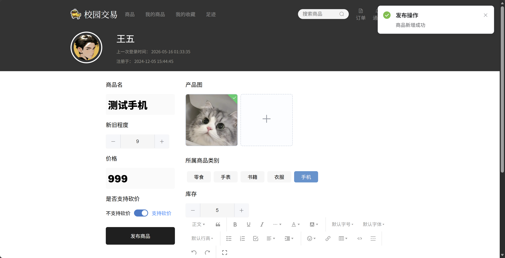 <br> 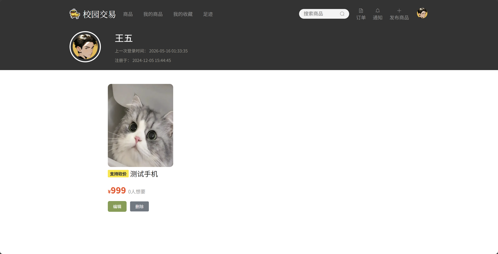 |
| myproduct_001 | 查看我的商品列表 | 商品管理 | P1 | 用户已登录且有发布商品 | 1. 点击"我的商品"菜单 | 无 | 显示当前用户发布的所有商品 | 成功。 |
| myproduct_002 | 编辑我的商品 | 商品管理 | P1 | 用户有已发布的商品 | 1. 在"我的商品"列表<br>2. 点击某商品的"编辑"按钮<br>3. 修改商品信息后提交 | 修改价格、名称等 | 提示"商品修改成功"，信息更新 | 成功。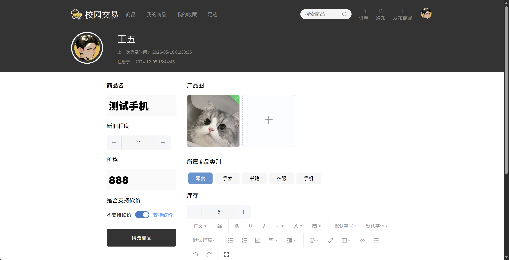 <br> 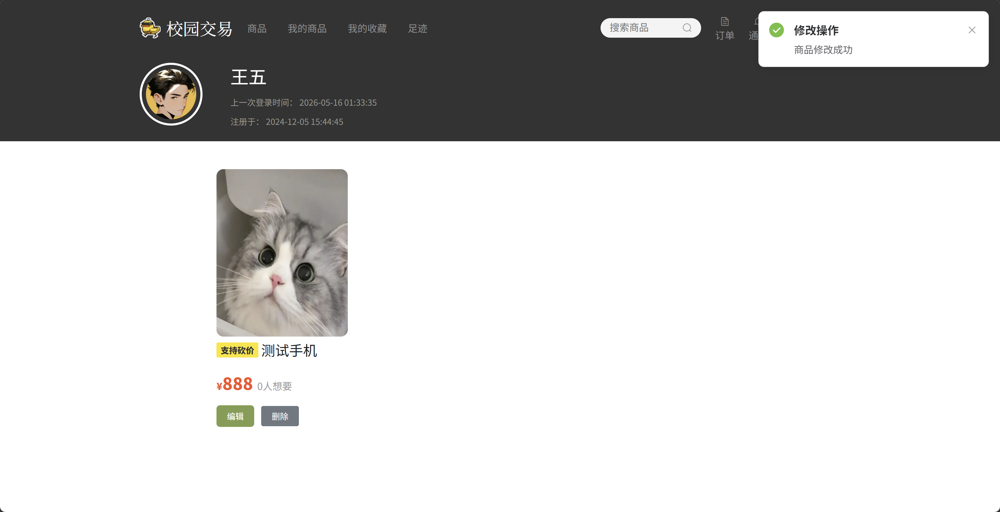 |
| myproduct_003 | 删除我的商品 | 商品管理 | P1 | 用户有已发布的商品 | 1. 在"我的商品"列表<br>2. 点击某商品的"删除"按钮<br>3. 确认删除 | 无 | 提示"商品删除成功"，商品从列表中消失 | 成功。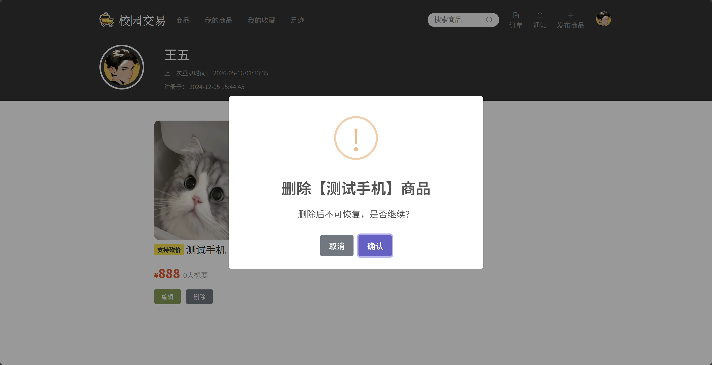 <br> 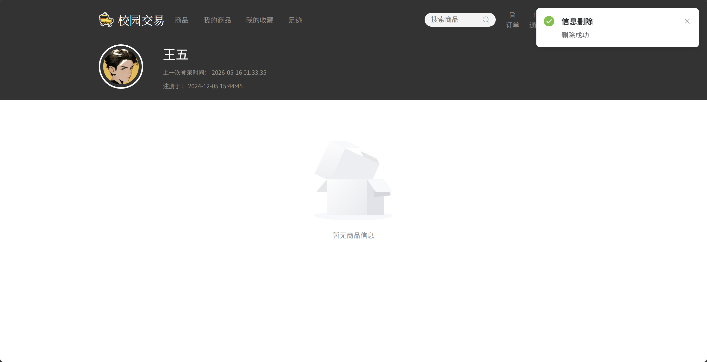 |

#### 2.2.1.6 购物订单功能（普通用户-买家视角）

| 用例编号 | 用例标题 | 项目/模块 | 优先级 | 前置条件 | 测试步骤 | 测试数据 | 预期结果 | 实际结果 |
|---------|---------|----------|--------|---------|---------|---------|---------|---------|
| buy_001 | 商品下单购买-成功 | 订单 | P0 | 用户已登录，商品库存充足 | 1. 进入商品详情页<br>2. 点击"立即购买"<br>3. 填写购买数量和备注<br>4. 提交下单 | 商品ID：15（自热火锅，库存1）<br>数量：1<br>备注：尽快发货 | 下单成功，订单在"购物订单"列表中，库存减少 | 成功。 <br> 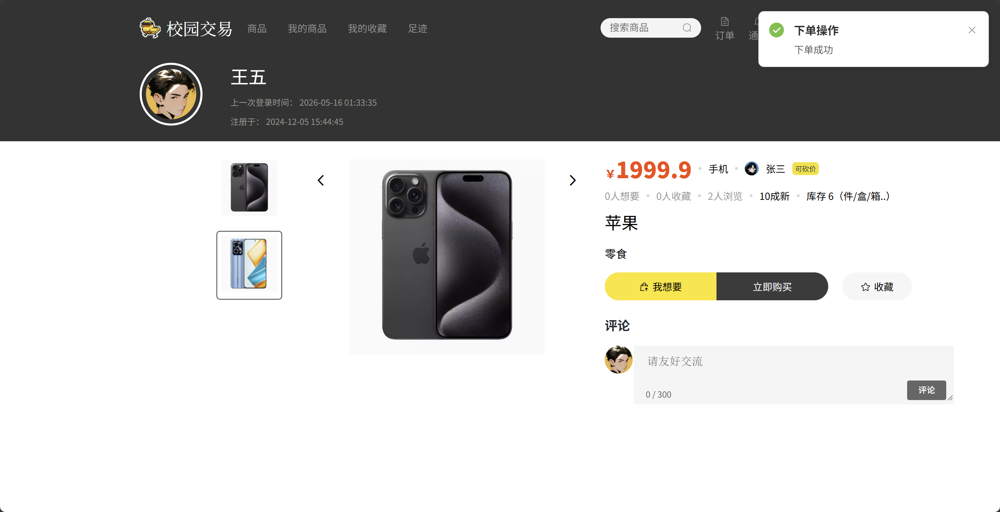 <br>   |
| buy_002 | 下单-库存不足 | 订单 | P1 | 商品库存为0 | 1. 进入库存为0的商品详情<br>2. 点击"立即购买" | 商品ID：1（库存0） | 提示"商品库存不足" | 成功。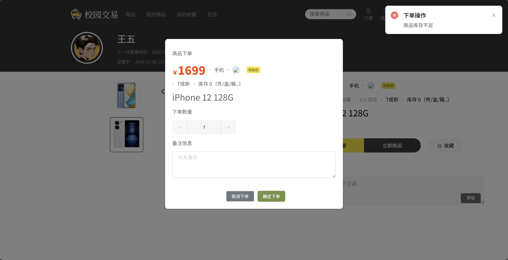 |
| buy_003 | 确认交易（支付下单） | 订单 | P1 | 存在未支付的订单 | 1. 进入"购物订单"<br>2. 查看未支付的订单<br>3. 点击"下单"按钮 | 选择未支付的订单 | 交易状态变为"已支付"，记录支付时间 | 成功。 <br> 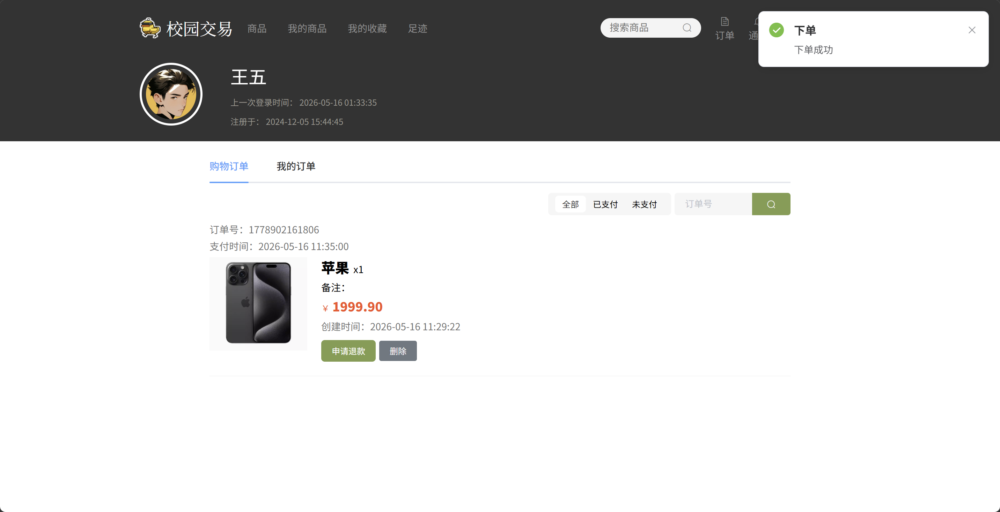 |
| buy_004 | 申请退款 | 订单 | P1 | 已支付的订单 | 1. 进入"购物订单"<br>2. 查看已支付的订单<br>3. 点击"申请退款" | 选择已支付的订单 | 提示"申请退款成功，请等待卖家审核" | 成功。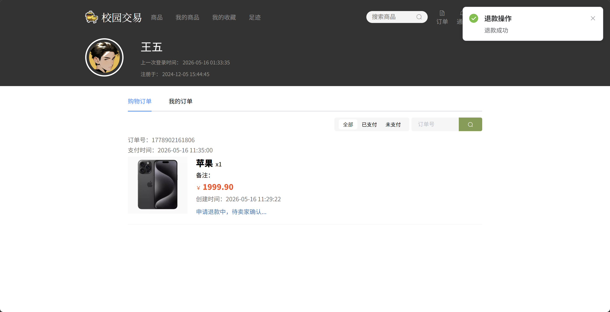 |
| buy_005 | 按交易状态筛选订单 | 订单 | P2 | 有不同状态的订单 | 1. 进入"购物订单"<br>2. 点击"已支付"/"未支付"筛选 | 筛选：已支付 | 仅显示已支付的订单 | 成功。 |
| buy_006 | 按订单号搜索订单 | 订单 | P2 | 有订单数据 | 1. 进入"购物订单"<br>2. 输入订单号搜索 | 订单号：1778902161806 | 显示匹配的订单 | 成功。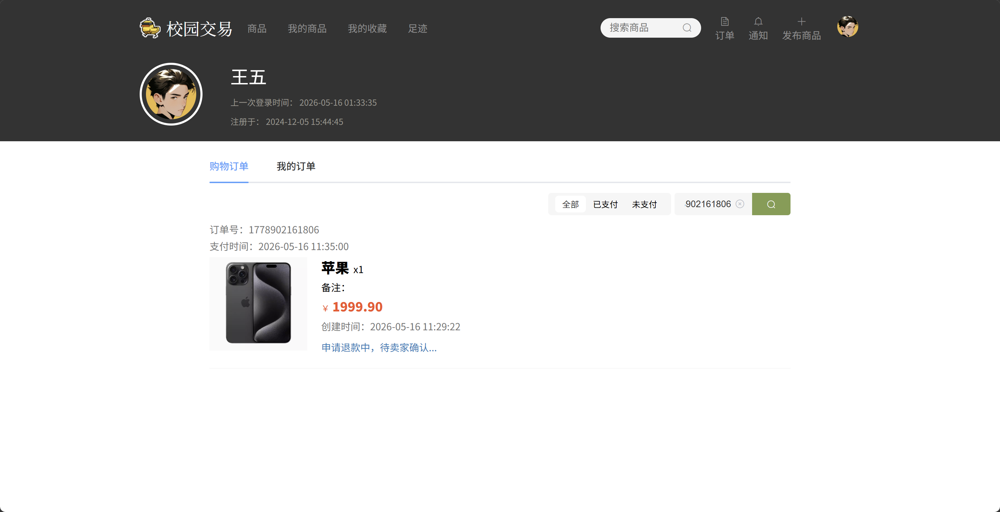 |

#### 2.2.1.7 卖家订单管理（普通用户-卖家视角）

| 用例编号 | 用例标题 | 项目/模块 | 优先级 | 前置条件 | 测试步骤 | 测试数据 | 预期结果 | 实际结果 |
|---------|---------|----------|--------|---------|---------|---------|---------|---------|
| seller_001 | 查看我收到的订单 | 订单管理 | P1 | 用户发布的商品有被下单 | 1. 进入"订单"页<br>2. 切换到"我的订单"标签 | 无 | 显示买家对自己商品下的订单列表 | 成功。|
| seller_002 | 确认退款（卖家） | 订单管理 | P1 | 买家已申请退款 | 1. 进入"我的订单"<br>2. 找到已申请退款的订单<br>3. 点击"确定退款" | 订单：自热火锅 | 提示"退款成功"，标记确认退款并记录退款时间 | 成功。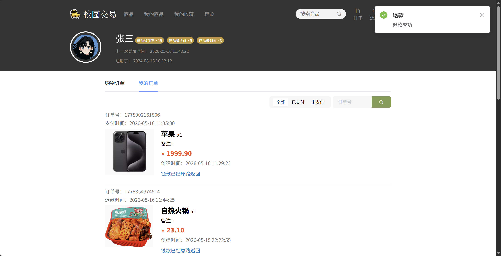 |
| seller_003 | 删除订单（卖家） | 订单管理 | P2 | 已支付的订单 | 1. 进入"我的订单"<br>2. 找到已支付的订单<br>3. 点击删除 | 选择已支付的订单 | 订单被删除 | 成功。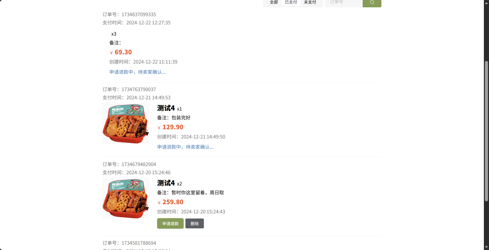 <br> 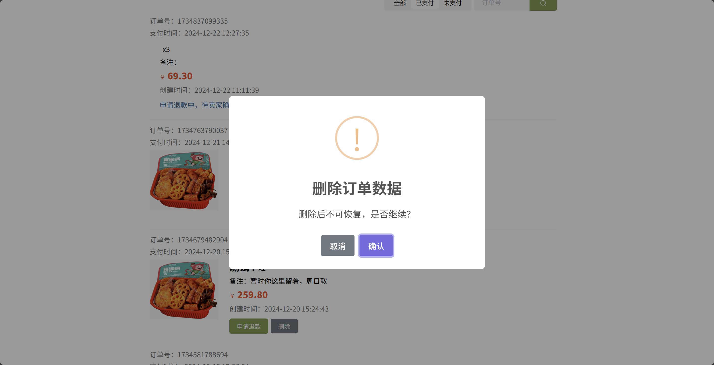 <br> 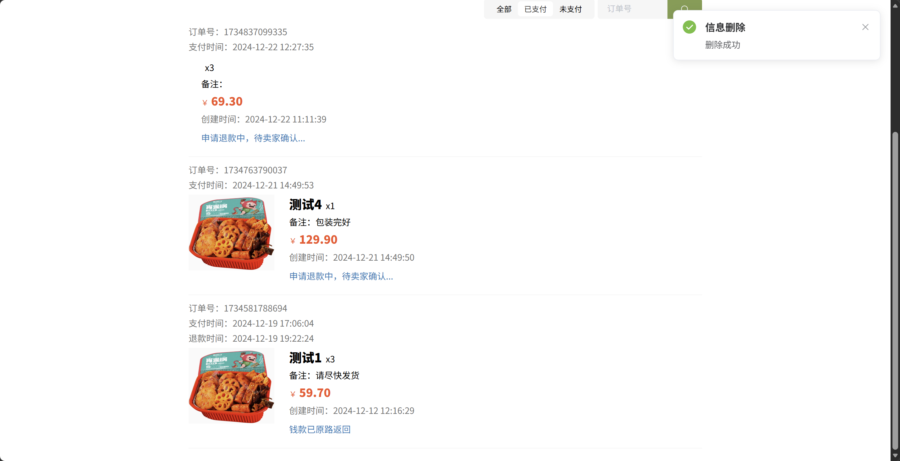 |

#### 2.2.1.8 评论功能

| 用例编号 | 用例标题 | 项目/模块 | 优先级 | 前置条件 | 测试步骤 | 测试数据 | 预期结果 | 实际结果 |
|---------|---------|----------|--------|---------|---------|---------|---------|---------|
| eval_001 | 发表商品评论 | 评论 | P0 | 用户已登录且未被禁言 | 1. 进入商品详情页<br>2. 在评论区域输入评论内容<br>3. 点击发送 | 内容：手机成色很好 | 评论成功，评论出现在下方评论区 | 成功。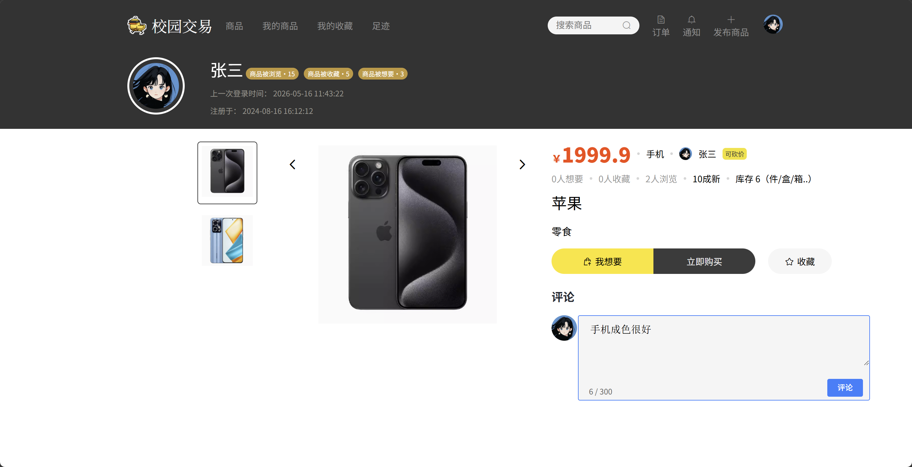 <br> 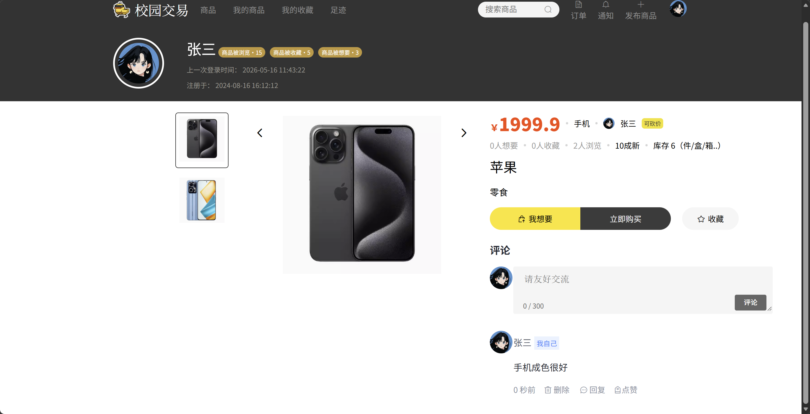 |
| eval_002 | 回复评论 | 评论 | P1 | 存在父级评论 | 1. 在商品详情页评论区<br>2. 点击某条评论的"回复"按钮<br>3. 输入回复内容 | 内容：谢谢 | 子评论显示在父评论下方 | 成功。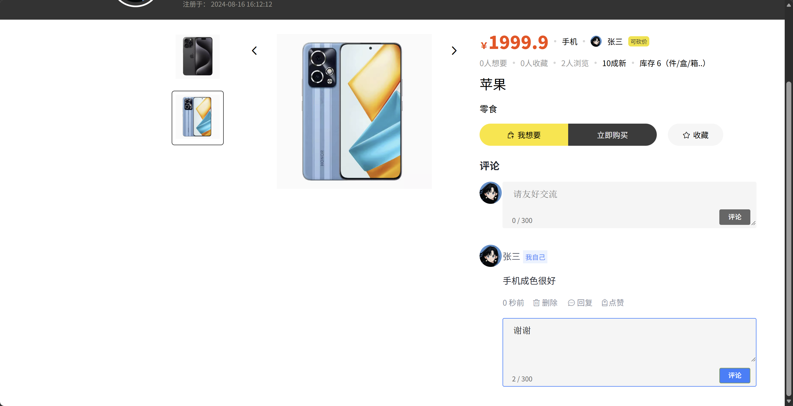 <br> 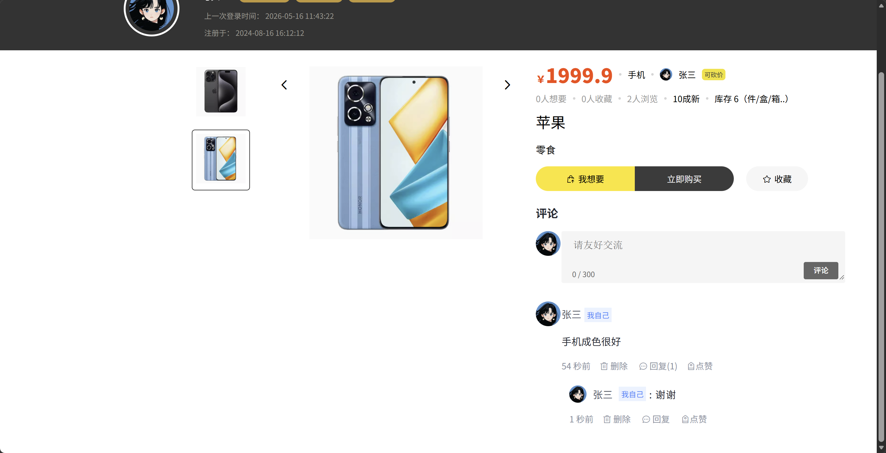 |
| eval_003 | 被禁言用户不能评论 | 评论 | P1 | 当前用户为禁言状态(如zhaoliu) | 1. 被禁言用户登录<br>2. 进入商品详情页<br>3. 尝试评论 | 用户：zhaoliu（is_word=1） | 提示"账户已被禁言" | 成功。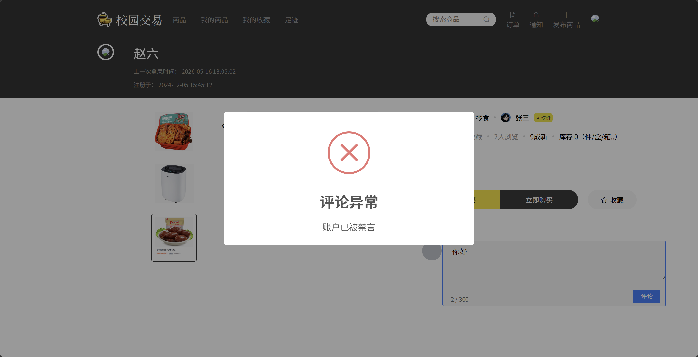 |

#### 2.2.1.9 消息功能

| 用例编号 | 用例标题 | 项目/模块 | 优先级 | 前置条件 | 测试步骤 | 测试数据 | 预期结果 | 实际结果 |
|---------|---------|----------|--------|---------|---------|---------|---------|---------|
| msg_001 | 查看我的消息列表 | 消息 | P1 | 用户已登录且有消息 | 1. 点击"通知"菜单 | 用户：zhangsan（有未读消息） | 显示消息列表，含已读/未读状态 | 成功。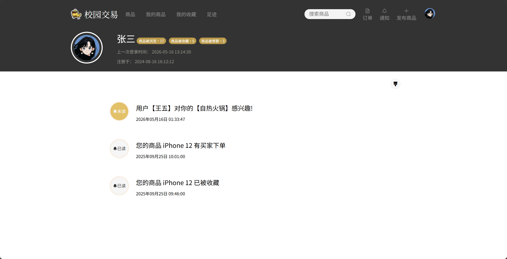 |
| msg_002 | 消息全部标为已读 | 消息 | P2 | 用户有未读消息 | 1. 进入通知页面<br>2. 点击"全部已读" | 无 | 所有消息变为已读状态 | 成功。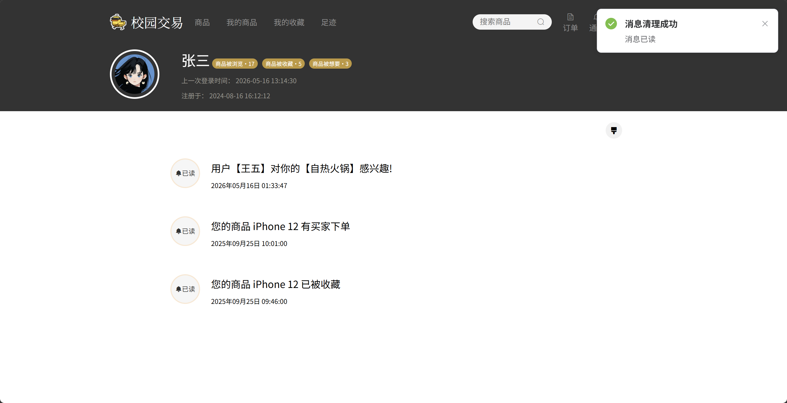 |

#### 2.2.1.10 个人信息管理

| 用例编号 | 用例标题 | 项目/模块 | 优先级 | 前置条件 | 测试步骤 | 测试数据 | 预期结果 | 实际结果 |
|---------|---------|----------|--------|---------|---------|---------|---------|---------|
| profile_001 | 修改个人信息 | 个人信息 | P1 | 用户已登录 | 1. 点击个人中心<br>2. 修改头像、昵称、邮箱<br>3. 点击"修改" | 新昵称：新名字<br>新邮箱：new@qq.com | 修改成功，信息更新 | 成功。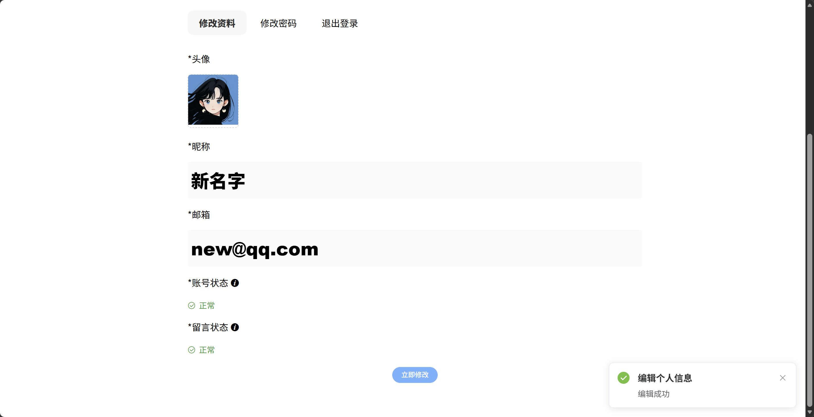 |
| pwd_001 | 修改密码-成功 | 个人信息 | P1 | 用户已登录 | 1. 进入修改密码页面<br>2. 输入旧密码、新密码、确认密码<br>3. 提交 | 旧密码：123456<br>新密码：654321 | 密码修改成功 | 成功。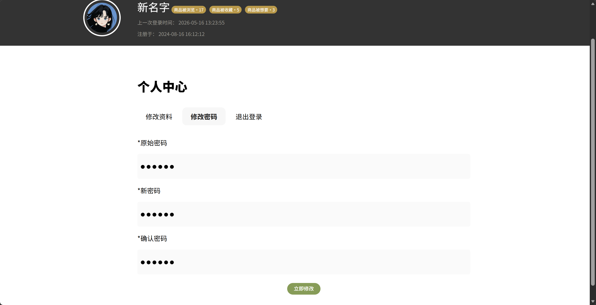 <br> 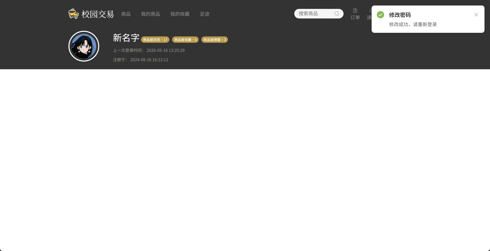 |
| pwd_002 | 修改密码-旧密码错误 | 个人信息 | P2 | 用户已登录 | 1. 输入错误旧密码<br>2. 输入新密码和确认密码 | 旧密码：wrong | 提示"原始密码验证失败" | 成功。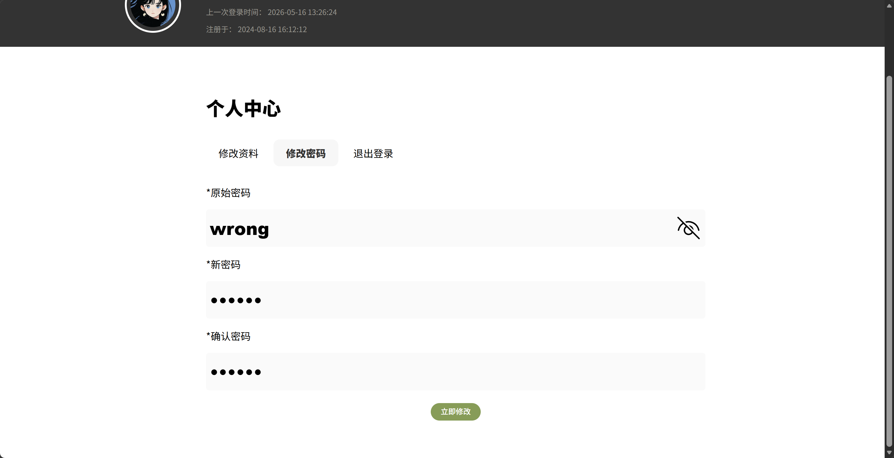 <br>  |
| pwd_003 | 修改密码-两次密码不一致 | 个人信息 | P2 | 用户已登录 | 1. 输入正确旧密码<br>2. 新密码和确认密码不同 | 新密码：abc<br>确认密码：def | 提示"前后密码输入不一致" | 成功。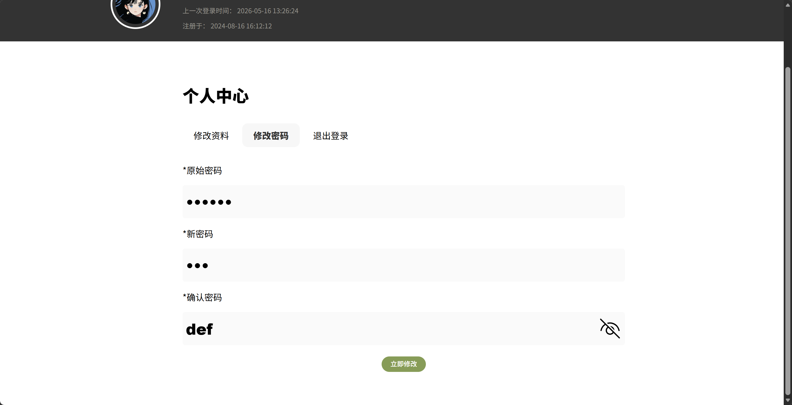 <br> 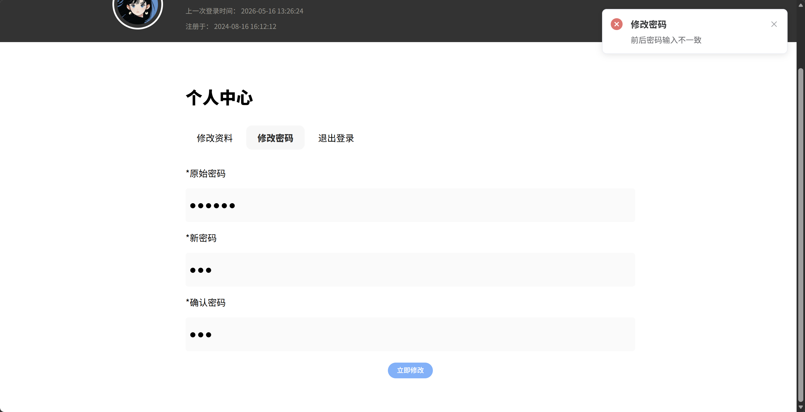 |

#### 2.2.1.11 管理员-仪表盘

| 用例编号 | 用例标题 | 项目/模块 | 优先级 | 前置条件 | 测试步骤 | 测试数据 | 预期结果 | 实际结果 |
|---------|---------|----------|--------|---------|---------|---------|---------|---------|
| dash_001 | 查看仪表盘统计数据和趋势图 | 仪表盘 | P1 | 管理员已登录，系统有数据 | 1. 管理员登录后进入首页<br>2. 查看仪表盘 | 无 | 显示用户数、商品数、订单数、消息数、互动数、评论数的统计卡片及商品上架趋势图 | 成功。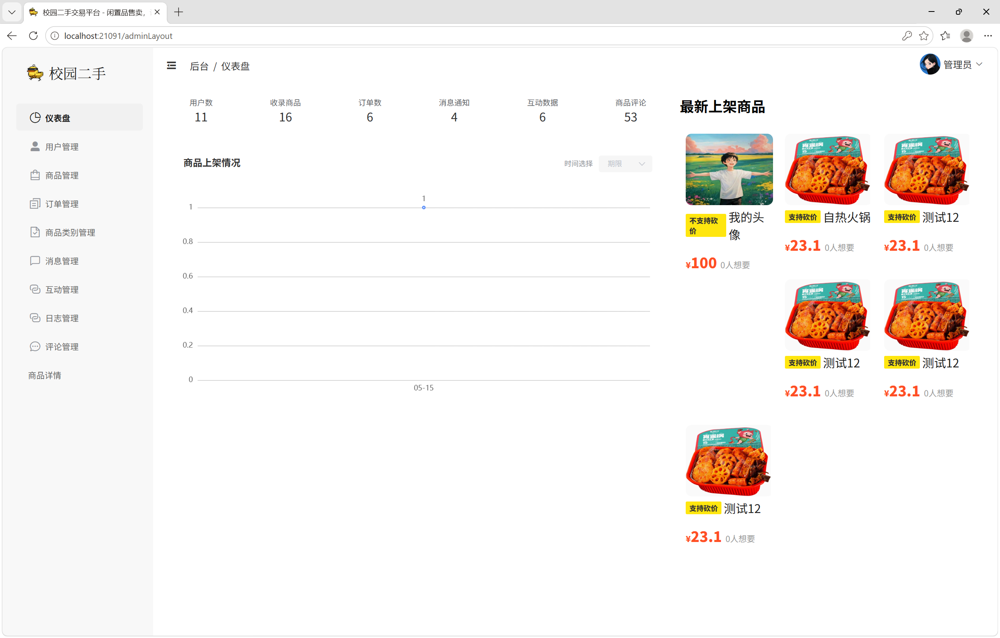 |

#### 2.2.1.12 管理员-用户管理

| 用例编号 | 用例标题 | 项目/模块 | 优先级 | 前置条件 | 测试步骤 | 测试数据 | 预期结果 | 实际结果 |
|---------|---------|----------|--------|---------|---------|---------|---------|---------|
| usermgmt_001 | 分页查看用户列表 | 用户管理 | P0 | 管理员已登录 | 1. 点击"用户管理"菜单 | 无 | 显示所有用户列表（头像、名称、账号、邮箱、角色、封号状态、禁言状态）并可分页 | 成功。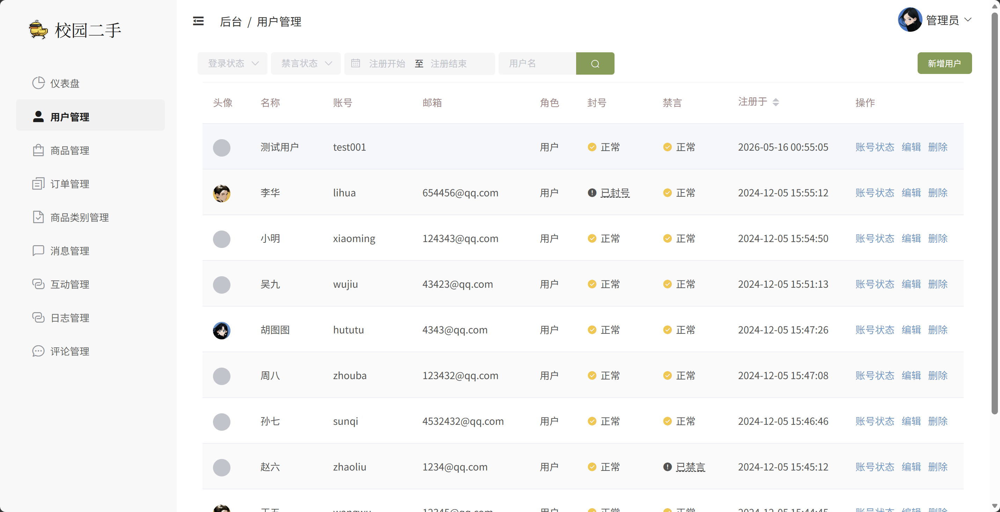 |
| usermgmt_002 | 按登录状态筛选用户 | 用户管理 | P1 | 存在被封号的用户 | 1. 在用户管理页面<br>2. 选择登录状态下拉筛选 | 筛选：已封号 | 仅显示被封号的用户 | 成功。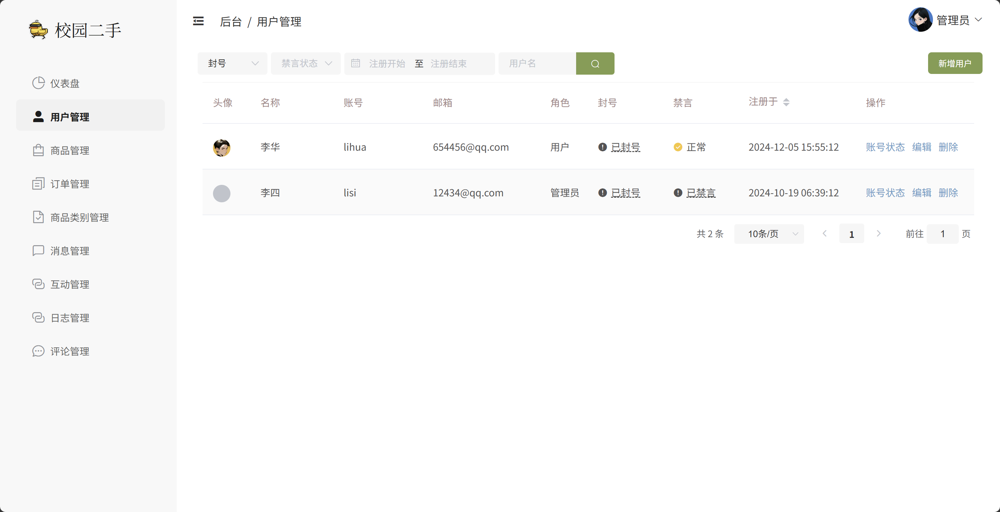 |
| usermgmt_003 | 按禁言状态筛选用户 | 用户管理 | P1 | 存在被禁言的用户 | 1. 在用户管理页面<br>2. 选择禁言状态下拉筛选 | 筛选：已禁言 | 仅显示被禁言的用户 | 成功。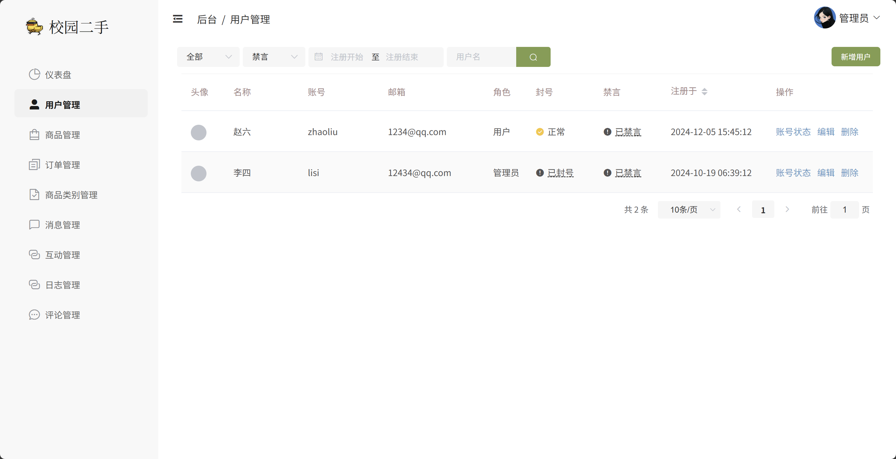 |
| usermgmt_004 | 按时间范围筛选用户 | 用户管理 | P2 | 用户数据存在 | 1. 在用户管理页面<br>2. 选择注册时间范围 | 查询在2024-12-15注册的用户 | 仅显示该时间段注册的用户 | 失败。查询在2024-12-15注册的用户，查询结果显示却是2024-12-04的。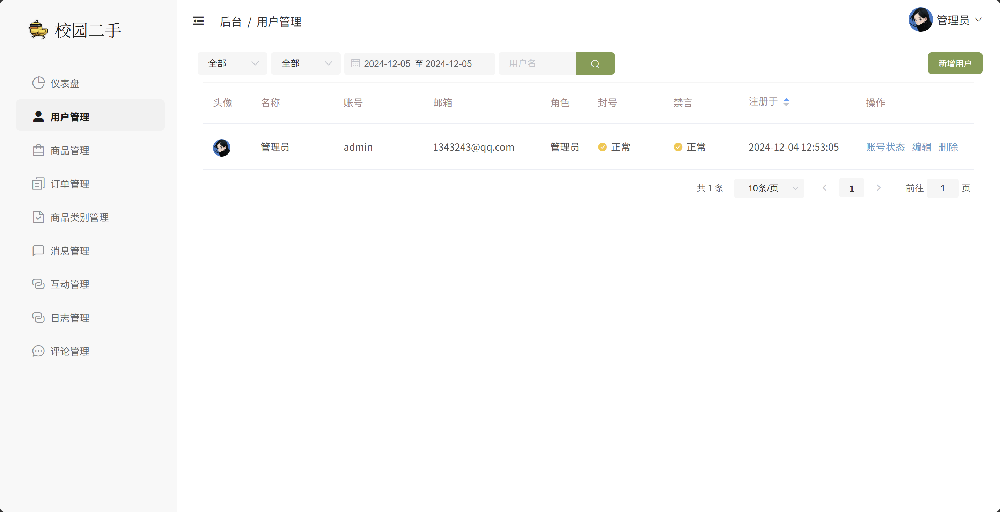 |
| usermgmt_005 | 按用户名搜索用户 | 用户管理 | P1 | 用户数据存在 | 1. 在用户管理页面<br>2. 输入用户名搜索 | 搜索：王五 | 显示匹配的用户 | 成功。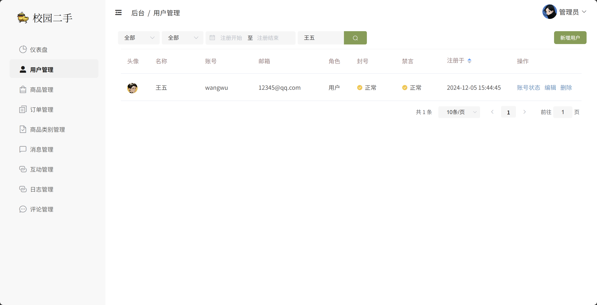 |
| usermgmt_006 | 新增用户（管理员） | 用户管理 | P1 | 管理员已登录 | 1. 在用户管理页面<br>2. 点击"新增用户"<br>3. 填写账号、用户名、密码<br>4. 确定新增 | 账号：newuser<br>用户名：新用户<br>密码：123456 | 新增成功，用户列表刷新 | 成功。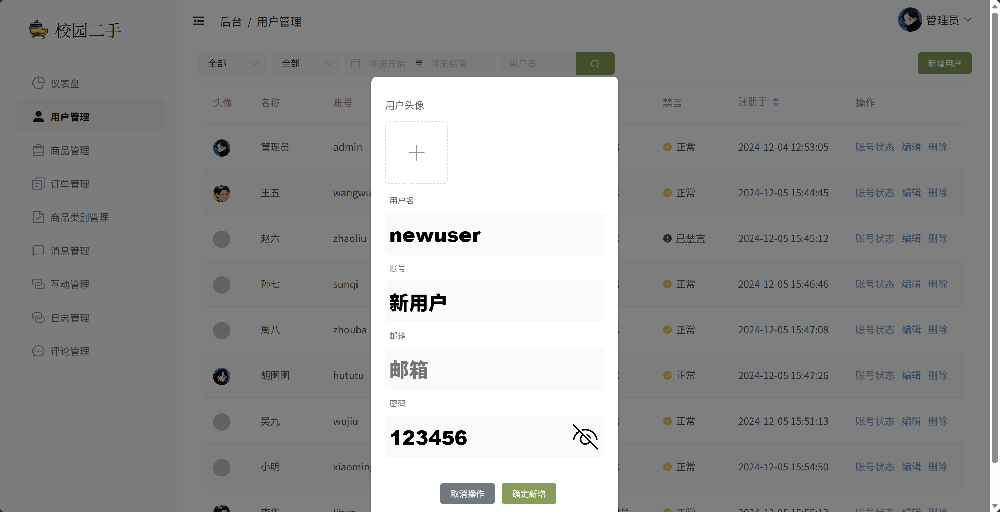 <br> 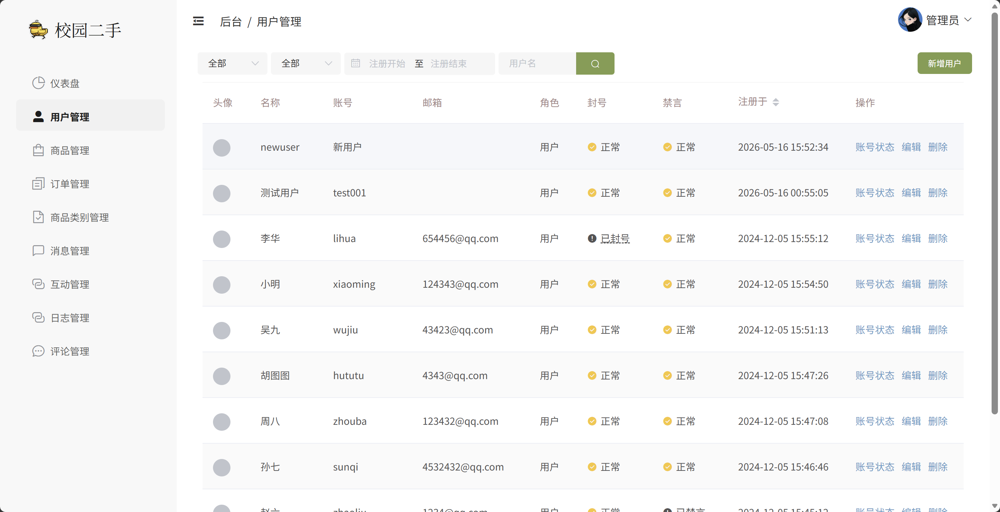 |
| usermgmt_007 | 编辑用户（管理员） | 用户管理 | P1 | 管理员已登录 | 1. 在用户列表<br>2. 点击某用户的"编辑"按钮<br>3. 修改邮箱、角色等<br>4. 确认修改 | 修改用户角色 | 修改成功 | 成功。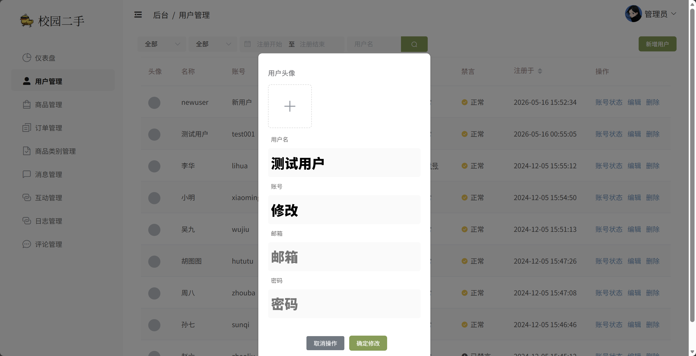 <br> 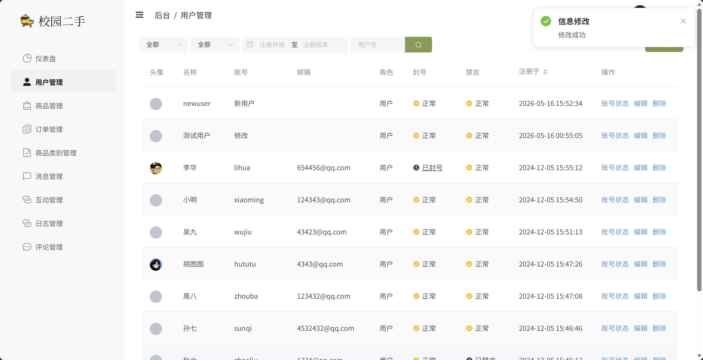 |
| usermgmt_008 | 管理账号状态（封号/解封） | 用户管理 | P1 | 管理员已登录 | 1. 在用户列表<br>2. 点击某用户的"账号状态"按钮<br>3. 切换封号状态 | 将“hututu”封号 | 状态切换，被封号用户无法登录 | 成功。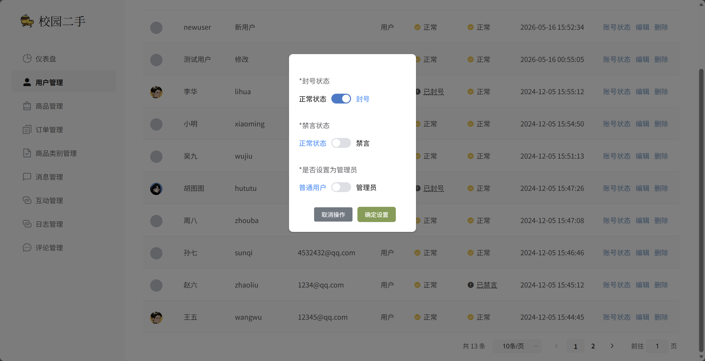 <br> 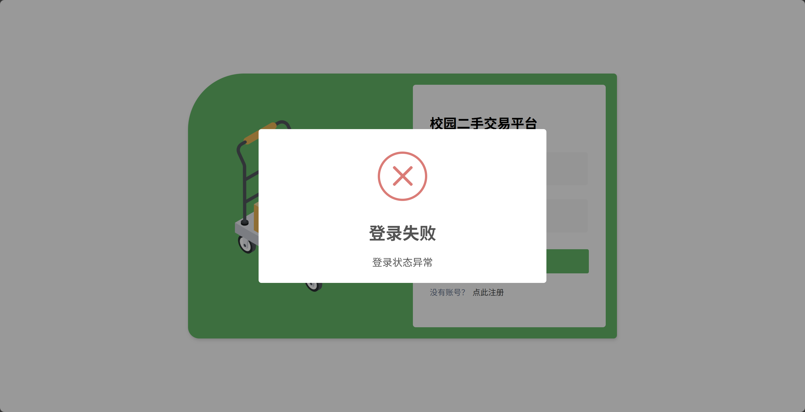 |
| usermgmt_009 | 删除用户（管理员） | 用户管理 | P1 | 管理员已登录 | 1. 在用户列表<br>2. 点击“测试用户”的"删除"按钮<br>3. 确认删除 | 选择用户 | 用户被删除 | 成功。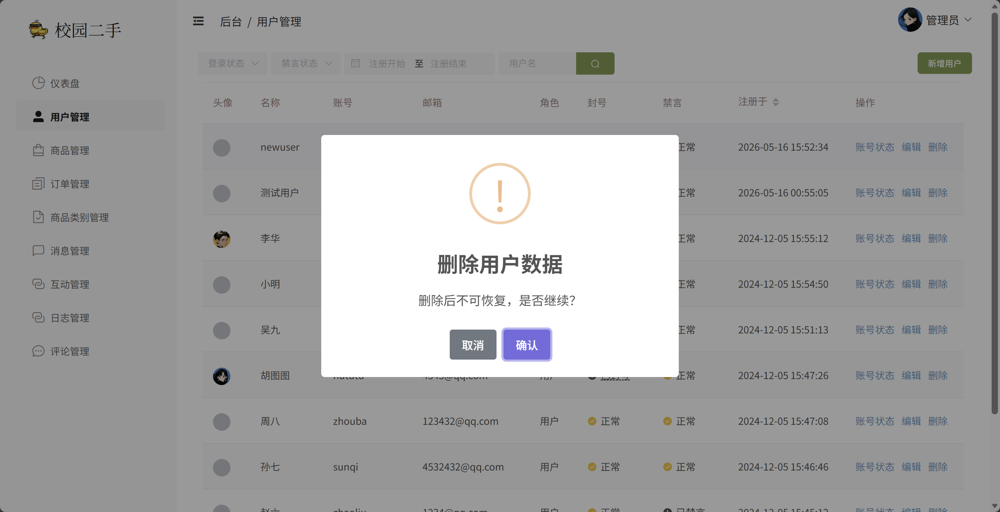 <br> 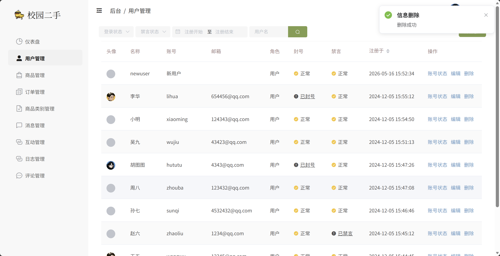 |

#### 2.2.1.13 管理员-商品管理

| 用例编号 | 用例标题 | 项目/模块 | 优先级 | 前置条件 | 测试步骤 | 测试数据 | 预期结果 | 实际结果 |
|---------|---------|----------|--------|---------|---------|---------|---------|---------|
| adminprod_001 | 查看商品列表 | 商品管理 | P0 | 管理员已登录 | 1. 点击"商品管理"菜单 | 无 | 显示所有商品列表（头像、用户名、商品名、类别、价格、库存、新旧程度、是否砍价、发布时间） | 成功。 |
| adminprod_002 | 按类别筛选商品 | 商品管理 | P1 | 商品类别存在 | 1. 在商品管理页面<br>2. 类别下拉选择 | 类别：零食 | 仅显示零食商品 | 成功。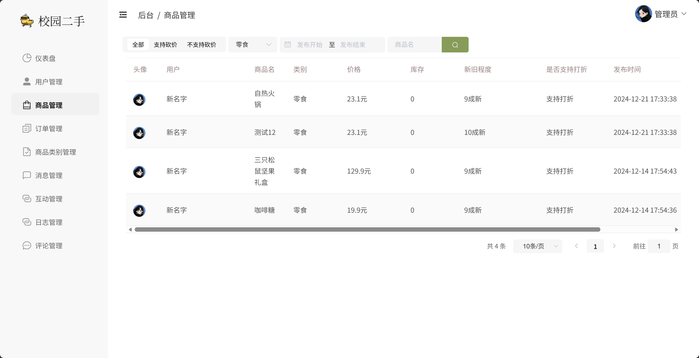 |
| adminprod_003 | 按商品名称搜索 | 商品管理 | P1 | 商品数据存在 | 1. 输入商品名搜索 | 搜索：iPhone | 显示匹配商品 | 成功。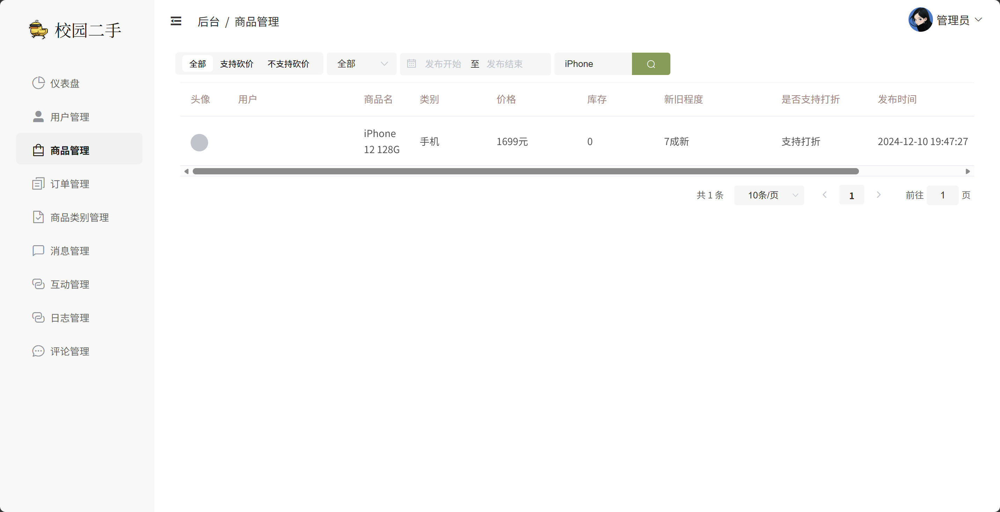 |
| adminprod_004 | 查看商品详情 | 商品管理 | P1 | 管理员已登录 | 1. 在商品列表<br>2. 点击某商品的"商品详情"按钮 | 选择商品 | 弹窗显示商品详情和封面图 | 成功。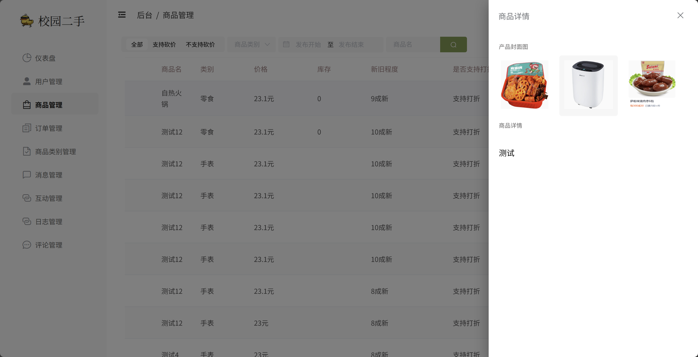 |
| adminprod_005 | 删除商品（管理员） | 商品管理 | P1 | 管理员已登录 | 1. 在商品列表<br>2. 点击某商品的"删除"按钮<br>3. 确认删除 | 选择商品 | 提示"商品删除成功"，商品被删除 | 成功。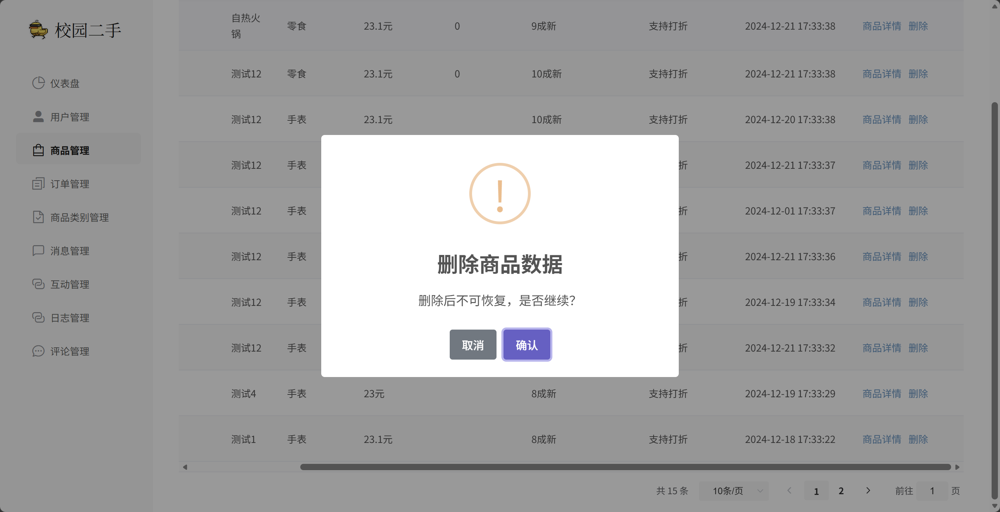 <br> 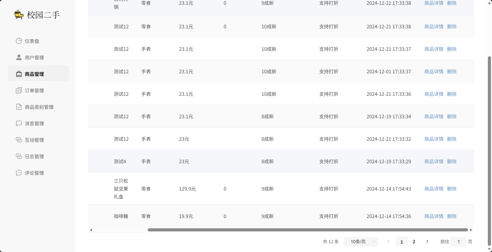 |

#### 2.2.1.14 管理员-订单管理

| 用例编号 | 用例标题 | 项目/模块 | 优先级 | 前置条件 | 测试步骤 | 测试数据 | 预期结果 | 实际结果 |
|---------|---------|----------|--------|---------|---------|---------|---------|---------|
| adminord_001 | 查看订单列表 | 订单管理 | P0 | 管理员已登录 | 1. 点击"订单管理"菜单 | 无 | 显示所有订单列表（订单号、买家头像、用户名、订单名、价格、数量、创建时间、备注） | 成功。 |
| adminord_002 | 按交易状态筛选订单 | 订单管理 | P1 | 有不同状态的订单 | 1. 在订单管理页面<br>2. 点击交易状态标签筛选 | 筛选：已下单 | 仅显示已下单的订单 | 成功。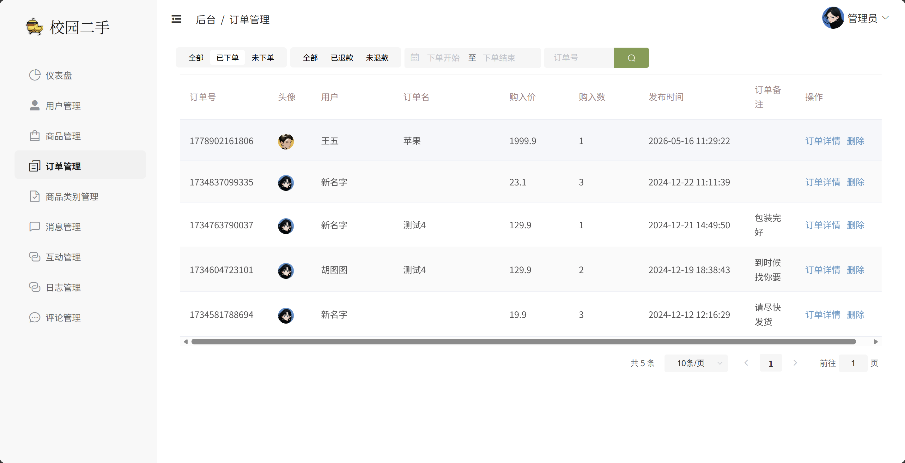 |
| adminord_003 | 按退款状态筛选订单 | 订单管理 | P2 | 有申请退款的订单 | 1. 在订单管理页面<br>2. 点击退款状态标签筛选 | 筛选：已退款 | 仅显示已退款的订单 | 成功。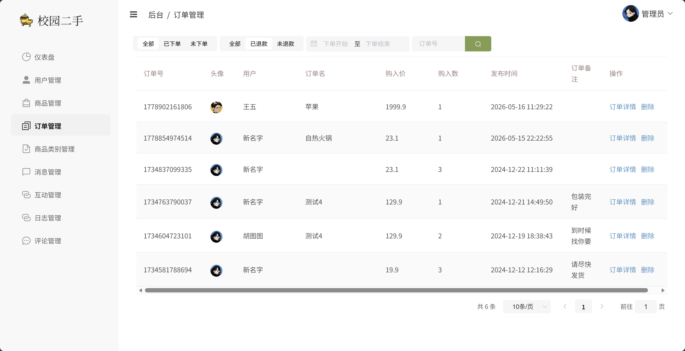 |
| adminord_004 | 按订单号搜索 | 订单管理 | P2 | 订单数据存在 | 1. 输入订单号搜索 | 订单号：1734581788694 | 显示匹配订单 | 成功。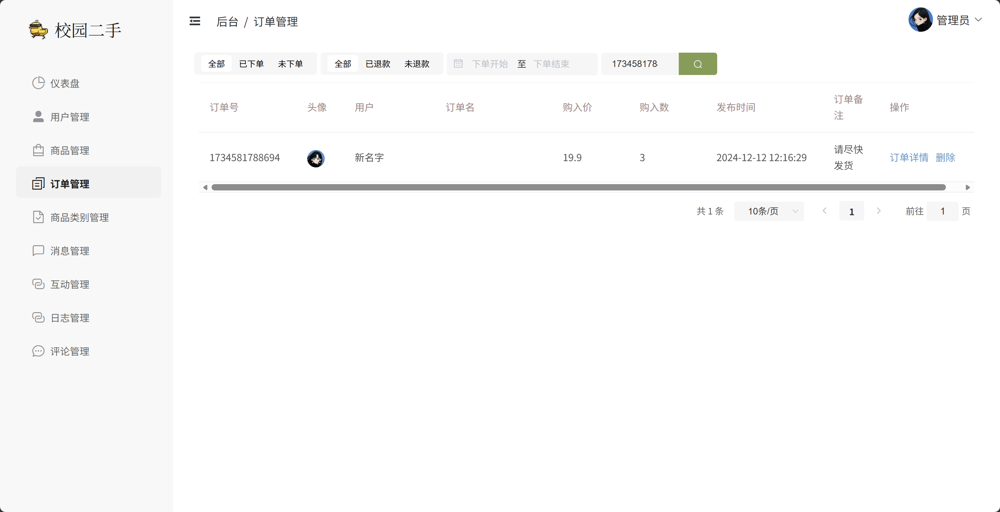 |
| adminord_005 | 查看订单详情 | 订单管理 | P1 | 管理员已登录 | 1. 在订单列表<br>2. 点击某订单的"订单详情"按钮 | 选择订单 | 弹窗显示订单详情（支付状态、退款状态等） | 成功。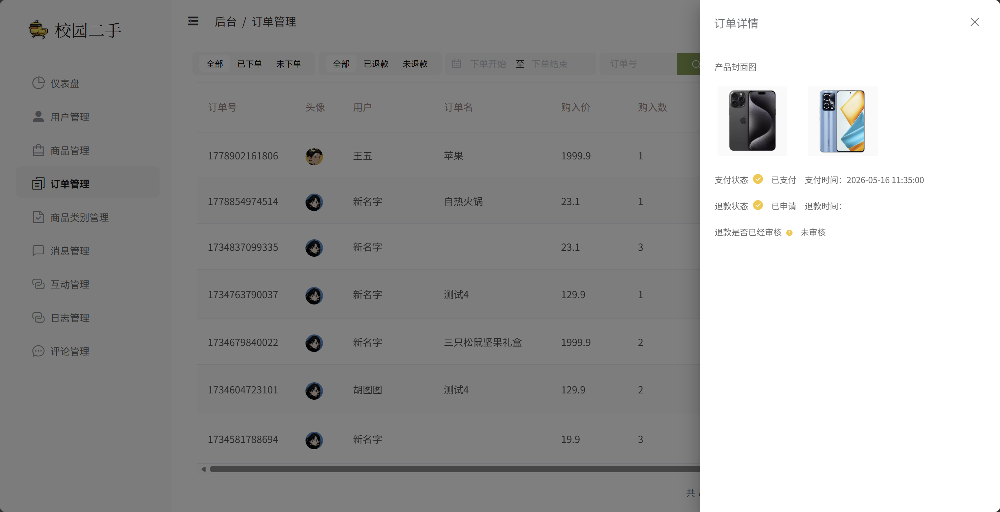 |
| adminord_006 | 删除订单（管理员） | 订单管理 | P1 | 管理员已登录 | 1. 点击某订单的"删除"按钮<br>2. 确认删除 | 选择订单 | 订单被删除 | 成功。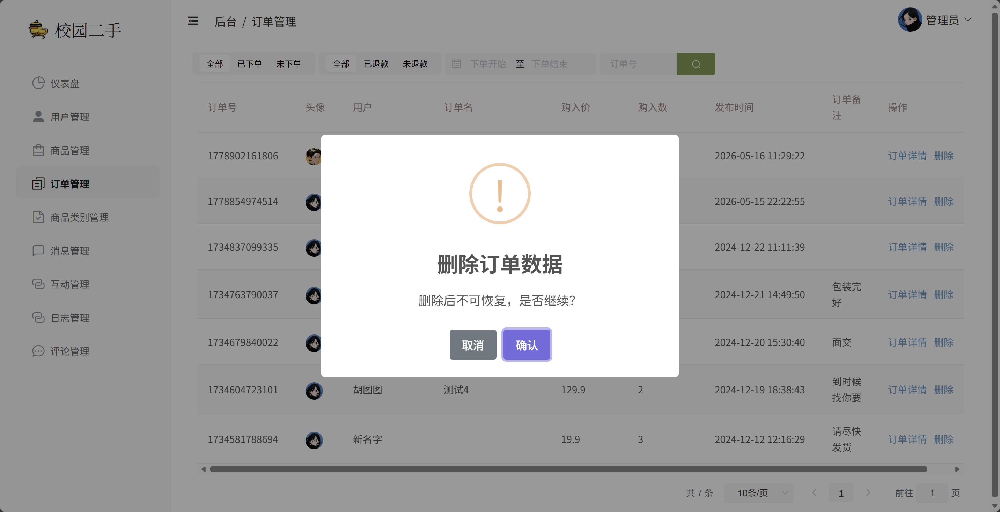 <br> 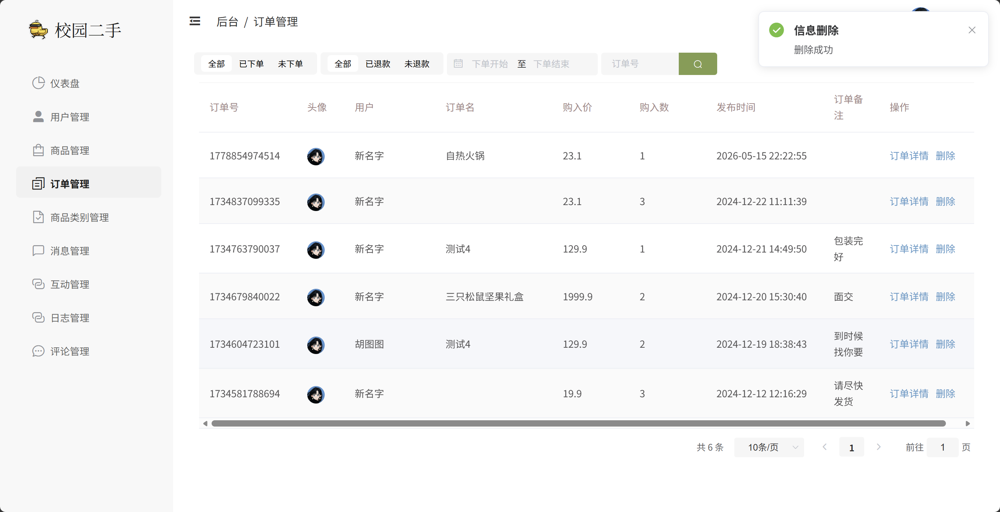 |

#### 2.2.1.15 管理员-商品类别管理

| 用例编号 | 用例标题 | 项目/模块 | 优先级 | 前置条件 | 测试步骤 | 测试数据 | 预期结果 | 实际结果 |
|---------|---------|----------|--------|---------|---------|---------|---------|---------|
| category_001 | 查看所有商品类别 | 类别管理 | P1 | 管理员已登录 | 1. 点击"商品类别管理"菜单 | 无 | 显示所有商品类别列表（名称、启用状态） |  成功。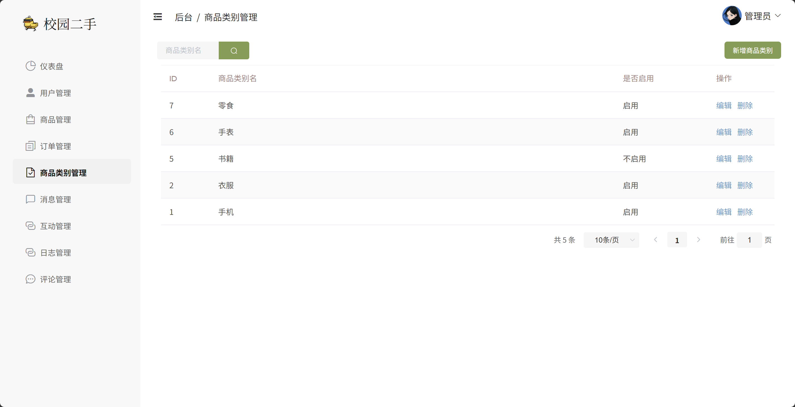 |
| category_002 | 新增商品类别 | 类别管理 | P1 | 管理员已登录 | 1. 点击"新增"按钮<br>2. 输入类别名称<br>3. 设置启用状态<br>4. 确定 | 名称：数码配件<br>启用：是 | 新增成功 | 成功。 <br> 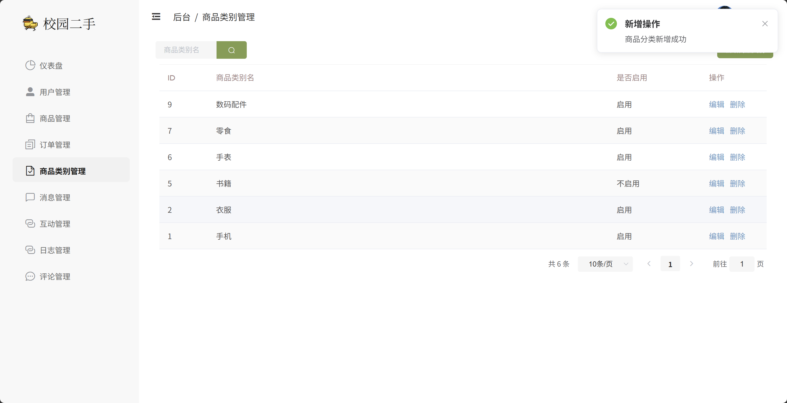 |
| category_003 | 编辑商品类别 | 类别管理 | P2 | 管理员已登录 | 1. 点击某分类的"编辑"按钮<br>2. 修改名称或状态 | 修改名称或启用/禁用 | 修改成功 | 成功。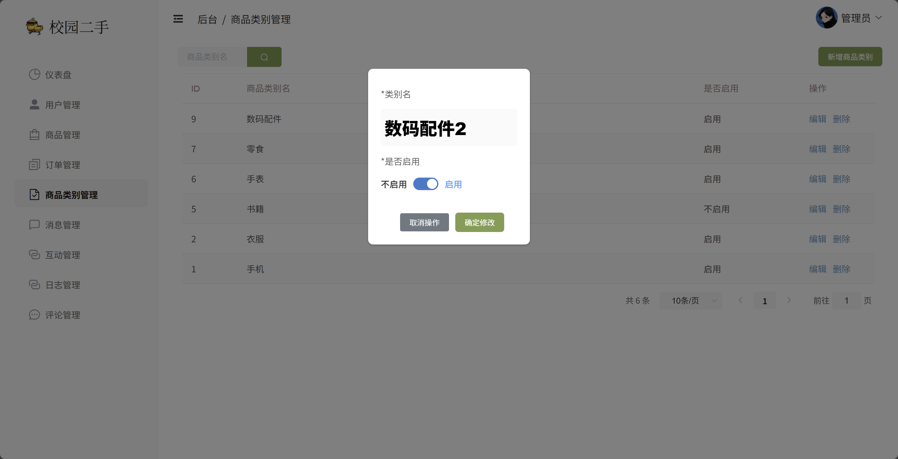 <br> 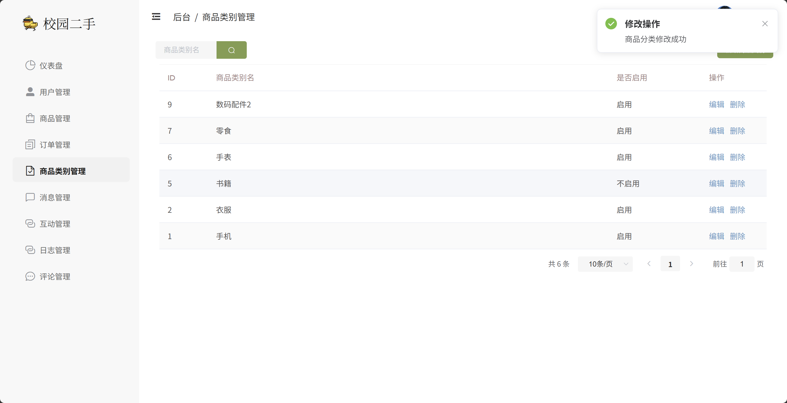 |
| category_004 | 删除商品类别 | 类别管理 | P1 | 管理员已登录 | 1. 点击某分类的"删除"按钮<br>2. 确认删除 | 选择类别 | 类别被删除 | 成功。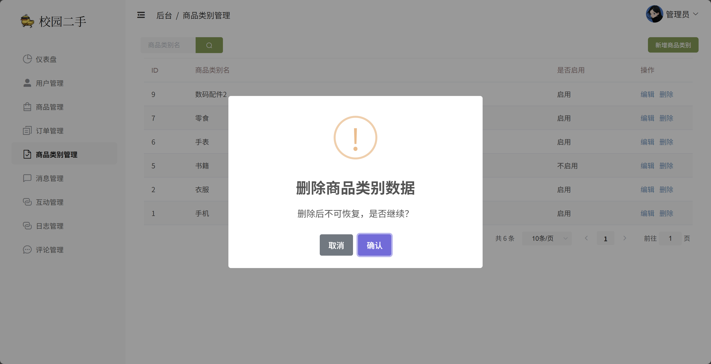 <br> 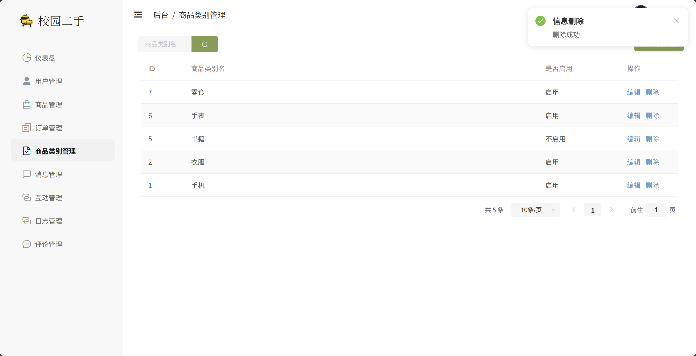 |
| category_005 | 启用/禁用商品类别 | 类别管理 | P2 | 类别数据存在 | 1. 修改类别的启用状态<br>2. 保存 | 将类别设为禁用 | 禁用后，前端商品列表中不再显示该类别的商品 | 成功。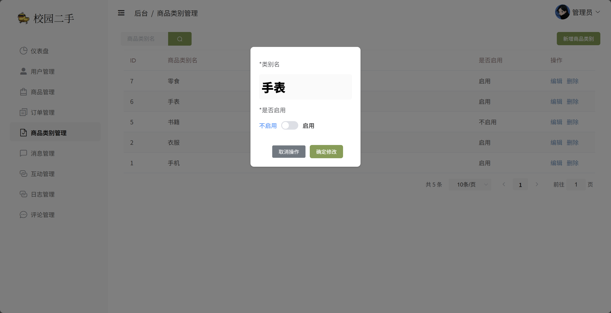 <br> 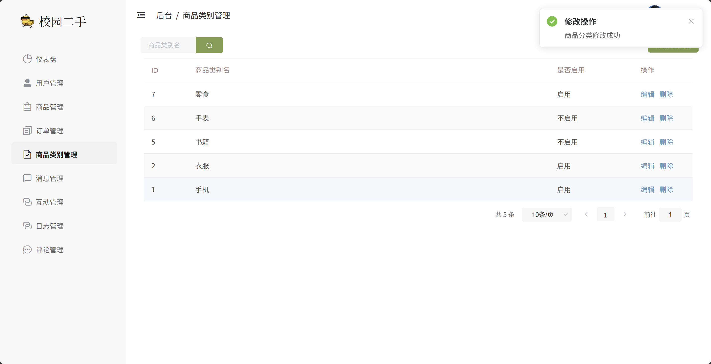 |

#### 2.2.1.16 管理员-评论管理

| 用例编号 | 用例标题 | 项目/模块 | 优先级 | 前置条件 | 测试步骤 | 测试数据 | 预期结果 | 实际结果 |
|---------|---------|----------|--------|---------|---------|---------|---------|---------|
| admineval_001 | 查看评论列表 | 评论管理 | P1 | 管理员已登录 | 1. 点击"评论管理"菜单 | 无 | 显示所有评论列表 | 成功。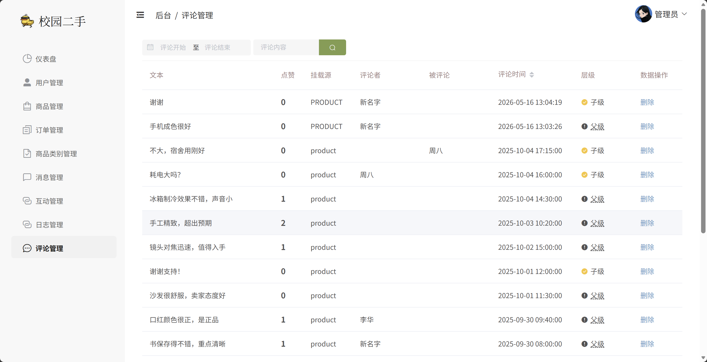 |
| admineval_002 | 删除评论（管理员） | 评论管理 | P1 | 管理员已登录 | 1. 点击某评论的"删除"按钮<br>2. 确认删除 | 选择评论 | 评论被删除 | 成功。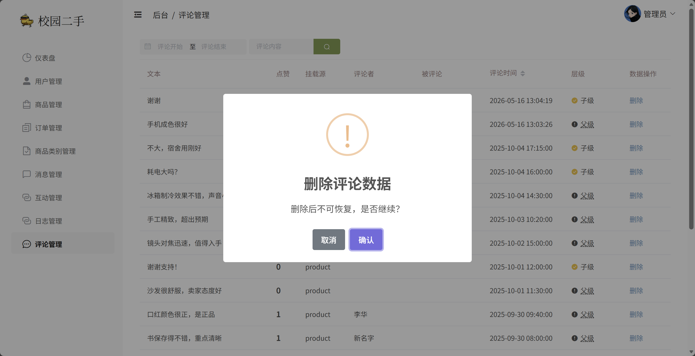 <br> 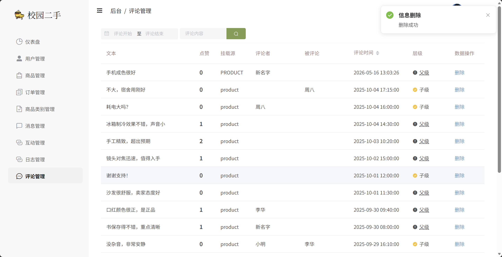 |

#### 2.2.1.17 管理员-消息管理

| 用例编号 | 用例标题 | 项目/模块 | 优先级 | 前置条件 | 测试步骤 | 测试数据 | 预期结果 | 实际结果 |
|---------|---------|----------|--------|---------|---------|---------|---------|---------|
| adminmsg_001 | 查看消息列表 | 消息管理 | P1 | 管理员已登录 | 1. 点击"消息管理"菜单 | 无 | 显示全平台所有消息列表 | 成功。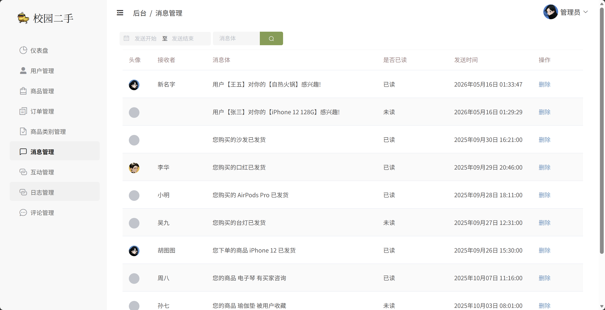 |
| adminmsg_002 | 删除消息（管理员） | 消息管理 | P2 | 管理员已登录 | 1. 点击某消息的"删除"按钮<br>2. 确认删除 | 选择消息 | 消息被删除 | 成功。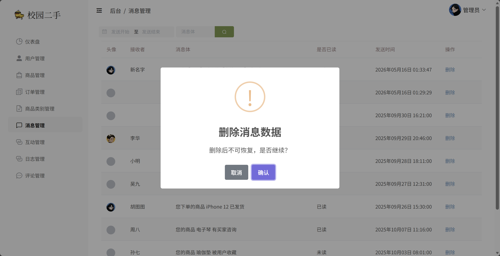 <br> 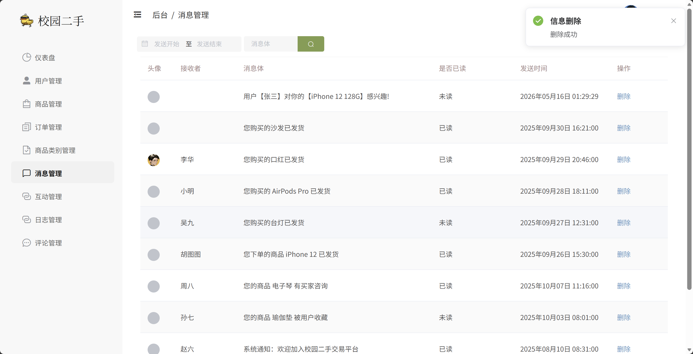  |

#### 2.2.1.18 管理员-互动管理

| 用例编号 | 用例标题 | 项目/模块 | 优先级 | 前置条件 | 测试步骤 | 测试数据 | 预期结果 | 实际结果 |
|---------|---------|----------|--------|---------|---------|---------|---------|---------|
| adminint_001 | 查看互动数据列表 | 互动管理 | P1 | 管理员已登录 | 1. 点击"互动管理"菜单 | 无 | 显示所有用户互动行为记录列表 | 成功。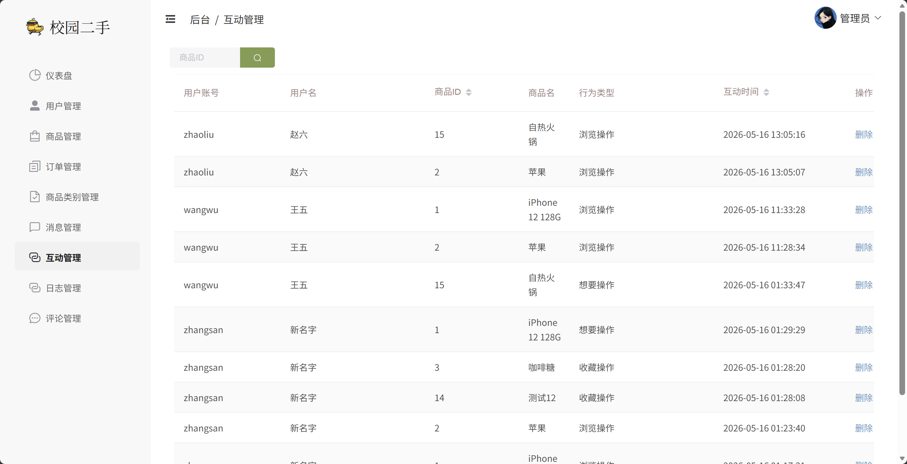 |
| adminint_002 | 删除互动记录（管理员） | 互动管理 | P2 | 管理员已登录 | 1. 点击某记录的"删除"按钮<br>2. 确认删除 | 选择记录 | 互动记录被删除 | 成功。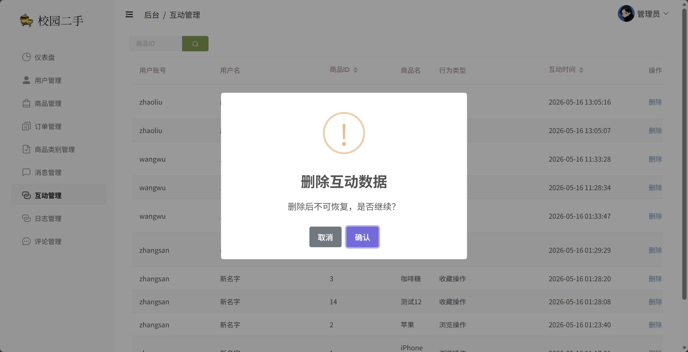 <br> 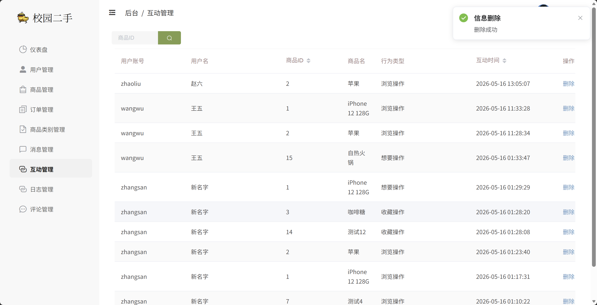 |

#### 2.2.1.19 管理员-操作日志管理

| 用例编号 | 用例标题 | 项目/模块 | 优先级 | 前置条件 | 测试步骤 | 测试数据 | 预期结果 | 实际结果 |
|---------|---------|----------|--------|---------|---------|---------|---------|---------|
| log_001 | 查看操作日志列表 | 日志管理 | P1 | 管理员已登录 | 1. 点击"日志管理"菜单 | 无 | 显示所有操作日志（用户、操作描述、时间） | 成功。 |
| log_002 | 删除操作日志（管理员） | 日志管理 | P2 | 管理员已登录 | 1. 点击某日志的"删除"按钮<br>2. 确认删除 | 选择日志 | 日志被删除 | 成功。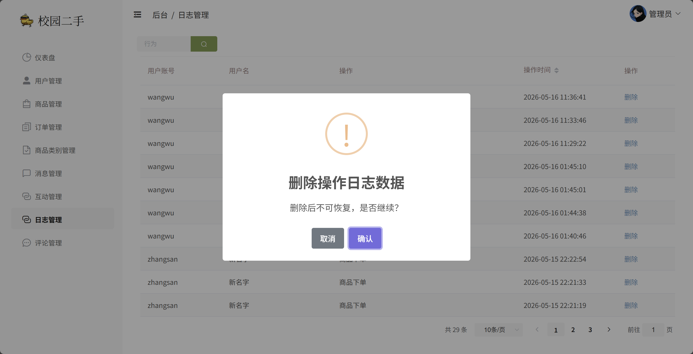 <br> 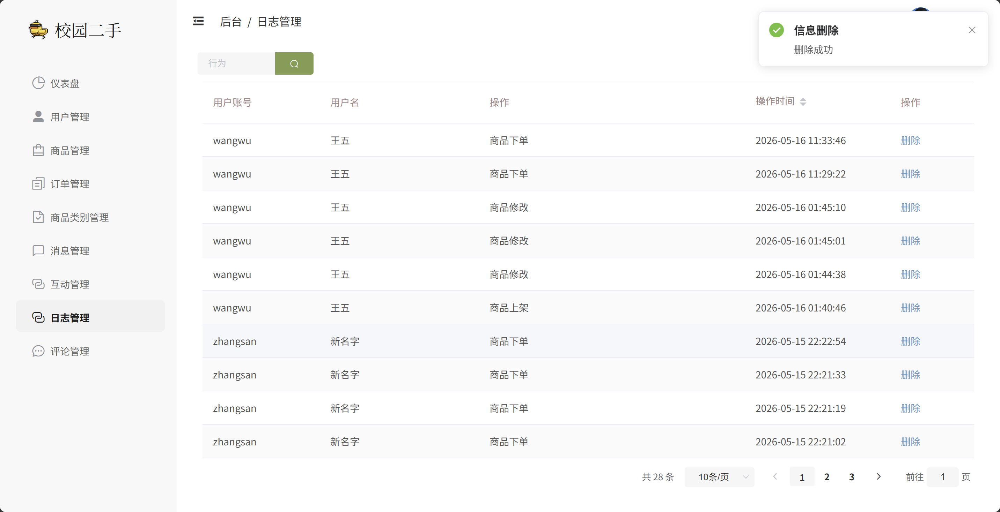 |

#### 2.2.1.20 退出

| 用例编号 | 用例标题 | 项目/模块 | 优先级 | 前置条件 | 测试步骤 | 测试数据 | 预期结果 | 实际结果 |
|---------|---------|----------|--------|---------|---------|---------|---------|---------|
| auth_001 | 退出登录 | 退出 | P1 | 用户已登录 | 1. 点击退出按钮 | 无 | token被清除，跳转到登录页面 | 成功。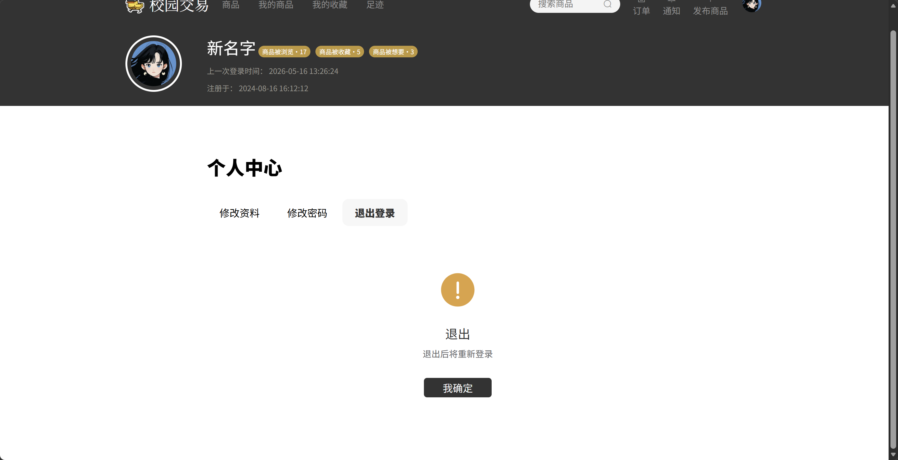 <br> 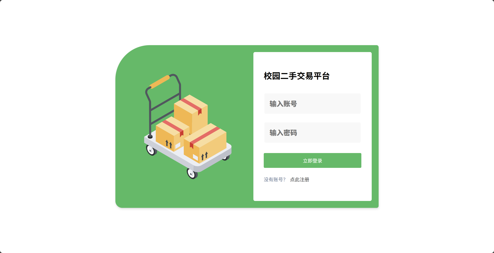 |

### 3. 问题与改进

| Bug编号 | 关联用例 | 模块 | 问题描述 | 严重程度 | 复现步骤 | 状态 |
|--------|--------|------|---------|---------|---------|------|
| BUG-001 | usermgmt_004 | 用户管理 | 按注册时间范围筛选用户时，查询结果与选择的时间段不符。选择2024-12-15注册的用户，实际显示的是2024-12-04注册的用户数据。 | 中 | 1. 进入用户管理页面 <br> 2. 在注册时间筛选条件中选择时间范围：2024-12-15 至 2024-12-15 <br> 3. 执行查询 | 待修复 |

---

## 六、用户手册  

### 1. 安装部署说明

#### 1.1 环境配置

| 环境 | 版本要求 |
|------|----------|
| JDK | JDK 8 及以上 |
| Node.js | Node.js 12.x 及以上 |
| MySQL | MySQL 8.x |
| Maven | Maven 3.x |
| npm | npm 6.x 及以上 |

#### 1.2 部署步骤

##### （1）数据库初始化

**第一步：打开cmd，输入以下指令，登录 MySQL**

```bash
#root改成你自己的数据库用户名,一般会是root
mysql -u root -p 
```

**第二步：执行以下 SQL 语句，初始化数据库**

```sql
-- 1、创建数据库
CREATE DATABASE campus-product CHARACTER SET utf8mb4 COLLATE utf8mb4_bin;

-- 2、进入刚创建的数据库
USE campus-product;

-- 3、导入表结构
SOURCE ../../init_table.sql; -- 这里填你电脑上init_table.sql的文件路径

-- 4、导入初始数据
SOURCE ../../init_data.sql; -- 这里填你电脑上init_data.sql的文件路径
```

##### （2）后端启动

**第一步：修改数据库连接配置**

```text
1、找到 backend/src/main/resources/application.yml
2、修改 spring.datasource.username 和 spring.datasource.password ,改成你自己的数据库用户名和密码
```

**第二步：启动后端**

```bash
在 IDEA 中运行 CampusProductApplication.java
# 后端默认运行在 http://localhost:21090
```

##### （3）前端启动

**在终端执行以下命令**
```bash
cd frontend
npm install        # 安装依赖
npm run serve      # 启动开发服务器
# 前端默认运行在 http://localhost:21091
```

##### （4）访问系统

打开浏览器访问 `http://localhost:21091`

### 2. 操作指南

#### 2.1 用户端操作说明

| 操作 | 说明 |
|------|------|
| 注册账号 | 在登录页面点击"点此注册"，填写账号、用户名、密码、确认密码后提交 |
| 登录系统 | 输入账号和密码，点击"立即登录"，管理员自动跳转管理后台，普通用户跳转商品首页 |
| 浏览商品 | 登录后在首页查看商品卡片列表，支持按分类/砍价状态/时间/类别筛选 |
| 搜索商品 | 在搜索页输入商品名称关键字，实时搜索匹配商品 |
| 查看详情 | 点击商品卡片进入详情页，可查看大图、价格、卖家信息、互动数据和评论区 |
| 收藏商品 | 在商品详情页点击"收藏"按钮，可在"我的收藏"中查看已收藏商品 |
| 标记想要 | 在商品详情页点击"我想要"，系统将通知卖家 |
| 购买商品 | 在商品详情页点击"立即购买"，选择数量和备注后提交订单 |
| 确认支付 | 在"订单"→"购物订单"中对未支付订单点击"下单" |
| 申请退款 | 对已支付订单点击"申请退款"，等待卖家确认 |
| 发布商品 | 点击"发布商品"，填写商品信息、上传图片、编辑描述后提交 |
| 编辑商品 | 在"我的商品"中点击某商品的"编辑"按钮，修改信息后提交 |
| 删除商品 | 在"我的商品"中点击"删除"按钮并确认 |
| 发表评论 | 在商品详情页评论区输入内容后发送，可回复他人评论 |
| 查看消息 | 点击"通知"菜单查看系统消息，可点击"全部已读" |
| 修改资料 | 在"个人中心"→"修改资料"中修改头像、昵称、邮箱 |
| 修改密码 | 在"个人中心"→"修改密码"中输入旧密码验证后设置新密码 |
| 退出登录 | 在"个人中心"→"退出登录"中点击"我确定" |

#### 2.2 管理员端操作说明

| 操作 | 说明 |
|------|------|
| 查看仪表盘 | 登录后进入管理后台首页，查看系统统计数据和上架趋势图 |
| 用户管理 | 在"用户管理"中查看、筛选、新增、编辑、封号/解封、禁言/解禁、删除用户 |
| 商品管理 | 在"商品管理"中查看、筛选商品，查看商品详情，删除违规商品 |
| 订单管理 | 在"订单管理"中查看、筛选、查看详情、删除全平台订单 |
| 类别管理 | 在"商品类别管理"中新增、编辑、启用/禁用、删除商品分类 |
| 评论管理 | 在"评论管理"中查看和删除评论 |
| 消息管理 | 在"消息管理"中查看和删除系统消息 |
| 互动管理 | 在"互动管理"中查看和删除用户互动记录 |
| 日志管理 | 在"日志管理"中查看和删除操作日志 |

---

## 七、项目总结 

### 1. 成果总结
  经过团队五名成员的共同努力，我们成功设计并实现了"校园二手交易系统"。项目采用 Spring Boot + Vue.js + MySQL 技术栈，实现了前后端分离的完整 Web 应用。系统覆盖了用户注册登录、商品发布与管理、商品浏览与搜索、收藏互动、下单购买与退款、评论互动、消息通知、个人信息管理等完整的二手交易业务流程，同时为管理员提供了包括仪表盘、用户管理、商品管理、订单管理、类别管理、评论管理、消息管理、互动管理、日志管理在内的九大后台管理功能。

  在技术实现上，系统运用了 JWT Token 认证、AOP 切面编程（权限保护、分页处理、操作日志自动化）、ThreadLocal 用户上下文、MyBatis ORM 映射、MD5 双重密码加密等关键技术，体现了良好的软件工程实践。

### 2. 不足与改进方向

（1）图片存储待优化： 当前图片以本地文件系统存储，随着数据量增长可能成为性能瓶颈。后续可迁移至对象存储服务。

（3）移动端适配： 当前界面针对 PC 端优化，暂不支持移动端。后续可开发微信小程序或响应式移动端页面。

（4）搜索功能升级： 当前仅支持按商品名称等字段的模糊查询，后续可引入 ElasticSearch 实现全文检索和智能推荐。

### 3. 成员分工表
| 姓名 | 班级 | 学号 | git账号 | 任务 |
|------|---------|-----|------|------|
| 蔺钊宇 | 24计科4班 | 202405567335 | anianzyl | 组长，前端。<br>项目统筹，核心架构设计；前端页面开发、网页设计； |
| 龙昊天 | 24计科4班 | 202405567324 | Loonght666 | 前端。<br>设计页面UI，开发网页；对接后端接口，前端原型、交互页面； |
| 罗琨 | 24计科4班 | 202405566519 | EnigLightic | 后端，数据库。<br>设计数据库表；开发API接口； |
| 毛纳 | 24计科4班 | 202305190852 | oioinn | 测试、文档。<br>编写测试报告、软件说明书；编写MD格式开发文档、PPT制作； |
| 王敬尧 | 24计科4班 | 202405567302 | Simonnalty | 后端，数据库。<br>绘制ER图；编写数据库脚本、API文档；|

### 4. Git 提交记录
（附主要提交记录截图或说明）

> 中期要求：  
> - 可先写阶段成果、当前问题、下一步计划；  
> - 成员分工与Git阶段记录应已对应。  
>
> 结项要求：  
> - 更新为最终完成情况；  
> - 补全最终成员分工与Git记录说明。  

---

## 附录  

### 1. 参考资料
Spring Boot 官方文档：https://spring.io/projects/spring-boot
Vue.js 官方文档：https://vuejs.org/
Element UI 文档：https://element.eleme.io/
MyBatis 官方文档：https://mybatis.org/
JJWT (Java JWT) GitHub：https://github.com/jwtk/jjwt

### 2. 源代码仓库链接
https://github.com/anianzyl/Campus-Second-hand-Recycling-Low-Carbon-Credit-System/tree/Campus-Second-hand-Recycling-Low-Carbon-Credit-System

### 3. 其他补充材料

---

## 附：推荐的图片与文件组织方式

```text
docs/
  report/
    中期与结项报告.md
    assets/
      fig_architecture.png
      fig_er.png
      fig_ui_login.png
      fig_ui_admin.png
      fig_test_result.png
```

图片在正文中建议这样引用：

```md

```


