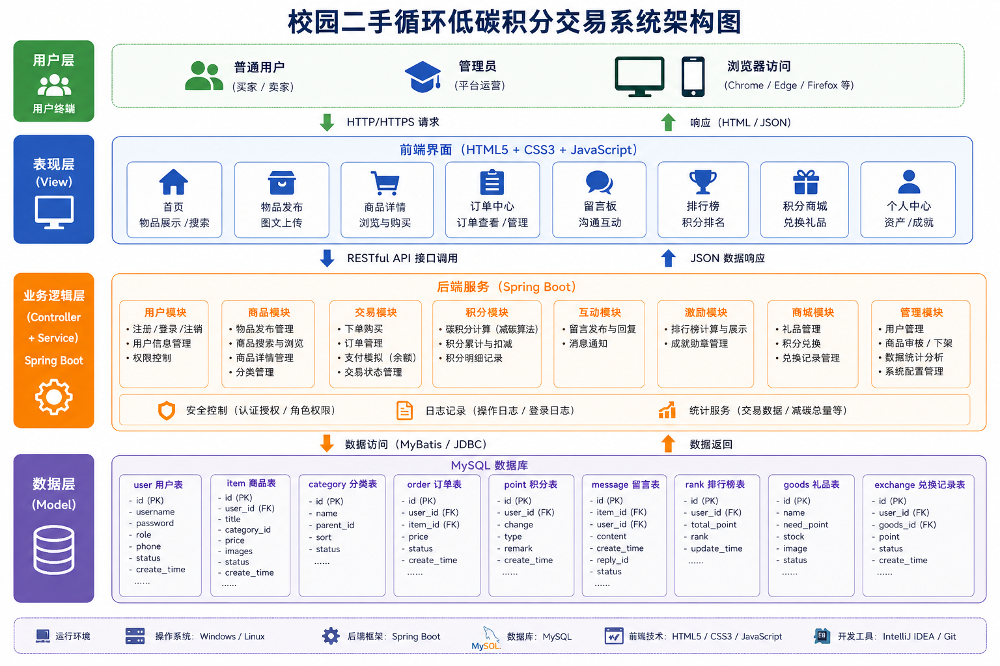
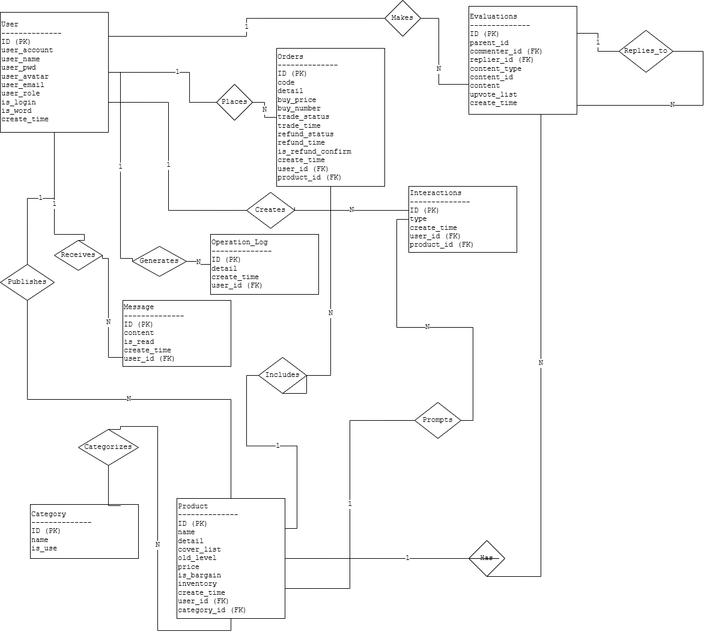

# 软件说明书（中期 / 结项共用主文档）

> 使用说明 
> - 本文档作为**中期检查**与**最终软件说明书**的共用主文档。  
> - **中期阶段**：先完成标注为“中期必填”的内容；标注为“结项补全”的内容可暂留空。  
> - **结项阶段**：在中期版本基础上继续补全，整理后导出为最终doc/docx。  
> - 过程性图片请单独存放在`assets/`目录，正文中使用相对路径引用。  
> - 过程考核以Git中的md增量记录为主，最终排版稿以导出的doc/docx为准。  

---

## 基本信息

**项目名称：** 校园二手循环低碳积分交易系统 
**学    院：** 计算机学院  
**小组序号：** 19  
**成员姓名：** 蔺钊宇/龙昊天/罗琨/毛纳/王敬尧 
**指导老师：** 尹兆远  
**当前版本：** 中期版 / 结项版  
**更新日期：** 2026年5月___日  

---

## 一、项目概述  【中期必填】

### 1. 项目背景

#### 1.1 项目来源：

&emsp;&emsp;本项目的选题来源于高校校园中普遍存在的资源浪费与交易效率低下的实际问题。毕业季期间，由于搬运成本高、处理时间短，大量具有较高使用价值的课本教辅、小型电器（如台灯、电风扇）、生活用品被当作废品处理甚至直接丢弃，造成了极大的资源浪费。每年入学的学弟学妹或在校生，往往需要支付全价购买新的教材和生活设施。虽然校内存在零散的“跳蚤市场”或微信群，但由于信息碎片化、缺乏统一的管理平台，导致供需双方难以精准匹配，交易效率低下。
&emsp;&emsp;通用的二手平台（如闲鱼、转转）因缺乏校园身份背书，学生在交易时往往存在安全顾虑；同时，纯粹的买卖行为缺乏社会责任感的驱动，难以形成长效的环保参与动力。因此，本小组决定设计并实现一套面向校园场景的二手循环与低碳积分交易系统。

#### 1.2 应用场景：

&emsp;&emsp;本系统主要应用于高校校园内部，面向在校本科生及研究生。具体使用场景包括：

（1）**毕业季闲置处理：** 毕业生在离校前集中发布教材、生活用品等物品信息，快速找到买家，减少直接丢弃造成的浪费。
（2）**日常二手交易：** 在校生可以在任何时间发布或购买二手物品，如教材、考试资料、体育用品、电子产品等，形成常态化的校园循环交易网络。
（3）**环保行为记录与激励：** 用户在完成一笔二手交易后，系统根据交易金额或物品类型自动计算碳积分，积分可用于兑换虚拟成就（如勋章、排行榜名次）或积分商店中的实物礼品，从而将环保行为转化为可量化的个人收益。

#### 1.3 现实意义：

（1）**资源节约：** 本系统通过数字化的物品发布与撮合机制，将闲置资源精准导流至有需求的学生手中，减少了因信息不畅导致的物品浪费，提高了校内资源的整体周转效率。
（2）**环保教育：** 通过将每笔订单转换为具体的碳积分并可视化展示（如排行榜、碳足迹曲线），使抽象的“低碳生活”概念转变为学生可感知的数字成就，有助于在日常使用中潜移默化地培养环保意识。
（3）**技术验证：** 本项目尝试在校园这一相对封闭且用户特征明确的社区内，验证“交易 + 积分 + 激励”三位一体模式的可行性，为后续在更大范围内推广低碳普惠体系提供一个可参考的微型案例。
（4）**校园管理：** 系统可以减轻毕业季校园垃圾处理的压力，同时通过规范的线上交易流程和物品审核机制，提升校内二手交易的安全性和秩序。


### 2. 系统目标

#### 2.1 主要目标

**（1）构建统一的校园二手交易渠道**

- 为在校生提供一个集中的物品发布、浏览、搜索与购买平台，改变当前依赖微信群、线下摆摊等零散交易方式的现状。
- 支持物品按分类（教材、生活用品、电子产品等）筛选及关键词检索，提高供需匹配效率。
- 每个物品详情页提供图文展示及留言功能，方便买卖双方沟通，降低信息不对称。

**（2）实现交易流程的自动化与规范化**

- 用户可进行模拟充值，购买时系统自动校验余额并完成扣款，交易记录自动写入数据库。
- 管理员可对违规物品进行下架处理，对异常用户进行禁用，维护平台基本秩序。
- 订单生成后，买卖双方可追溯交易详情，减少售后纠纷。

**（3）量化用户环保行为并给予正向激励**

- 每完成一笔二手交易，系统根据交易金额或物品类别自动计算减碳量，并转换为对应的“碳积分”发放至买家账户。
- 提供个人碳积分累计查询、全校积分排行榜、成就勋章系统，让环保行为可视化、可比较。
- 设立“积分商店”，用户可使用碳积分兑换虚拟礼品或实物奖励，形成“交易→积分→激励”的闭环。

**（4）提升校园资源利用率并增强环保意识**

- 通过平台撮合，将毕业季等场景下闲置的教材、电器、生活用品引流至有需求的学生手中，减少直接丢弃造成的资源浪费。
- 通过积分奖励与排行榜等设计，激励学生更积极地参与二手循环交易，在校内营造低碳环保的氛围。
- 为学校提供一定程度上的垃圾减量支持，降低毕业季清理压力。

**（5）为小组提供完整的软件开发实践案例**

- 采用 Spring Boot + MySQL + HTML/CSS/JS 技术栈，按 MVC 三层架构组织代码，锻炼后端业务逻辑开发、数据库设计及前端交互能力。
- 使用 Git 进行版本管理，GitHub 托管代码，规范 commit 记录，模拟真实团队开发流程。
- 最终产出包括可运行的系统、项目文档（计划书、需求分析、设计说明、测试报告、软件说明书）及过程性材料。


#### 2.2 预期效果

| 维度 | 预期效果 |
| :--- | :--- |
| 用户侧 | 能够方便地发布、查找、购买二手物品，获得碳积分并兑换奖励 |
| 管理侧 | 能够监管用户与物品，配置积分规则与商店内容 |
| 资源侧 | 减少校园闲置物品浪费，提高教材及生活用品的循环利用率 |
| 环保侧 | 使低碳行为可量化、可感知，长期培养用户环保习惯 |
| 技术侧 | 完成一个前后端完整、数据库规范、文档齐全的课程项目 |


### 3. 开发环境

#### 3.1 主要开发工具

（1）前端：VS Code
（2）后端：IntelliJ IDEA

#### 3.2 运行环境

校园局域网环境，支持Chrome, Edge, Firefox等主流浏览器

#### 3.3 数据库

MySQL

## 二、需求分析  【中期必填】

### 1. 功能需求

#### 1.1 主要功能

#### （1）普通用户功能

| 功能模块 | 功能描述 |
| :--- | :--- |
| 用户注册与登录 | 用户通过学号、姓名等信息注册账号，登录后使用系统功能。密码需加密存储。 |
| 个人资产管理 | 查看账户余额、碳积分数量；支持模拟充值（输入金额即可增加余额）。 |
| 物品发布 | 填写物品标题、描述、价格、选择分类（教材、生活用品、电子产品等），上传图片，发布到平台。 |
| 物品浏览与搜索 | 按分类浏览在售物品；支持关键词搜索（如搜索“高数”可匹配物品标题）。 |
| 物品详情查看 | 点击物品进入详情页，查看图文信息、卖家信息、当前状态（在售/已售）。 |
| 购买下单 | 买家确认购买后，系统校验余额是否充足；通过后自动扣款并生成订单；卖家账户增加对应金额。 |
| 留言互动 | 在物品详情页下方留言提问或回复；仅登录用户可留言。 |
| 碳积分查询 | 查看个人累计碳积分、积分获取记录（如“购买《高数教材》获得XX积分”）。 |
| 排行榜与成就 | 查看全校碳积分排行榜；达到一定积分后自动获得成就勋章（如“低碳新手”“环保先锋”）。 |
| 积分商店 | 使用碳积分兑换虚拟礼品（如头像框）或实物礼品（需管理员配置）；兑换后扣除相应积分。 |

#### （2）管理员功能

| 功能模块 | 功能描述 |
| :--- | :--- |
| 用户管理 | 查看所有用户列表；禁用或启用用户账号（禁用后无法登录及操作）。 |
| 物品监管 | 查看所有上架物品；对违规物品进行强制下架操作。 |
| 交易记录查看 | 浏览全平台所有订单记录，包括买家、卖家、物品、金额、时间。 |
| 排行榜与成就配置 | 更新碳积分排行榜规则（如展示前10名）；配置成就勋章的获取条件。 |
| 积分商店管理 | 添加、修改、下架积分商店礼品；设置礼品名称、所需积分数、库存数量。 |

#### 1.2 业务流程

**流程一：物品发布与购买**

```text
用户登录 → 填写物品信息并发布 → 物品进入在售列表 → 
买家搜索/浏览 → 查看详情 → 确认购买 → 
系统校验余额 → 扣款成功 → 生成订单 → 卖家账户增加金额 → 
买家获得碳积分 → 订单状态更新
```

**流程二：碳积分激励闭环**

```text
订单完成 → 系统根据交易金额/物品类别计算减碳量 → 
转换为碳积分并累加到买家账户 → 
买家查询积分及排名 → 使用积分在商店兑换礼品
```

### 2. 非功能需求

#### 2.1 性能要求

- 在校园局域网环境下，页面跳转及主要操作（登录、发布、搜索、下单）的响应时间应小于2秒。
- 系统应支持至少50人同时在线使用，无明显卡顿或请求超时。
- 数据库查询（如搜索物品）在数据量达到1000条时，响应时间不超过1秒。

#### 2.2 安全要求

- 用户密码不得以明文形式存储，需进行加密处理。
- 系统需具备基础权限控制：未登录用户只能浏览物品列表，无法进行购买、发布、留言等操作。
- 防止常见Web漏洞：对用户输入进行过滤，防止SQL注入；对页面输出进行转义，防止XSS攻击。
- 订单金额扣减需使用数据库事务保证一致性，避免超扣或重复扣款。

#### 2.3 兼容性要求

- 前端界面应适配主流分辨率（1920×1080、1366×768）。
- 支持以下浏览器的最新版本：
  - Google Chrome
  - Microsoft Edge
  - Mozilla Firefox
- 暂不考虑移动端适配，以PC端Web页面为主。

> 中期要求：功能清单、主要业务流程、基本非功能需求应明确。  
> 结项要求：与最终实现保持一致，删除未完成但未说明的内容。  

---

## 三、系统设计  【中期必填】

### 1. 系统架构
（说明系统总体架构并附架构图）

&emsp;&emsp;本系统采用 MVC（Model-View-Controller）三层架构，将系统分为表现层、业务逻辑层和数据访问层，确保各层职责清晰，便于小组成员分工并行开发。

**架构分层说明：**

| 层级 | 技术选型 | 职责 |
| :--- | :--- | :--- |
| 表现层 (View) | HTML5 + CSS3 + JavaScript | 负责用户界面展示，接收用户操作，发送 HTTP 请求，渲染后端返回的数据 |
| 控制层 (Controller) | Spring Boot (Controller) | 接收前端请求，调用业务逻辑层进行处理，返回响应数据 |
| 业务逻辑层 (Service) | Spring Boot (Service) | 处理核心业务逻辑，如金额扣减、积分计算、权限校验等 |
| 数据访问层 (DAO) | MyBatis / JPA | 封装数据库操作，与 MySQL 进行数据交互 |
| 数据库层 | MySQL | 存储用户、物品、订单、积分记录等数据 |

**系统架构图：**



> 上图展示了从用户浏览器到数据库的完整请求处理流程：
> 1. 用户在浏览器进行操作 → 2. 请求发送至 Controller → 3. Controller 调用 Service 层执行业务逻辑 → 4. Service 调用 DAO 层操作数据库 → 5. 返回结果逐层回传 → 6. 前端更新页面显示

### 2. 模块设计
（说明主要模块及其职责关系）

系统主要划分为以下六个核心模块：

#### （1）二手交易模块

| 项目 | 内容 |
| :--- | :--- |
| 功能 | 物品发布、分类浏览、关键词搜索、详情查看、购买下单 |
| 主要流程 | 用户登录 → 填写物品信息并发布 → 物品进入在售列表 → 买家搜索/浏览 → 查看详情 → 确认购买 → 系统校验余额 → 扣款成功 → 生成订单 |
| 关键设计 | 购买前需校验物品状态是否为“在售”；购买后自动将物品状态改为“已售”，防止重复购买 |

#### （2）资产与账户模块

| 项目 | 内容 |
| :--- | :--- |
| 功能 | 余额查询、模拟充值、购买结算、碳积分查询 |
| 主要流程 | 用户输入充值金额 → 系统增加账户余额 → 交易时校验余额 → 扣除相应金额 |
| 关键设计 | 充值记录和消费记录均写入数据库，便于后续追溯；余额变动使用数据库事务保证一致性 |

#### （3）低碳积分体系模块

| 项目 | 内容 |
| :--- | :--- |
| 功能 | 减碳算法计算、积分累加、积分排行榜、成就展示、积分商店兑换 |
| 主要流程 | 订单完成 → 根据交易金额和物品分类计算碳积分 → 累加到买家账户 → 更新排行榜 → 用户可使用积分兑换礼品 |
| 关键设计 | 积分计算公式：`碳积分 = 交易金额 × 分类系数`（教材系数0.8，电子产品0.6，生活用品0.4）；积分变动记录写入积分日志表 |

#### （4）留言板模块

| 项目 | 内容 |
| :--- | :--- |
| 功能 | 在物品详情页留言、查看留言、回复留言 |
| 主要流程 | 已登录用户输入留言内容 → 提交 → 留言保存并显示在留言板中 |
| 关键设计 | 只有登录用户才能留言，未登录用户只能查看已有留言；每条留言关联对应的物品ID和用户ID |

#### （5）状态管理模块

| 项目 | 内容 |
| :--- | :--- |
| 功能 | 物品状态（在售/已售/已下架）、订单状态（已完成/已取消） |
| 关键设计 | 物品购买成功后自动更新状态为“已售”；管理员可手动将违规物品状态设为“已下架” |

#### （6）系统管理后台模块

| 项目 | 内容 |
| :--- | :--- |
| 功能 | 用户管理、物品审核/监管、交易记录查看、积分商店配置 |
| 关键设计 | 管理员具有独立的权限，可禁用违规用户账号，强制下架违规物品，查看全平台交易记录，添加或修改积分商店礼品 |

### 3. 数据库设计
- E-R 图
- 主要数据表设计
#### 3.1 E-R 图



#### 3.2 主要数据表设计

**（1）用户表 (User)**

存储系统用户的基本信息。

| 字段名 | 类型 | 约束 | 说明 |
| :--- | :--- | :--- | :--- |
| id | INT | PRIMARY KEY, AUTO_INCREMENT | 用户ID |
| user_account | VARCHAR(50) | NOT NULL, UNIQUE | 用户账号（学号） |
| user_name | VARCHAR(50) | NOT NULL | 用户姓名 |
| user_pwd | VARCHAR(100) | NOT NULL | 密码（加密存储） |
| user_avatar | VARCHAR(200) | | 头像URL |
| user_email | VARCHAR(100) | | 邮箱 |
| user_role | TINYINT | DEFAULT 0 | 角色（0:普通用户，1:管理员） |
| is_login | TINYINT | DEFAULT 0 | 是否在线 |
| is_word | TINYINT | DEFAULT 1 | 账号状态（1:正常，0:禁用） |
| create_time | DATETIME | DEFAULT CURRENT_TIMESTAMP | 注册时间 |

**（2）物品表 (Product)**

存储用户发布的二手物品信息。

| 字段名 | 类型 | 约束 | 说明 |
| :--- | :--- | :--- | :--- |
| id | INT | PRIMARY KEY, AUTO_INCREMENT | 物品ID |
| name | VARCHAR(100) | NOT NULL | 物品名称 |
| detail | TEXT | | 物品描述 |
| cover_list | VARCHAR(500) | | 图片路径列表 |
| old_level | TINYINT | DEFAULT 0 | 新旧程度 |
| price | DECIMAL(10,2) | NOT NULL | 价格 |
| is_bargain | TINYINT | DEFAULT 0 | 是否可议价（0:否，1:是） |
| inventory | INT | DEFAULT 1 | 库存数量 |
| create_time | DATETIME | DEFAULT CURRENT_TIMESTAMP | 发布时间 |
| user_id | INT | FOREIGN KEY $\to$ User(id) | 发布者ID |
| category_id | INT | FOREIGN KEY $\to$ Category(id) | 分类ID |

**（3）分类表 (Category)**

存储物品的分类信息。

| 字段名 | 类型 | 约束 | 说明 |
| :--- | :--- | :--- | :--- |
| id | INT | PRIMARY KEY, AUTO_INCREMENT | 分类ID |
| name | VARCHAR(50) | NOT NULL | 分类名称 |
| is_use | TINYINT | DEFAULT 1 | 是否启用（1:启用，0:禁用） |

**（4）订单表 (Order)**

存储交易订单信息。

| 字段名 | 类型 | 约束 | 说明 |
| :--- | :--- | :--- | :--- |
| id | INT | PRIMARY KEY, AUTO_INCREMENT | 订单ID |
| code | VARCHAR(50) | NOT NULL, UNIQUE | 订单编号 |
| detail | TEXT | | 订单详情 |
| buy_price | DECIMAL(10,2) | NOT NULL | 成交价格 |
| buy_number | INT | DEFAULT 1 | 购买数量 |
| trade_status | TINYINT | DEFAULT 0 | 交易状态 |
| trade_time | DATETIME | | 交易完成时间 |
| refund_status | TINYINT | DEFAULT 0 | 退款状态 |
| refund_time | DATETIME | | 退款时间 |
| is_refund_confirm | TINYINT | DEFAULT 0 | 是否确认退款 |
| create_time | DATETIME | DEFAULT CURRENT_TIMESTAMP | 下单时间 |
| user_id | INT | FOREIGN KEY $\to$ User(id) | 买家ID |
| product_id | INT | FOREIGN KEY $\to$ Product(id) | 物品ID |

**（5）留言表 (Message)**

存储用户在物品详情页的留言信息。

| 字段名 | 类型 | 约束 | 说明 |
| :--- | :--- | :--- | :--- |
| id | INT | PRIMARY KEY, AUTO_INCREMENT | 留言ID |
| content | VARCHAR(500) | NOT NULL | 留言内容 |
| is_read | TINYINT | DEFAULT 0 | 是否已读 |
| create_time | DATETIME | DEFAULT CURRENT_TIMESTAMP | 留言时间 |
| user_id | INT | FOREIGN KEY $\to$ User(id) | 留言者ID |
| product_id | INT | FOREIGN KEY $\to$ Product(id) | 所属物品ID |

**（6）评价表 (Evaluations)**

存储用户对交易的评价信息。

| 字段名 | 类型 | 约束 | 说明 |
| :--- | :--- | :--- | :--- |
| id | INT | PRIMARY KEY, AUTO_INCREMENT | 评价ID |
| parent_id | INT | DEFAULT 0 | 父评价ID（用于回复） |
| commenter_id | INT | FOREIGN KEY $\to$ User(id) | 评价者ID |
| replier_id | INT | FOREIGN KEY $\to$ User(id) | 回复者ID |
| content_type | TINYINT | | 内容类型 |
| content_id | INT | | 关联内容ID |
| content | TEXT | | 评价内容 |
| upvote_list | VARCHAR(500) | | 点赞用户列表 |
| create_time | DATETIME | DEFAULT CURRENT_TIMESTAMP | 评价时间 |

**（7）操作日志表 (Operation_Log)**

存储管理员的操作记录。

| 字段名 | 类型 | 约束 | 说明 |
| :--- | :--- | :--- | :--- |
| id | INT | PRIMARY KEY, AUTO_INCREMENT | 日志ID |
| detail | VARCHAR(500) | | 操作详情 |
| create_time | DATETIME | DEFAULT CURRENT_TIMESTAMP | 操作时间 |
| user_id | INT | FOREIGN KEY $\to$ User(id) | 操作者ID |

**（8）互动记录表 (Interactions)**

存储用户对物品的互动行为。

| 字段名 | 类型 | 约束 | 说明 |
| :--- | :--- | :--- | :--- |
| id | INT | PRIMARY KEY, AUTO_INCREMENT | 记录ID |
| type | TINYINT | | 互动类型（0:收藏，1:点赞） |
| create_time | DATETIME | DEFAULT CURRENT_TIMESTAMP | 互动时间 |
| user_id | INT | FOREIGN KEY $\to$  User(id) | 用户ID |
| product_id | INT | FOREIGN KEY $\to$ Product(id) | 物品ID |


> 中期要求：架构、模块、数据库设计基本定稿。  
> 结项要求：与最终系统一致，如有调整需同步更新。  

---

## 四、系统实现  【中期部分填写；结项补全】

### 1. 关键技术
（说明使用的核心算法、框架或技术难点解决方案）

#### 1.1 前端框架

&emsp;&emsp;前端采用原生 HTML5、CSS3 和 JavaScript 构建，便于小组成员快速上手。使用 CSS Flexbox 和 Grid 实现响应式布局，适配不同分辨率；通过原生 JavaScript 处理表单提交、异步请求（Ajax）、DOM 操作等；使用 fetch 或 XMLHttpRequest 调用后端 RESTful API，传递 JSON 格式数据。

#### 1.2 后端框架

&emsp;&emsp;本系统采用 Spring Boot 作为后端开发框架，Spring Boot 提供了自动配置功能，减少了传统 Spring 项目中繁琐的 XML 配置，能够快速搭建 Web 应用。

#### 1.3 数据库

&emsp;&emsp;本系统使用 MySQL 作为关系型数据库，存储用户信息、物品清单、订单记录、积分记录等数据。MySQL 开源免费，配置简单，适合课程项目开发。且MySQL 的 InnoDB 引擎支持事务，与 Spring 事务管理配合，确保金融相关操作的可靠性（如扣款与订单生成需同时成功或同时回滚）。

### 2. 界面展示
（提供主要功能界面截图并配文字说明）

### 3. 核心代码片段
（展示关键功能的代码并注释，例如数据库连接、核心算法）

> 中期要求：  
> - 可先填写已确定的关键技术；  
> - 可展示已完成页面或原型图；  
> - 核心代码片段可暂不完整。  
>
> 结项要求：  
> - 补全最终关键技术说明；  
> - 使用真实系统界面截图替换原型图；  
> - 展示关键功能的代码片段。  

---

## 五、系统测试  【中期先写方案；结项补全结果】

### 1. 测试方案

#### 1.1 测试方法

&emsp;&emsp;本次测试采用**黑盒测试**方法，重点关注系统功能是否正确实现。测试人员基于需求文档编写测试用例，验证输入与输出是否符合预期。主要覆盖以下类型：

- **正常流程测试**：验证用户在正常操作下，功能是否按预期执行（如注册成功、购买成功、积分累加）。
- **异常流程测试**：验证用户进行非法或错误操作时，系统是否能给出正确提示（如余额不足、重复注册、未登录购买）。
- **边界值测试**：验证系统在边界条件下的处理情况（如充值输入0或负数、搜索无结果）。

#### 1.2 测试范围

| 模块 | 测试范围 |
| :--- | :--- |
| 用户管理 | 注册、登录、未登录权限控制、管理员禁用/启用账号 |
| 资产管理 | 余额查询、模拟充值、购买时余额校验及扣款 |
| 物品管理 | 物品发布（含图片）、列表展示、分类筛选、关键词搜索、详情查看 |
| 交易功能 | 下单购买、余额不足处理、购买已售物品处理、订单生成、卖家到账 |
| 碳积分 | 下单后积分计算与累加、积分查询、积分记录展示 |
| 留言功能 | 发布留言、查看留言、未登录无法留言 |
| 排行榜与成就 | 排行榜数据展示、成就勋章触发与显示 |
| 积分商店 | 礼品列表展示、积分兑换、积分扣除 |
| 管理后台 | 用户禁用/启用、物品下架、交易记录查看、商店礼品管理 |


### 2. 测试结果
（展示主要测试用例及结果）

### 3. 问题与改进
（说明发现的问题及改进措施）

> 中期要求：  
> - 先写测试计划、测试范围、测试思路；  
> - 可列出准备执行的测试用例。  
>
> 结项要求：  
> - 补全真实测试结果；  
> - 记录主要问题及修正情况。  

---

## 六、用户手册  【结项补全】

### 1. 安装部署说明
（说明环境配置与部署步骤）

### 2. 操作指南
（说明系统主要功能的使用方法）

> 中期阶段可暂不写完整。  
> 结项阶段需根据最终系统补全。  

---

## 七、项目总结  【中期可先写阶段总结；结项补全】

### 1. 成果总结
（概述项目完成情况）

### 2. 不足与改进方向
（说明现存问题与后续优化方向）

### 3. 成员分工表
（说明各成员姓名、班级、学号、git账号、承担的任务，并与Git记录对应）

### 4. Git 提交记录
（附主要提交记录截图或说明）

> 中期要求：  
> - 可先写阶段成果、当前问题、下一步计划；  
> - 成员分工与Git阶段记录应已对应。  
>
> 结项要求：  
> - 更新为最终完成情况；  
> - 补全最终成员分工与Git记录说明。  

---

## 附录  【中期可留空；结项补全】

- 参考资料
- 源代码仓库链接
- 其他补充材料

---

## 附：推荐的图片与文件组织方式

```text
docs/
  report/
    中期与结项报告.md
    assets/
      fig_architecture.png
      fig_er.png
      fig_ui_login.png
      fig_ui_admin.png
      fig_test_result.png
```

图片在正文中建议这样引用：

```md

```

---

## 附：版本推进建议

- **中期版**：至少完成 第一～三章，并对第四、五、七章写出当前进展。  
- **结项版**：在中期版基础上补全第四～七章，整理后导出为最终软件说明书。  
- **不要中期另写一套、结项再重写一套。**  
