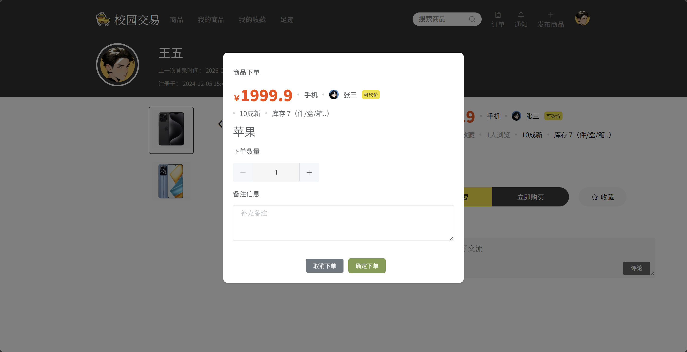
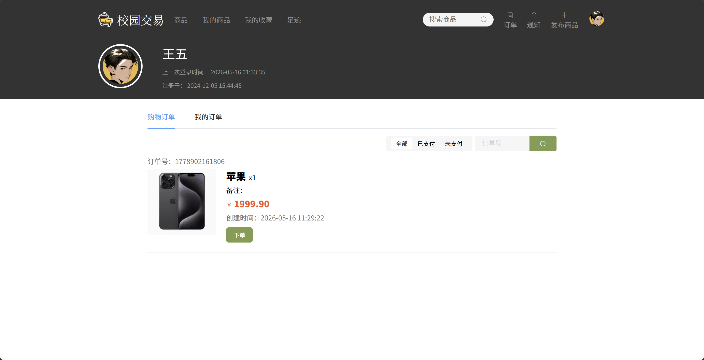
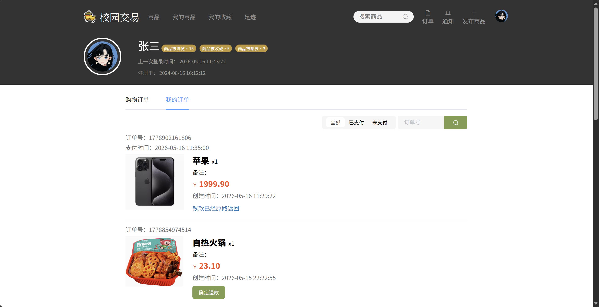
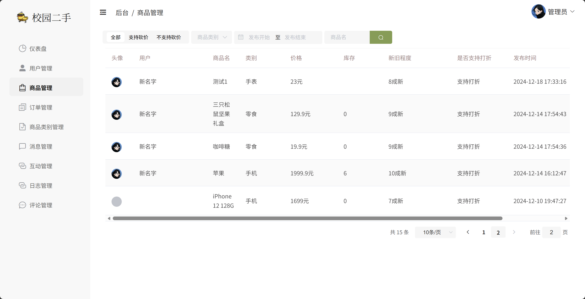
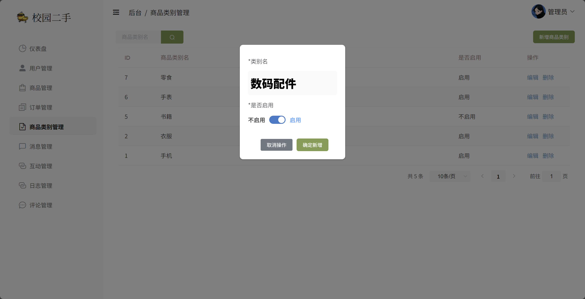
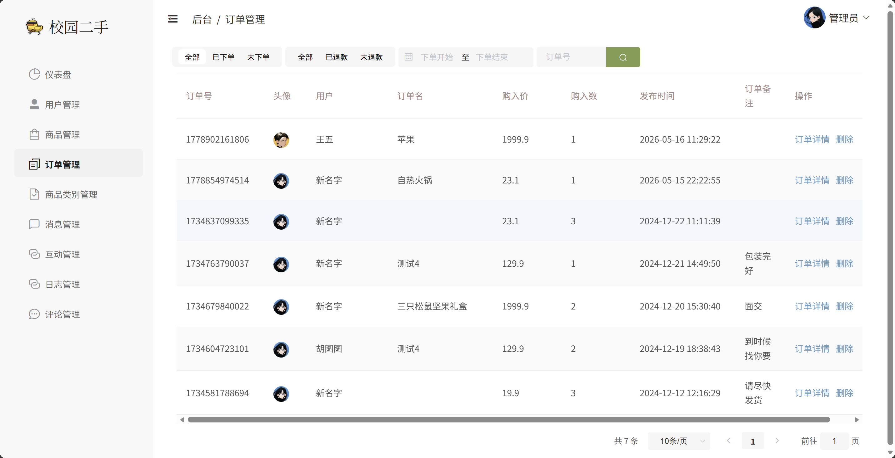
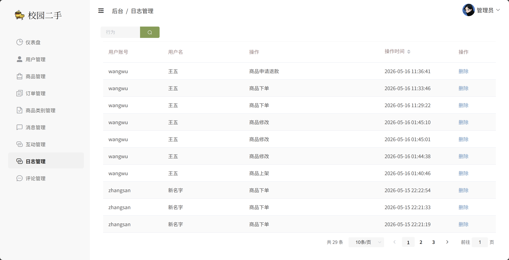

# 校园二手交易系统 - 前端界面展示文档

## 一、 引言

### 1.1 项目背景与前端定位
本系统是专为高校校园设计的二手交易与低碳循环回收平台。作为前端开发负责人，本项目的前端研发定位为**“高交互性、轻量化、极简美观的校园生活服务终端”**。前端不仅需要承载复杂的二手商品发布、多维筛选、即时消息互动、买卖双端订单流转等业务流程，还需要为系统管理员提供高可视化、直观易用的后台数据监管控制台。

### 1.2 前端视觉设计与用户体验
* **界面风格：** 采用清新温和的校园主题色（明黄色 `#FEDF46` 作为主色调，搭配高雅的灰蓝色与护眼底色），营造亲切、充满活力的校园氛围。
* **布局设计：** 大量采用 **Flexbox** 和 **CSS Grid** 响应式流式布局，完美适配主流 PC 分辨率（从 $1366 \times 768$ 到 $1920 \times 1080$），保证各组件在不同屏幕下的间距和谐、排版优雅。
* **交互体验：** 深度集成 **Element UI** 的响应式弹窗、即时反馈通知（Notification/Message）、流线型表单校验与步骤条，使用户在发布商品、下单交易、沟通互动时享有丝滑顺畅的“无感式”过渡体验。
* **数据可视化：** 引入 **ECharts 4.8.0** 绘制动态图表，实现后台多维指标的可视化呈现，让数据统计不再枯燥。

### 1.3 核心前端技术栈
* **核心框架：** Vue.js 2.6.11（渐进式 JavaScript 框架，实现高效的视图双向绑定）
* **路由管理：** Vue Router 3.2.0（支持路由全局守卫，实现无感知权限拦截）
* **UI 组件库：** Element UI 2.15.14（提供表单、对话框、表格、上传等丰富的高级组件支持）
* **网络请求：** Axios 0.21.1（配置全局请求/响应拦截器，自动装配 JWT Token 令牌）
* **富文本处理：** @wangeditor/editor 5.1.23（轻量级富文本编辑器，用于商品详情的精细化编排）

---
## 二、 普通用户端前台界面 (User Portal)

### 2.1 身份认证与安全设置 (Authentication & Security)

#### 2.1.1 登录界面 (Login)
* **设计概述：** 登录页面采用经典的“左侧品牌图 + 右侧登录卡片”的黄金分割布局。左侧插入趣味校园包包图（`bag.png`），右侧为扁平化输入框及高显眼度的“立即登录”按钮。
* **交互特性：** 
  * 支持输入为空的前端校验，若账号密码为空则使用 `SweetAlert2`（`$swal`）弹出醒目的错误提醒。
  * 用户密码在前端进行 **双重 MD5 加密** 后再通过 Axios 传输，极大地提升了用户账户在传输过程中的安全性。
  * 登录成功后，系统自动解析 JWT Token 中的用户角色属性，实现**管理员直达后台、普通用户直达商品首页**的智能路由导航。

*图 2-1 用户及管理员登录主界面*

*图 2-2 账号密码为空的前端即时校验提示*

#### 2.1.2 注册界面 (Register)
* **设计概述：** 注册模块支持新用户快捷创建账户，包含“学号/账号”、“用户昵称”、“密码设置”及“确认密码”四个核心输入字段。
* **安全拦截：** 两次密码输入不一致时，前端进行即时拦截并提示，避免无效的网络请求；若账号已被占用，后台返回的校验结果将通过 Element 通知组件即时反馈给用户。

*图 2-3 新用户注册信息填写界面*

*图 2-4 注册成功后的成功气泡与登录跳转引导*

#### 2.1.3 密码修改 (Reset Password)
* **设计概述：** 位于用户个人中心的“修改密码”面板，遵循密保安全规范，要求输入“原始旧密码”进行身份双重认证。
* **前端验证：** 包含旧密码空校验、新密码与确认密码一致性匹配。

*图 2-5 个人中心密码修改卡片*

*图 2-6 密码重置成功即时反馈*

---

### 2.2 商品浏览与智能检索 (Product Browse & Search)

#### 2.2.1 首页商品大厅 (Marketplace)
* **布局美学：** 采用标准的卡片网格流（Grid Layout）。每张商品卡片包含“商品精美缩略图（支持多图解析第一张封面）”、“新旧成色/支持砍价个性标签”、“商品标题”、“价格及想要人数”以及底部“卖家头像与昵称信息栏”。
* **动态反馈：** 卡片整体配备平滑的悬浮阴影（Box-Shadow Hover）与微缩放动效，极大增强了市场的可逛性。

*图 2-7 校园二手大厅商品瀑布流展示*

#### 2.2.2 多维条件筛选 (Filters)
为了帮助学生在一秒内定位心仪好物，前端大厅顶部集成了极其强大的**多维组合过滤器**：
1. **左侧大分类标签：** 以黄色活力圆角胶囊块展示“全部”、“数码”、“图书”等大类，点击即时触发商品重绘。
2. **砍价状态快捷筛选：** 可一键筛选“支持砍价”或“不支持砍价”商品，满足预算有限学生的需要。
3. **日期范围选择器：** Element 日期范围组件，用于定位特定时间内发布的新上架宝贝。
4. **类别下拉精细化检索：** 联动后端动态分类数据源进行按需展示。

*图 2-8 选中特定商品分类后的精细化筛选流*

*图 2-9 开启“支持砍价”后的过滤显示*

#### 2.2.3 关键词搜索 (Search)
* **设计特性：** 独立的搜索页面，支持历史搜索词缓存。当用户输入关键字（如 "iPhone"）时，系统进行高效的模糊匹配检索。
* **友好兜底：** 当搜索无结果时，展示 Element 优雅的 `el-empty` 空数据状态插画，避免界面突兀。

*图 2-10 输入关键字搜索“iPhone”得到的匹配列表*

*图 2-11 搜索无匹配结果时的友好兜底空状态*

---

### 2.3 商品详情与深度交互 (Product Detail & Interaction)

#### 2.3.1 商品图文详情展示 (Carousel & Rich Text)
* **图片轮播（Carousel）：** 左侧大图展示区集成了精美的图片轮播切换，支持鼠标悬停切换及手动箭头微调，多角度还原二手物品的真实面貌。
* **属性列表：** 清晰呈现当前库存、新旧级别（几成新）、发布日期、卖家信用状况等，并高亮价格字段。
* **详情说明：** 底侧使用 HTML 容器安全渲染，完美还原卖家利用富文本编辑器排版出的个性排版、彩色文字与插图信息。

*图 2-12 商品详情页主视图（轮播图与核心参数区域）*

#### 2.3.2 留言评论区 (Nested Comments)
* **嵌套式社交留言：** 详情页底侧集成功能完备的评论回复模块。支持直接对商品进行一级留言，或对特定用户的评论进行多级嵌套回复（Sub-replies）。
* **点赞动效：** 评论卡片右侧集成小爱心点赞，记录用户的认可。
* **禁言权限锁：** 若当前用户的账号状态在后台被管理员设置为“禁言状态”，则底部的留言框被禁用，并弹出相应的错误警示。

*图 2-13 留言评论框与发送即时回复演示*

#### 2.3.3 收藏夹功能 (Favorites)
* **状态联动：** 详情页中部提供“收藏”心形按钮。点击后按钮状态发生即时切换（按钮文字转为“取消收藏”并点亮图标），并在后台记录互动数据。
* **集中管理：** “我的收藏”列表页提供一键访问，方便用户持续跟进心仪好物的动态。

*图 2-14 点击“收藏”后的界面即时状态联动*

*图 2-15 个人中心“我的收藏”集中展示视图*

#### 2.3.4 “我想要”即时呼叫机制 (Want-it Alert)
* **业务概述：** 校园二手交易极度依赖即时沟通。“我想要”按钮充当了快速建立联系的桥梁。
* **防重发限制：** 点击后，系统除触发特效通知外，还会严格限制用户的二次点击，防止给卖家造成消息轰炸。
* **消息流传递：** 点击该按钮后，系统会自动在后台向卖家发送一条系统提示：“用户【xxx】对你的商品【xxx】非常感兴趣，快去和Ta聊聊吧！”

*图 2-16 触发“我想要”操作时的顶部温馨提示*

#### 2.3.5 我的足迹 (Footprints)
* **设计概述：** 用户浏览商品时，前端会在路由钩子中触发足迹记录接口，无感录入足迹（互动类型为浏览）。
* **清理机制：** 用户可在“我的足迹”中查看完整的历史浏览瀑布流，并支持点击“清空足迹”按钮来保障隐私安全。

*图 2-17 浏览历史足迹页面*

---

### 2.4 商品发布与编辑 (Publish & Edit)

#### 2.4.1 丰富商品发布表单 (Post Form)
为了统一商品的描述
#### 2.3.5 我的足迹 (Footprints)
* **设计概述：** 用户浏览商品时，前端会在路由钩子中触发足迹记录接口，无感录入足迹（互动类型为浏览）。
* **清理机制：** 用户可在“我的足迹”中查看完整的历史浏览瀑布流，并支持点击“清空足迹”按钮来保障隐私安全。

*图 2-17 浏览历史足迹页面*

---
质量，发布商品页被精心划分为两栏式精美表单：
* **左栏（基础数据）：** 包含“商品名称（标题）”、“新旧程度控制键（1-10成新，使用 `el-input-number` 计数器）”、“价格输入框”、“是否支持砍价切换器（`el-switch`）”。
* **右栏（多媒体展示）：**
  * **Element 上传多图墙（Picture-card）：** 点击 `+` 快速上传商品多张实拍图，且集成点击眼睛图标触发的大图预览模态框。
  * **商品所属类别动态徽章：** 蓝底徽章交互，点击一键选定类别。
  * **库存量滑块：** 设置商品库存上限。
  * **WangEditor 富文本区域：** 提供功能丰富的富文本编辑环境，卖家可自由加粗、插入表格、段落编排，生动呈现宝贝背后的故事。

*图 2-18 卖家商品发布双栏高级表单页面*

#### 2.4.2 在售商品管理与编辑 (My Products)
* **列表管理：** “我的商品”页面汇总了用户当前上架的所有宝贝，包含商品的缩略图、价格、剩余库存和具体发布日期。
* **快速修改：** 点击卡片下方的“编辑”按钮，将平滑拉出侧边商品编辑抽屉或弹框，允许卖家即时下架无库存的商品，或修改定价。

*图 2-19 用户个人“我的商品”工作台界面*

---

### 2.5 交易订单流转中心 (Order Management)

#### 2.5.1 下单与备注流程 (Checkout)
* **设计概述：** 在详情页点击“立即购买”后，系统不会粗暴跳转，而是平滑弹出一个精致的“确认下单”对话框。
* **安全校验：** 用户可在此调整购买份数，前端自动联动单价算出总额；同时提供“买家备注”大文本框输入配送或面交约定。

*图 2-20 点击购买时弹出的订单确认明细与备注对话框*

#### 2.5.2 买家订单工作台 (Buyer Orders)
* **状态过滤：** 买家专属的“购物订单”页面，使用 Element 面板卡片承载订单。卡片清晰呈现：订单编码、物品详情、应付总额、交易创建时间以及当前的交易流转状态（如“未支付”、“已下单（已支付）”、“申请退款中”）。
* **核心动作按钮：** 
  * 对“未支付”订单，高亮提供“下单（确认支付）”按钮，点击后模拟资金划拨，交易瞬间转为“已支付”。
  * 对已付订单，提供“申请退款”按钮，用于遭遇特殊情况时的资金安全保障。

*图 2-21 买家视角下的“购物订单”卡片化工作台*

#### 2.5.3 卖家订单中心 (Seller Orders)
* **双向流转：** 普通用户如果既是买家又是卖家，可以在“我的订单”页面的“我收到的订单”标签页中，查看到其他学生向自己发布的商品发起的采购订单。
* **审核流：** 卖家在此界面行使订单的“发货指引”或“同意退款”等订单状态维护动作。

*图 2-22 卖家视角下“我收到的订单”管理流*

---

### 2.6 个人空间与消息盒子 (Profile & Notification)

#### 2.6.1 个人资料修改 (Profile Update)
* **设计概述：** 用户可以进入个人中心对自己的基本资料进行编辑，包括头像图片上传替换、用户昵称更新、电子邮箱绑定等。

*图 2-23 用户基本资料卡片式编辑视图*

#### 2.6.2 即时消息盒子 (Inbox)
* **设计概述：** 消息中心收集了与当前用户相关的所有动态。无论是商品被他人收藏、收到了“我想要”的强烈信号，还是留言被学长学姐回复，消息中心都会集中列出。
* **红点通知：** 未读消息均配有醒目的红点标志。前端提供“全部标为已读”按钮，点击后所有未读红点一键清除。

*图 2-24 个人消息通知收件箱*

---

## 三、 管理员端后台管理平台 (Admin Portal)

### 3.1 经营看板与数据可视化 (ECharts Dashboard)
* **数据卡片：** 专为平台运维管理人员打造的精美后台大屏。顶部设计了六个带有高辨识度微缩图标 of 彩色指标卡片，直观展现系统当前的总注册用户数、上架商品总量、累积订单笔数、系统广播量、用户互动轨迹以及全网评论数据。
* **ECharts 趋势折线图：** 仪表盘主体部分引入了 **ECharts 4.8.0** 动态渲染数据折线图，以平滑的曲线、半透明黄色至白色的渐变填充区域，生动直观地刻画出“近期商品上架趋势走向”，支持鼠标悬浮时触发辅助十字光标与浮窗数据提示（Tooltip）。

*图 3-1 管理员后台统计大屏与 ECharts 上架趋势走向折线图*

---

### 3.2 用户群体监管工作台 (User Moderation)
* **设计概述：** “用户管理”面板以严谨的表格（`el-table`）排版形式，汇总展现了校园网内所有注册师生的关键档案信息。
* **极速检索：** 支持通过用户名输入进行秒级模糊过滤，同时集成了“按封号状态”、“按禁言状态”及“注册时间跨度”的多功能下拉过滤器。
* **精细化控制（一键封号/禁言）：** 
  * 管理员可在列表中直接开启“新增用户”弹窗；
  * 提供“修改角色（普通用户/管理员）”功能；
  * 列表右侧直观设计了“账号状态”与“禁言状态”的双重状态滑块开关。管理员滑开关，即可瞬间冻结涉嫌欺诈的用户登录权限（封号），或切断涉嫌发布垃圾广告用户的社交互动权限（禁言）。

*图 3-2 全平台注册用户管理与监控主面板*

*图 3-3 新建系统用户档案对话框*

*图 3-4 编辑用户资料与管理角色转换面板*

---

### 3.3 全平台数据监管与维护 (Platform Vetting)

#### 3.3.1 商品违规审查与下架 (Product Vetting)
* **列表详尽：** “商品管理”列表将全平台商品以封面图、分类属性、剩余库存、新旧成色、议价设置等多维结构呈现。
* **穿透预览：** 提供“详情查看”动作按钮，点击后弹出画中画对话框，无需跳转即可全屏审阅商品的详细富文本描述及关联图片，便于快速判定是否合规。

*图 3-5 后台商品监管工作台*

*图 3-6 商品多图与详情富文本内容审核穿透弹框*

#### 3.3.2 商品类别控制中心 (Category Control)
* **设计特征：** 针对平台的分类菜单进行增删改查。管理员在此处新增的分类，将实时渲染在普通用户前端的大厅分类过滤栏中。
* **开关激活：** 支持“启用/禁用”一键开关，处于禁用状态的分类将从前台自动隐藏。

*图 3-7 商品类别配置维护工作台*

*图 3-8 快捷创建新商品类目弹窗*

#### 3.3.3 全平台订单流转追踪 (Order Audit)
* **全局视图：** 订单管理控制台能够调阅全平台任意买家与卖家之间的交易合同。
* **详情穿透：** 支持通过订单状态筛选、订单号精确索引。提供“订单详情”模态框，供客服或纠纷裁决员查看支付时间、退款发起状态及备注明细。

*图 3-9 平台全局订单交易明细列表*

#### 3.3.4 评论管理 (Evaluations)
* **内容过滤：** 全网评论的“审判台”。支持将带有不当言论、人身攻击的交易评论或回复进行永久性彻底清除，确保校园社区讨论氛围的文明与健康。

*图 3-10 后台用户评论互动监管列表*

#### 3.3.5 消息广播管理 (Broadcasts)
* **消息流归档：** 查看及删除系统产生的各种互动消息，确保系统通知引擎的高效运转。

*图 3-11 后台系统消息通知分发归档*

#### 3.3.6 互动行为审计 (Interactions)
* **行为热度追踪：** 集中调阅用户对商品的每一次收藏、浏览足迹与想要尝试。分析用户偏好，并可通过删除违规产生的假互动行为来确保数据的真实可信。

*图 3-12 用户全量交互足迹行为追踪面板*

#### 3.3.7 操作日志溯源 (Audit Logs)
* **操作溯源：** 全面记录管理员对系统进行的重要变更操作。每一条日志均带有责任人账号、精确的操作行为描述（如“对用户hututu进行了封禁”）及具体时间戳，实现有据可查的平台风控。

*图 3-13 管理员核心管理行为操作日志追踪审计*

---

## 四、 总结与结语
本前端系统在开发过程中，从**“页面结构的高效化”**、**“数据通信的高内聚性”**以及**“视觉审美的精致度”**三个维度深入实践。依托 Vue.js 数据响应驱动，结合 Element UI 高级组件封装 and ECharts 动态数据可视化，极大提升了校园师生日常二手物品周转的效率，并在管理员端提供了全套精细化、穿透式的风控手段。

未来，我们将朝着“移动端轻量级小程序适配”以及“引入全文检索提升搜索体验”方向继续优化迭代。
