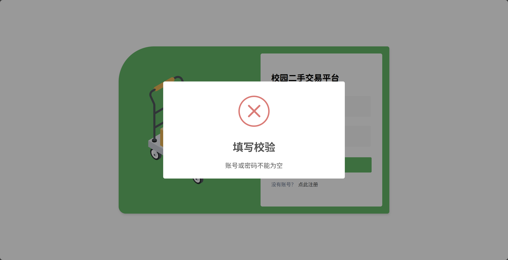
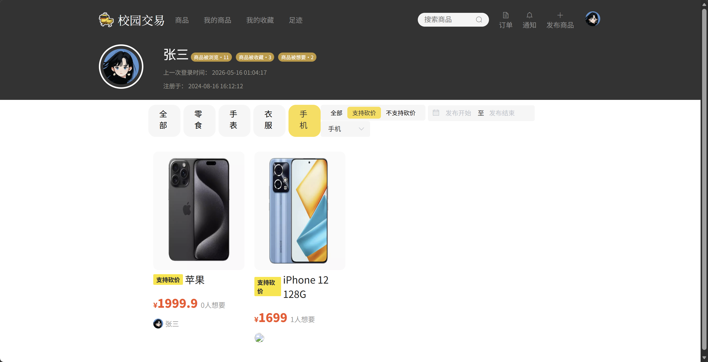
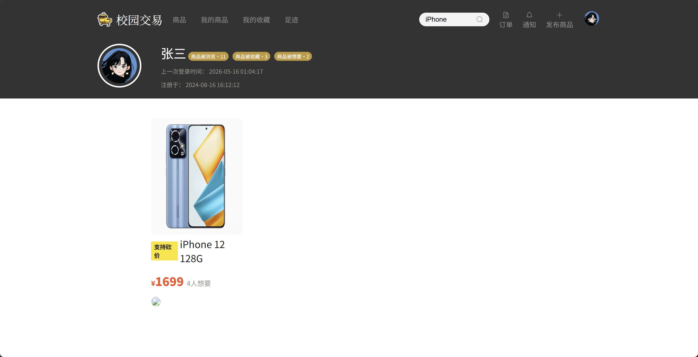
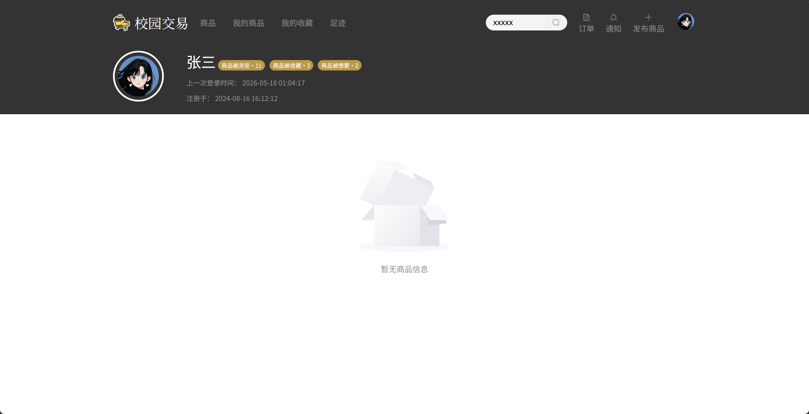
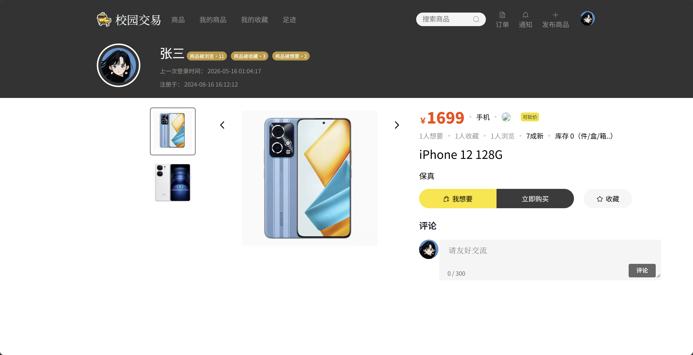
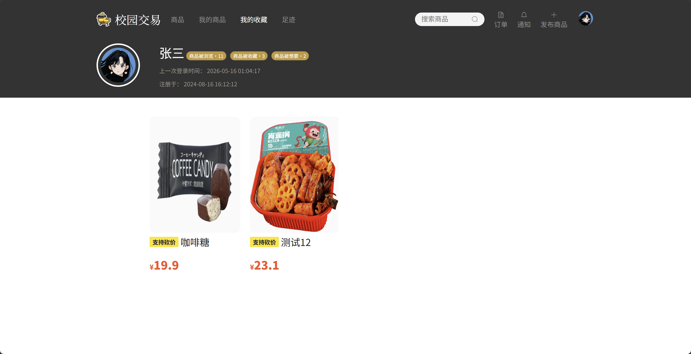
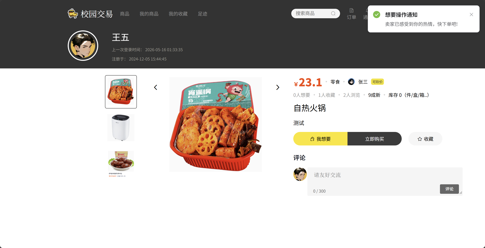

# 校园二手交易系统 - 前端界面展示文档

## 一、 引言

### 1.1 项目背景与前端定位
本系统是专为高校校园设计的二手交易与低碳循环回收平台。作为前端开发负责人，本项目的前端研发定位为**“高交互性、轻量化、极简美观的校园生活服务终端”**。前端不仅需要承载复杂的二手商品发布、多维筛选、即时消息互动、买卖双端订单流转等业务流程，还需要为系统管理员提供高可视化、直观易用的后台数据监管控制台。

### 1.2 前端视觉设计与用户体验
* **界面风格：** 采用清新温和的校园主题色（明黄色 `#FEDF46` 作为主色调，搭配高雅的灰蓝色与护眼底色），营造亲切、充满活力的校园氛围。
* **布局设计：** 大量采用 **Flexbox** 和 **CSS Grid** 响应式流式布局，完美适配主流 PC 分辨率（从 $1366 \times 768$ 到 $1920 \times 1080$），保证各组件在不同屏幕下的间距和谐、排版优雅。
* **交互体验：** 深度集成 **Element UI** 的响应式弹窗、即时反馈通知（Notification/Message）、流线型表单校验与步骤条，使用户在发布商品、下单交易、沟通互动时享有丝滑顺畅的“无感式”过渡体验。
* **数据可视化：** 引入 **ECharts 4.8.0** 绘制动态图表，实现后台多维指标的可视化呈现，让数据统计不再枯燥。

### 1.3 核心前端技术栈
* **核心框架：** Vue.js 2.6.11（渐进式 JavaScript 框架，实现高效的视图双向绑定）
* **路由管理：** Vue Router 3.2.0（支持路由全局守卫，实现无感知权限拦截）
* **UI 组件库：** Element UI 2.15.14（提供表单、对话框、表格、上传等丰富的高级组件支持）
* **网络请求：** Axios 0.21.1（配置全局请求/响应拦截器，自动装配 JWT Token 令牌）
* **富文本处理：** @wangeditor/editor 5.1.23（轻量级富文本编辑器，用于商品详情的精细化编排）

---
## 二、 普通用户端前台界面 (User Portal)

### 2.1 身份认证与安全设置 (Authentication & Security)

#### 2.1.1 登录界面 (Login)
* **设计概述：** 登录页面采用经典的“左侧品牌图 + 右侧登录卡片”的黄金分割布局。左侧插入趣味校园包包图（`bag.png`），右侧为扁平化输入框及高显眼度的“立即登录”按钮。
* **交互特性：** 
  * 支持输入为空的前端校验，若账号密码为空则使用 `SweetAlert2`（`$swal`）弹出醒目的错误提醒。
  * 用户密码在前端进行 **双重 MD5 加密** 后再通过 Axios 传输，极大地提升了用户账户在传输过程中的安全性。
  * 登录成功后，系统自动解析 JWT Token 中的用户角色属性，实现**管理员直达后台、普通用户直达商品首页**的智能路由导航。

*图 2-1 用户及管理员登录主界面*

*图 2-2 账号密码为空的前端即时校验提示*

#### 2.1.2 注册界面 (Register)
* **设计概述：** 注册模块支持新用户快捷创建账户，包含“学号/账号”、“用户昵称”、“密码设置”及“确认密码”四个核心输入字段。
* **安全拦截：** 两次密码输入不一致时，前端进行即时拦截并提示，避免无效的网络请求；若账号已被占用，后台返回的校验结果将通过 Element 通知组件即时反馈给用户。

*图 2-3 新用户注册信息填写界面*

*图 2-4 注册成功后的成功气泡与登录跳转引导*

#### 2.1.3 密码修改 (Reset Password)
* **设计概述：** 位于用户个人中心的“修改密码”面板，遵循密保安全规范，要求输入“原始旧密码”进行身份双重认证。
* **前端验证：** 包含旧密码空校验、新密码与确认密码一致性匹配。

*图 2-5 个人中心密码修改卡片*

*图 2-6 密码重置成功即时反馈*

---

### 2.2 商品浏览与智能检索 (Product Browse & Search)

#### 2.2.1 首页商品大厅 (Marketplace)
* **布局美学：** 采用标准的卡片网格流（Grid Layout）。每张商品卡片包含“商品精美缩略图（支持多图解析第一张封面）”、“新旧成色/支持砍价个性标签”、“商品标题”、“价格及想要人数”以及底部“卖家头像与昵称信息栏”。
* **动态反馈：** 卡片整体配备平滑的悬浮阴影（Box-Shadow Hover）与微缩放动效，极大增强了市场的可逛性。

*图 2-7 校园二手大厅商品瀑布流展示*

#### 2.2.2 多维条件筛选 (Filters)
为了帮助学生在一秒内定位心仪好物，前端大厅顶部集成了极其强大的**多维组合过滤器**：
1. **左侧大分类标签：** 以黄色活力圆角胶囊块展示“全部”、“数码”、“图书”等大类，点击即时触发商品重绘。
2. **砍价状态快捷筛选：** 可一键筛选“支持砍价”或“不支持砍价”商品，满足预算有限学生的需要。
3. **日期范围选择器：** Element 日期范围组件，用于定位特定时间内发布的新上架宝贝。
4. **类别下拉精细化检索：** 联动后端动态分类数据源进行按需展示。

*图 2-8 选中特定商品分类后的精细化筛选流*

*图 2-9 开启“支持砍价”后的过滤显示*

#### 2.2.3 关键词搜索 (Search)
* **设计特性：** 独立的搜索页面，支持历史搜索词缓存。当用户输入关键字（如 "iPhone"）时，系统进行高效的模糊匹配检索。
* **友好兜底：** 当搜索无结果时，展示 Element 优雅的 `el-empty` 空数据状态插画，避免界面突兀。

*图 2-10 输入关键字搜索“iPhone”得到的匹配列表*

*图 2-11 搜索无匹配结果时的友好兜底空状态*

---

### 2.3 商品详情与深度交互 (Product Detail & Interaction)

#### 2.3.1 商品图文详情展示 (Carousel & Rich Text)
* **图片轮播（Carousel）：** 左侧大图展示区集成了精美的图片轮播切换，支持鼠标悬停切换及手动箭头微调，多角度还原二手物品的真实面貌。
* **属性列表：** 清晰呈现当前库存、新旧级别（几成新）、发布日期、卖家信用状况等，并高亮价格字段。
* **详情说明：** 底侧使用 HTML 容器安全渲染，完美还原卖家利用富文本编辑器排版出的个性排版、彩色文字与插图信息。

*图 2-12 商品详情页主视图（轮播图与核心参数区域）*

#### 2.3.2 留言评论区 (Nested Comments)
* **嵌套式社交留言：** 详情页底侧集成功能完备的评论回复模块。支持直接对商品进行一级留言，或对特定用户的评论进行多级嵌套回复（Sub-replies）。
* **点赞动效：** 评论卡片右侧集成小爱心点赞，记录用户的认可。
* **禁言权限锁：** 若当前用户的账号状态在后台被管理员设置为“禁言状态”，则底部的留言框被禁用，并弹出相应的错误警示。

*图 2-13 留言评论框与发送即时回复演示*

#### 2.3.3 收藏夹功能 (Favorites)
* **状态联动：** 详情页中部提供“收藏”心形按钮。点击后按钮状态发生即时切换（按钮文字转为“取消收藏”并点亮图标），并在后台记录互动数据。
* **集中管理：** “我的收藏”列表页提供一键访问，方便用户持续跟进心仪好物的动态。

*图 2-14 点击“收藏”后的界面即时状态联动*

*图 2-15 个人中心“我的收藏”集中展示视图*

#### 2.3.4 “我想要”即时呼叫机制 (Want-it Alert)
* **业务概述：** 校园二手交易极度依赖即时沟通。“我想要”按钮充当了快速建立联系的桥梁。
* **防重发限制：** 点击后，系统除触发特效通知外，还会严格限制用户的二次点击，防止给卖家造成消息轰炸。
* **消息流传递：** 点击该按钮后，系统会自动在后台向卖家发送一条系统提示：“用户【xxx】对你的商品【xxx】非常感兴趣，快去和Ta聊聊吧！”

*图 2-16 触发“我想要”操作时的顶部温馨提示*
