## 一、测试环境

| 项目 | 值 |
|------|-----|
| 前端地址 | `http://localhost:21091` |
| 后端地址 | `http://localhost:21090`（需先启动） |
| 浏览器 | Chrome / Edge 最新版 |
| 测试账号 | 管理员：`admin` / 密码：`123456` |
| | 普通用户：`zhangsan` / 密码：`123456` |
| | 普通用户：`lisi` / 密码：`123456` |

## 二、功能测试

| 用例编号 | 用例标题 | 项目/模块 | 优先级 | 前置条件 | 测试步骤 | 测试数据 | 预期结果 | 实际结果 |
|---------|---------|----------|--------|---------|---------|---------|---------|---------|
| login_001 | 管理员成功登录 | 登录 | P0 | 数据库已导入初始数据 | 1、打开登录页面 2、输入账号和密码 3、点击"立即登录" | 账号：admin 密码：123456 | 登录成功，跳转到管理员首页 | |
| login_002 | 用户成功登录 | 登录 | P0 | 数据库已导入初始数据 | 1、打开登录页面 2、输入账号和密码 3、点击"立即登录" | 账号：zhangsan 密码：123456 | 登录成功，跳转到用户首页 | |
| login_003 | 错误密码登录 | 登录 | P2 | 打开登录页面 | 1、输入账号和错误密码 2、点击登录 | 账号：admin 密码：wrongpass | 弹出提示"密码错误"，登录失败 | |
| login_004 | 不存在的账号登录 | 登录 | P2 | 打开登录页面 | 1、输入不存在的账号 2、点击登录 | 账号：notexist 密码：123456 | 弹出提示"账号不存在"，登录失败 | |
| login_005 | 空账号空密码登录 | 登录 | P2 | 打开登录页面 | 1、不填任何信息 2、直接点击登录 | 账号：（空） 密码：（空） | 弹出提示"账号或密码不能为空" | |
| Register_001 | 用户成功注册 | 注册 | P1 | 打开登录页面 | 1、点击"点此注册"链接 2、填写注册信息 3、点击注册按钮 | 账号：test001 用户名：测试用户 密码：123456 确认密码：123456 邮箱：test@test.com | 注册成功，自动跳转回登录页面 | |
| Register_002 | 重复账号注册 | 注册 | P2 | 已存在admin账号 | 1、进入注册页面 2、填写已存在的账号 | 账号：admin 用户名：重复 密码：123456 | 弹出提示"账号不可用"，注册失败 | |
| Product_001 | 查看商品列表 | 商品浏览 | P0 | 已登录为普通用户 | 1、登录后进入用户首页 2、点击左侧菜单"商品" | 无 | 显示所有已发布的商品（名称、价格、图片） | |
| Product_002 | 查看商品详情 | 商品浏览 | P0 | 已登录，有商品数据 | 在商品列表中点击任意商品 | 无 | 显示商品完整信息（名称、描述、价格、发布者等） | |
| Product_003 | 搜索商品 | 商品浏览 | P1 | 已登录 | 1、在搜索框输入关键词 2、点击搜索或回车 | 关键词：iPhone | 搜索结果只显示包含"iPhone"的商品 | |
| Product_004 | 无结果搜索 | 商品浏览 | P2 | 已登录 | 搜索框中输入不存在的关键词 | 关键词：xyzabc123 | 显示"暂无数据"或空结果 | |
| Product_005 | 发布商品-成功 | 商品管理 | P1 | 已登录为zhangsan | 1、点击左侧"发布商品" 2、填写商品信息 3、点击发布 | 名称：测试笔记本 描述：九成新 分类：电子产品 价格：2000 库存：1 新旧：9成新 | 发布成功，跳转商品列表，出现新商品 | |
| Product_006 | 发布商品-名称为空 | 商品管理 | P2 | 已登录 | 1、进入发布商品页面 2、不填商品名称 3、点击发布 | 名称：（空） 其他字段正常 | 提示名称不能为空或发布按钮不可用 | |
| Product_007 | 查看我的商品 | 商品管理 | P1 | 已登录，有已发布商品 | 点击"我的商品" | 无 | 只显示当前用户发布的商品 | |
| Product_008 | 编辑我的商品 | 商品管理 | P1 | 已有自己的商品 | 1、在我的商品中点击"编辑" 2、修改信息 3、保存 | 修改后名称：已修改测试笔记本 价格：1800 | 修改成功，商品信息更新 | |
| Save_001 | 收藏商品 | 互动功能 | P1 | 已登录，打开商品详情 | 在商品详情页点击"收藏"按钮 | 无 | 收藏成功，按钮状态变化 | |
| Save_002 | 取消收藏 | 互动功能 | P1 | 已收藏该商品 | 再点击一次"收藏"按钮 | 无 | 取消收藏成功 | |
| Save_003 | 查看我的收藏 | 互动功能 | P1 | 已收藏至少1个商品 | 点击"我的收藏" | 无 | 显示所有收藏的商品列表 | |
| View_001 | 查看浏览足迹 | 互动功能 | P1 | 已浏览过商品 | 1、浏览几个商品 2、点击左侧"足迹" | 无 | 显示浏览过的商品记录 | |
| View_002 | 清空浏览记录 | 互动功能 | P2 | 有浏览记录 | 在足迹页面点击"清空" | 无 | 浏览记录被清空 | |
| Want_001 | "我想要"操作 | 互动功能 | P2 | 已登录，打开商品详情 | 在商品详情页点击"我想要"按钮 | 无 | 操作成功，按钮状态变化 | |
| Order_001 | 下单购买商品 | 订单管理 | P1 | 已登录为zhangsan | 1、进入商品详情 2、点击"立即购买" 3、填写备注 4、确认下单 | 商品ID：2（高等数学） 备注：测试下单 | 下单成功，跳转到订单页面 | |
| Order_002 | 查看我的订单 | 订单管理 | P1 | 已有至少1个订单 | 点击左侧"订单" | 无 | 显示自己下过的所有订单记录 | |
| Order_003 | 确认订单 | 订单管理 | P1 | 有未完成的订单 | 在订单列表中点击"确认收货" | 无 | 订单状态变为已完成 | |
| Eval_001 | 发表评论 | 评论功能 | P1 | 已登录，打开商品详情 | 1、在商品详情页底部评论框输入内容 2、点击发表 | 评论内容：这个商品看起来不错！ | 评论发布成功，显示在评论列表中 | |
| Eval_002 | 回复评论 | 评论功能 | P1 | 商品已有评论 | 1、在已有评论下点击"回复" 2、输入回复内容 3、提交 | 回复内容：谢谢支持！ | 回复成功，以嵌套形式显示 | |
| Eval_003 | 发表空评论 | 评论功能 | P2 | 已登录 | 1、不填评论内容 2、直接点击发表 | 评论内容：（空） | 提示评论内容不能为空 | |
| Msg_001 | 查看消息 | 消息管理 | P1 | 已登录为有消息的用户 | 点击"消息" | 无 | 显示收到的消息列表 | |
| Msg_002 | 全部标记已读 | 消息管理 | P1 | 有未读消息 | 1、进入消息页面 2、点击"全部标记已读" | 无 | 所有消息变为已读状态 | |
| User_001 | 查看个人中心 | 个人中心 | P1 | 已登录 | 点击左侧"个人中心" | 无 | 显示当前用户个人信息 | |
| User_002 | 修改个人信息 | 个人中心 | P1 | 已登录 | 1、在个人中心修改昵称 2、修改邮箱 3、点击保存 | 昵称：张三（已修改） 邮箱：new@test.com | 修改成功，页面信息更新 | |
| User_003 | 修改密码-成功 | 个人中心 | P1 | 已登录 | 1、点击"修改密码" 2、输入旧密码、新密码、确认密码 3、提交 | 旧密码：123456 新密码：12345678 确认密码：12345678 | 修改密码成功 | |
| User_004 | 修改密码-新旧不一致 | 个人中心 | P2 | 已登录 | 1、修改密码 2、两次新密码输入不一致 | 旧密码：123456 新密码：new123 确认密码：new456 | 提示"前后密码输入不一致" | |
| Admin_001 | 查看仪表盘 | 仪表盘 | P1 | 管理员admin已登录 | 登录后默认进入仪表盘 | 无 | 显示统计数据（用户总数、商品总数、订单总数、评论总数） | 成功。 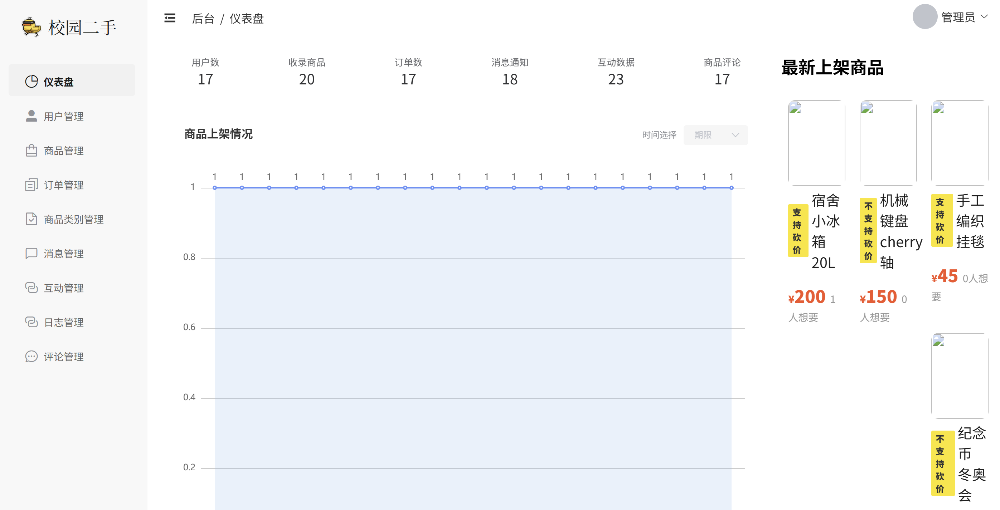|
| Admin_002 | 商品上架趋势-切换为近7天 | 仪表盘 | P2 | 管理员已登录 | 在趋势图上方的日期选择器中选择"7天内" | day=7 | 折线图更新为近7天的上架数据，仅显示有商品上架的日期 | 失败。并未显示7天内的上架数据的折线图 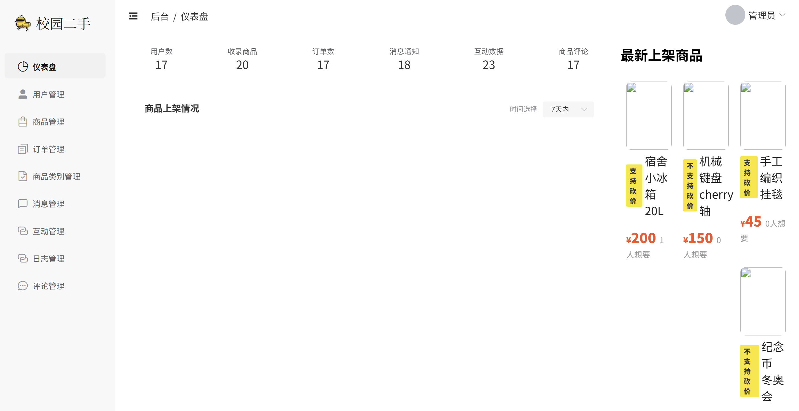 |
| Admin_003 | 查看用户列表 | 用户管理 | P1 | 管理员已登录 | 点击左侧"用户管理" | 无 | 分页显示所有注册用户 | 成功。 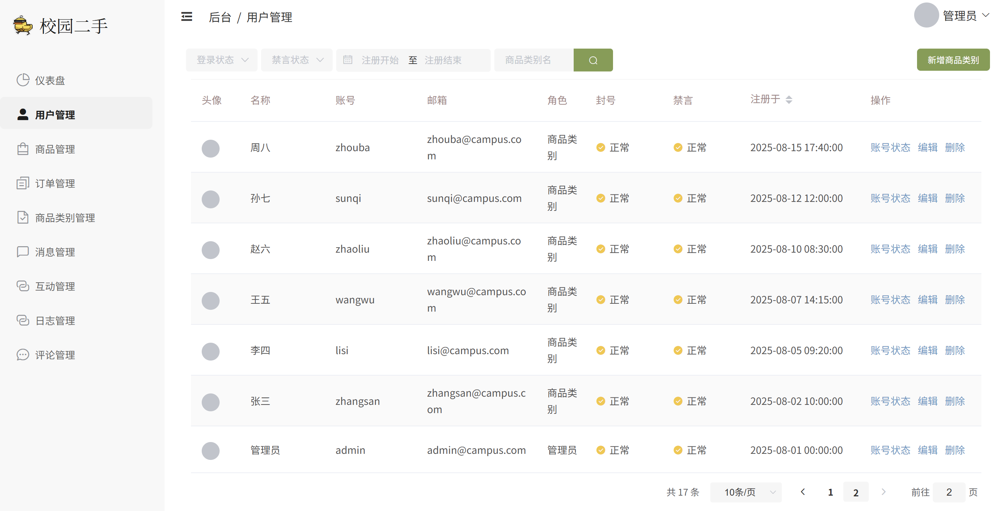 |
| Admin_004 | 管理员新增用户 | 用户管理 | P1 | 管理员已登录 | 1、点击"新增" 2、填写用户信息 3、提交 | 账号：newadmin 昵称：新建用户 密码：123456 | 新增成功，列表出现新用户 |  |
| Admin_005 | 管理员编辑用户 | 用户管理 | P1 | 管理员已登录 | 1、点击用户的"编辑" 2、修改信息 3、提交 | 修改昵称：已修改 | 修改成功 | |
| Admin_006 | 管理员删除用户 | 用户管理 | P1 | 管理员已登录，有测试用户 | 1、确定要删除的用户 2、点击"删除" 3、确认 | 删除：test001 | 选中用户被删除 | |
| Admin_007 | 查看商品管理列表 | 商品管理 | P1 | 管理员已登录 | 点击左侧"商品管理" | 无 | 显示所有用户发布的商品 | 成功。但左侧边栏宽度有问题。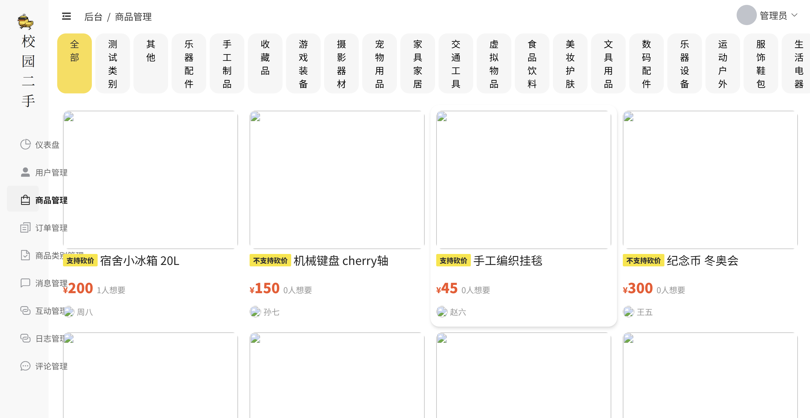 |
| Admin_008 | 查看订单列表 | 订单管理 | P1 | 管理员已登录 | 点击左侧"订单管理" | 无 | 显示所有订单 | 成功。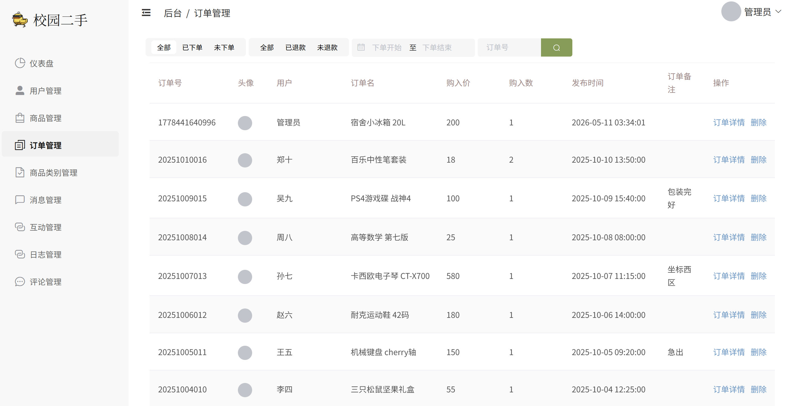 |
| Admin_009 | 查看类别列表 | 类别管理 | P1 | 管理员已登录 | 点击左侧"商品类别管理" | 无 | 显示所有商品分类 | 成功。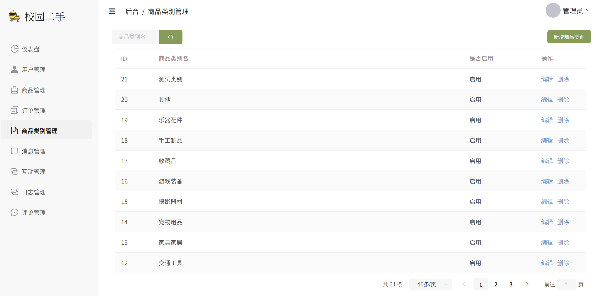  |
| Admin_010 | 新增商品类别 | 类别管理 | P1 | 管理员已登录 | 1、点击"新增商品类别" 2、输入分类名称 3、提交 | 分类名称：测试新增 | 新增成功 | 成功。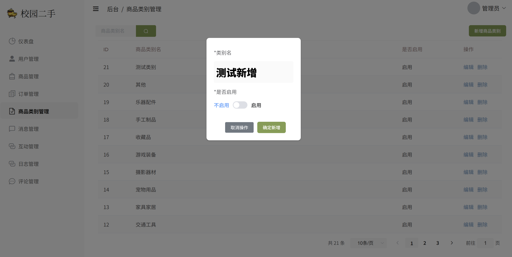   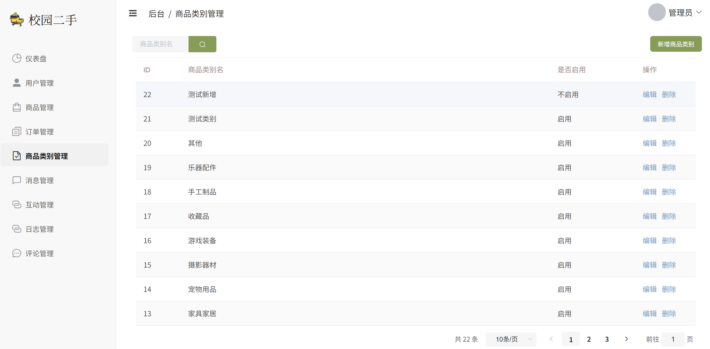  |
| Admin_011 | 修改商品类别 | 类别管理 | P2 | 管理员已登录 | 1、点击"编辑" 2、修改名称 3、提交 | 修改名称：测试新增已修改 | 修改成功 | 成功。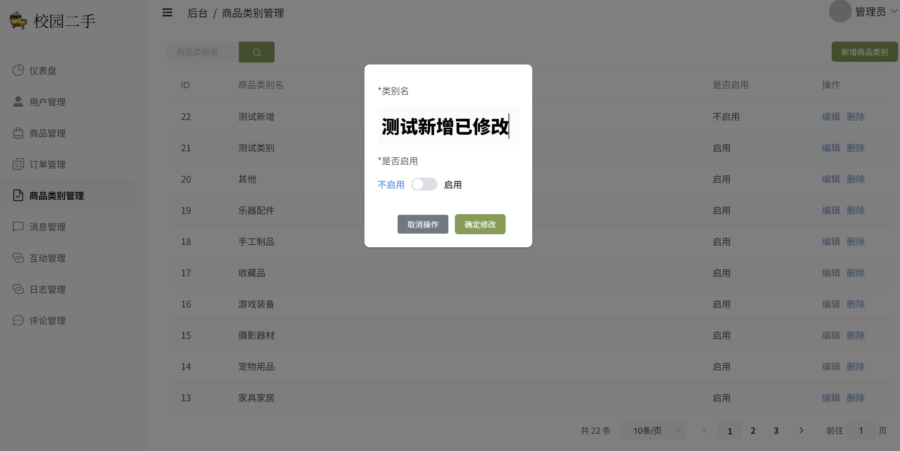   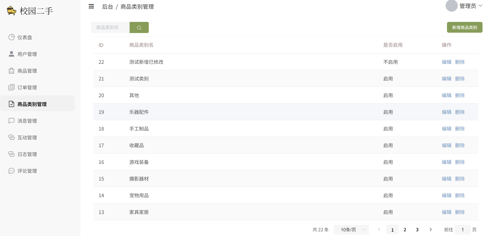  |
| Admin_012 | 删除商品类别 | 类别管理 | P2 | 管理员已登录 | 选择分类，点击"删除" | 删除分类ID：测试新增已修改 | 删除成功 | 失败。显示“商品类别信息删除异常”。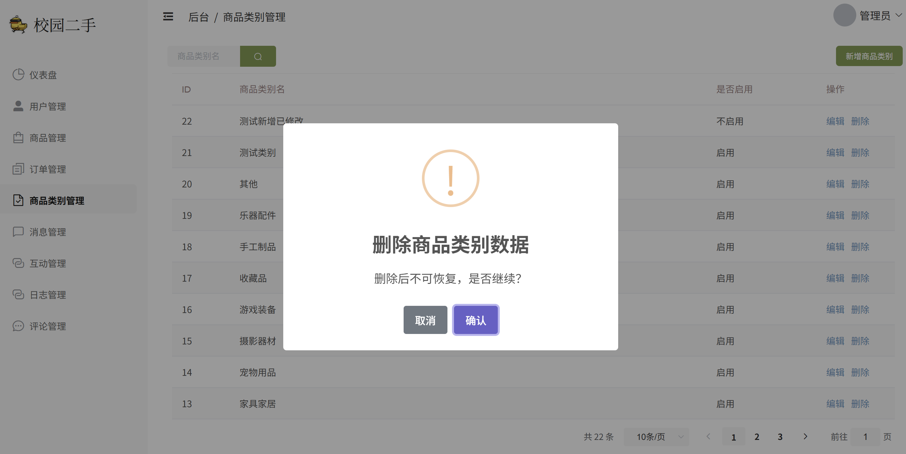   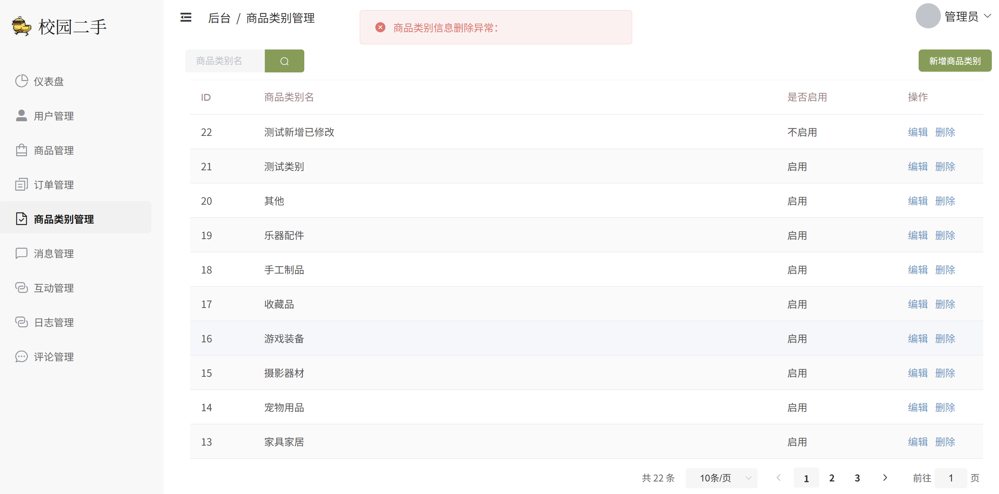 |
| Admin_013 | 查看消息列表 | 消息管理 | P2 | 管理员已登录 | 点击左侧"消息管理" | 无 | 显示所有消息记录 | 成功。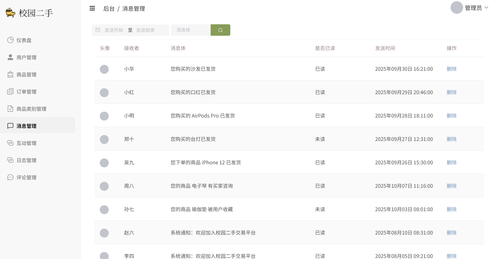  |
| Admin_014 | 管理员删除消息 | 消息管理 | P2 | 管理员已登录，有消息数据 | 选择消息，点击"删除" | 无 | 删除成功 | 失败。显示“消息信息删除异常”。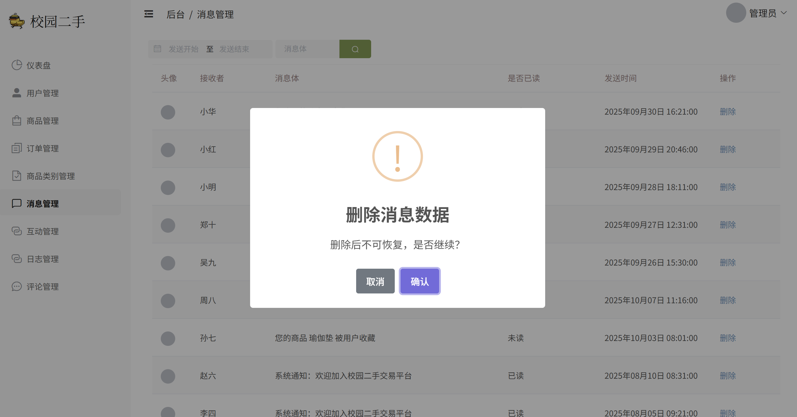   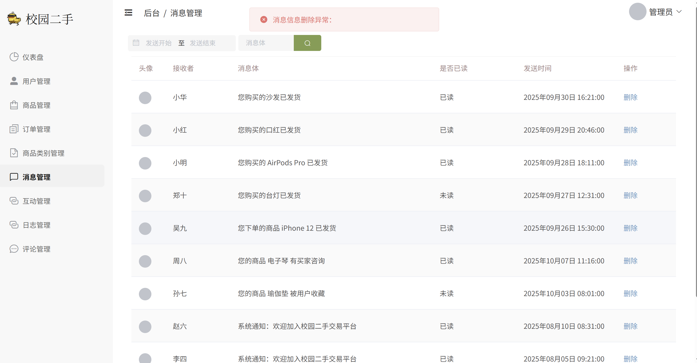  |
| Admin_015 | 查看互动记录 | 互动管理 | P2 | 管理员已登录 | 点击左侧"互动管理" | 无 | 显示所有互动记录 | |
| Admin_016 | 管理员互动记录 | 互动管理 | P2 | 管理员已登录，有互动数据 | 选择互动，点击"删除" | 无 | 删除成功 | |
| Admin_017 | 查看操作日志 | 日志管理 | P1 | 管理员已登录 | 点击左侧"日志管理" | 无 | 显示操作日志列表 | |
| Admin_018 | 管理员日志记录 | 日志管理 | P2 | 管理员已登录，有日志数据 | 选择日志记录，点击"删除" | 无 | 删除成功 | |
| Admin_019 | 查看评论列表 | 评论管理 | P1 | 管理员已登录 | 点击左侧"评论管理" | 无 | 显示所有评论记录 | |
| Admin_020 | 管理员删除评论 | 评论管理 | P2 | 管理员已登录，有评论数据 | 选择评论，点击"删除" | 无 | 删除成功 | |

### 4.2 Bug记录表

| Bug编号 | 关联用例 | 模块 | 问题描述 | 严重程度 | 复现步骤 | 状态 |
|---------|---------|------|---------|---------|---------|------|
| BUG-001 | | | | □高 □中 □低 | | □待修复 □已修复 |
| BUG-002 | | | | □高 □中 □低 | | □待修复 □已修复 |
| BUG-003 | | | | □高 □中 □低 | | □待修复 □已修复 |

## 三、使用说明

1. **前置条件**：确保后端已启动（端口21090）、前端已启动（端口21091）、数据库已初始化
2. **测试账号**：
   - 管理员：`admin` / `123456`
   - 普通用户A：`zhangsan` / `123456`
   - 普通用户B：`lisi` / `123456`
3. **测试标记**：在"实际结果"列填写实际情况，在"状态"列打勾
4. **发现Bug**：在Bug记录表中记录，包含操作步骤和截图
5. **数据依赖**：某些用例依赖前置用例产生的数据（如TC-F-001产生订单后，TC-F-002才能测试退款）