#### 2.1 测试环境

| 项目 | 值 |
|------|-----|
| 前端地址 | `http://localhost:21091` |
| 后端地址 | `http://localhost:21090`（需先启动） |
| 浏览器 | Chrome / Edge 最新版 |
| 测试账号 | 管理员：`admin` / 密码：`123456` |
| | 普通用户：`zhangsan` / 密码：`123456` |
| | 普通用户：`lisi` / 密码：`123456` |

#### 2.2 功能测试

##### 2.2.1 测试用例表

###### 2.2.1.1 登录功能

| 用例编号 | 用例标题 | 项目/模块 | 优先级 | 前置条件 | 测试步骤 | 测试数据 | 预期结果 | 实际结果 |
|---------|---------|----------|--------|---------|---------|---------|---------|---------|
| login_001 | 管理员成功登录 | 登录 | P0 | 数据库已导入初始数据 | 1. 打开登录页面 2. 输入账号和密码 3. 点击"立即登录" | 账号：admin 密码：123456 | 登录成功，跳转到管理员首页 | 成功。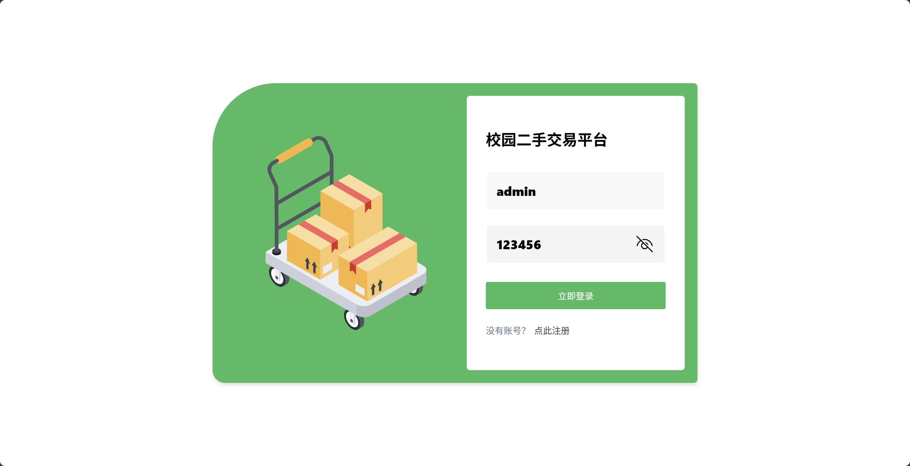   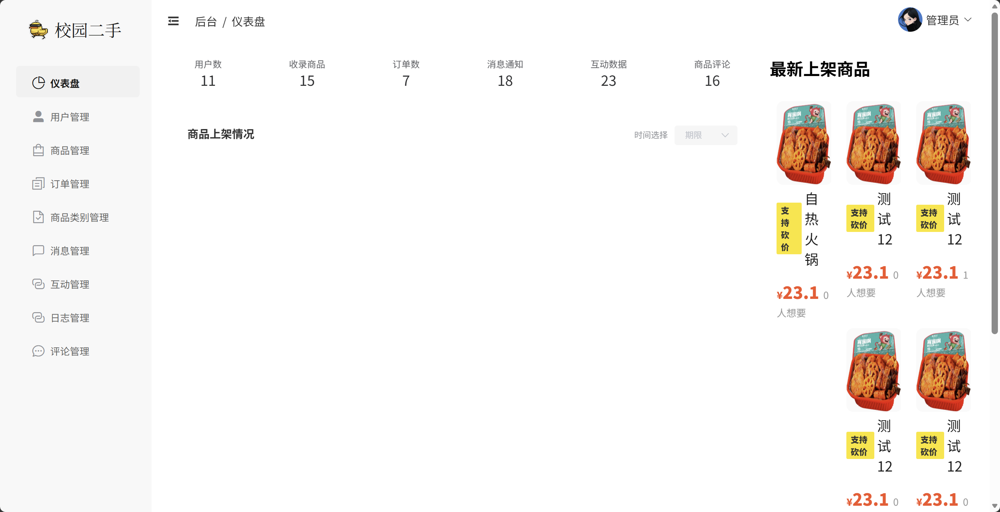 |
| login_002 | 普通用户成功登录 | 登录 | P0 | 数据库存在普通用户 | 1. 打开登录页面 2. 输入账号和密码 3. 点击"立即登录" | 账号：zhangsan 密码：123456 | 登录成功，跳转到用户首页 | 成功。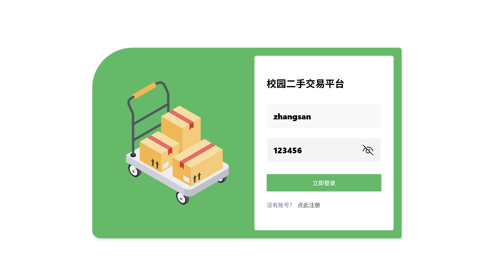   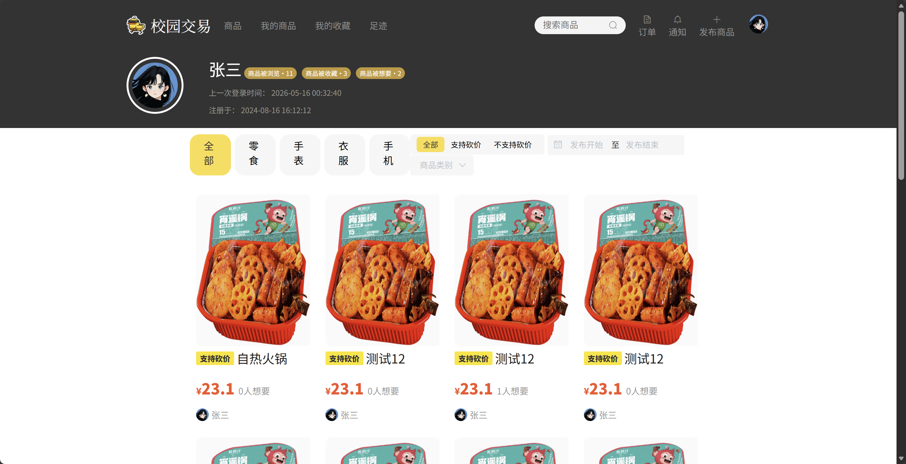 |
| login_003 | 登录-账号不存在 | 登录 | P1 | 无 | 1. 打开登录页面 2. 输入不存在的账号 3. 输入任意密码 4. 点击"立即登录" | 账号：notexist 密码：123456 | 提示"账号不存在" | 成功。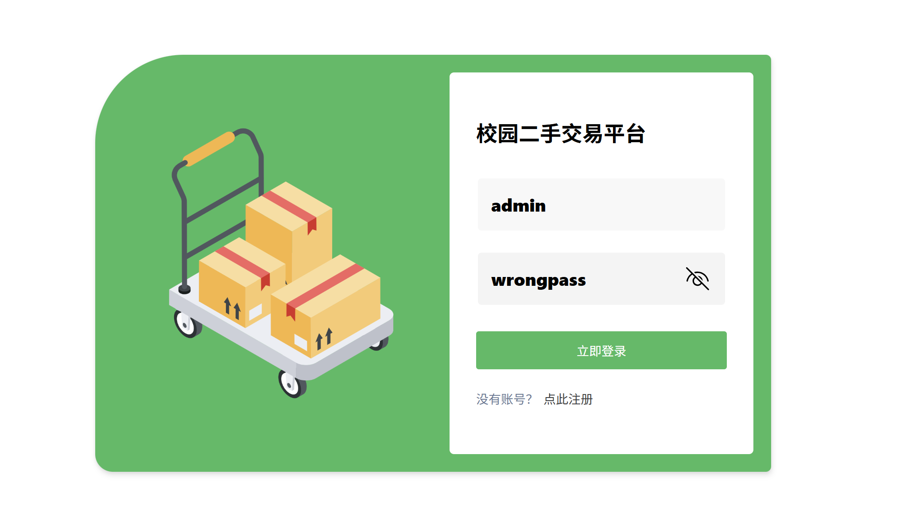   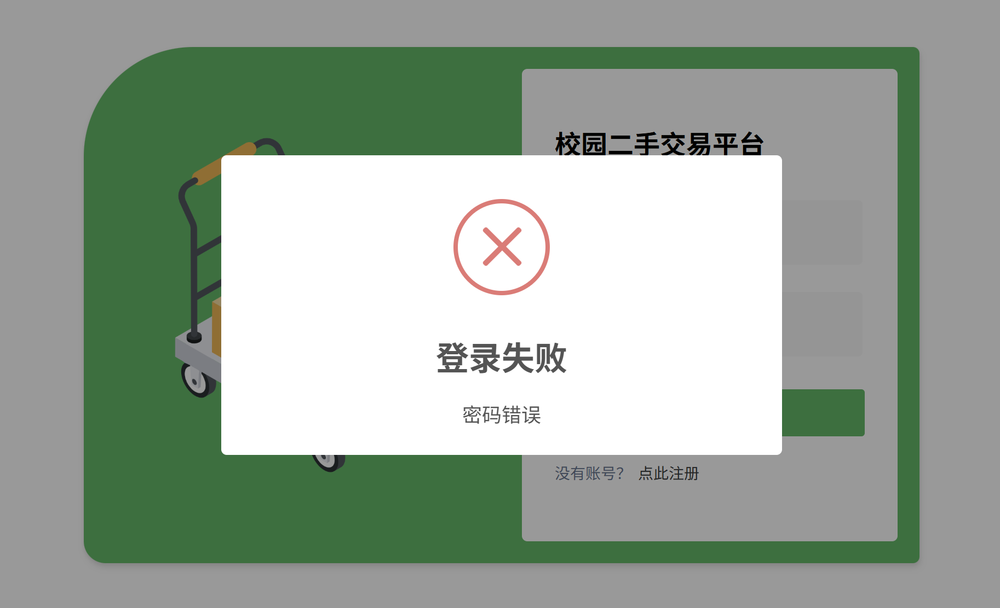 |
| login_004 | 登录-密码错误 | 登录 | P1 | 数据库中用户admin存在 | 1. 打开登录页面 2. 输入正确账号 3. 输入错误密码 4. 点击"立即登录" | 账号：admin 密码：wrongpwd | 提示"密码错误" | 成功。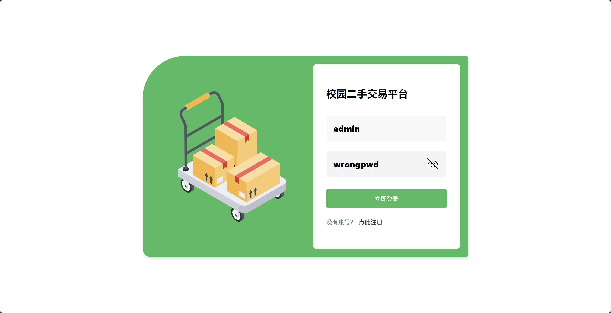   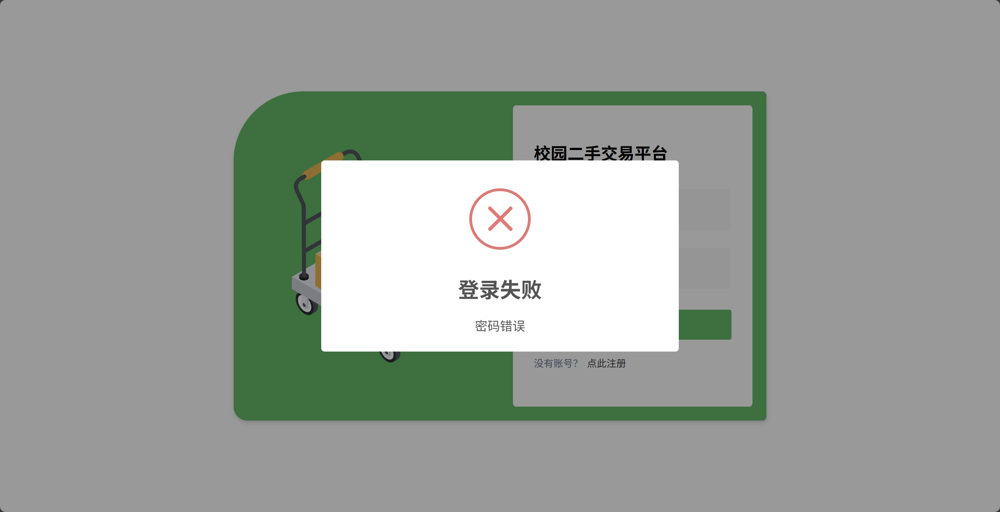 |
| login_005 | 登录-账号为空 | 登录 | P2 | 无 | 1. 打开登录页面 2. 账号输入框为空 3. 输入密码 4. 点击"立即登录" | 账号： 密码：123456 | 前端提示"账号或密码不能为空" | 成功。    |
| login_006 | 登录-密码为空 | 登录 | P2 | 无 | 1. 打开登录页面 2. 输入账号 3. 密码输入框为空 4. 点击"立即登录" | 账号：admin 密码： | 前端提示"账号或密码不能为空" | 成功。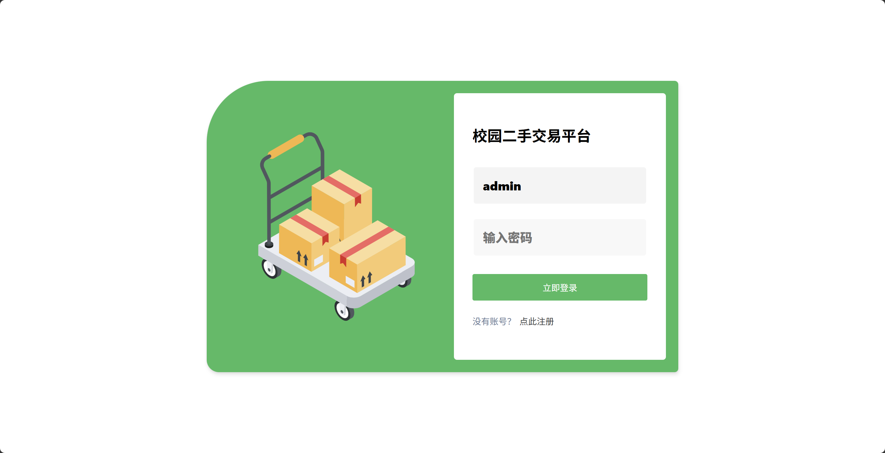    |
| login_007 | 登录-被封号用户登录 | 登录 | P1 | 用户lisi(is_login=1)已存在 | 1. 打开登录页面 2. 输入被封号的账号和正确密码 3. 点击"立即登录" | 账号：lisi 密码：123456 | 提示"登录状态异常" | 成功。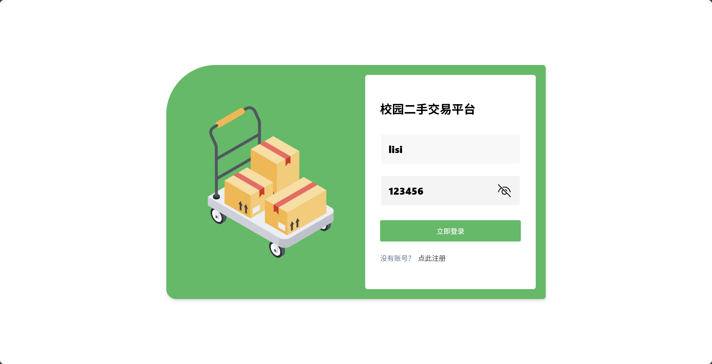   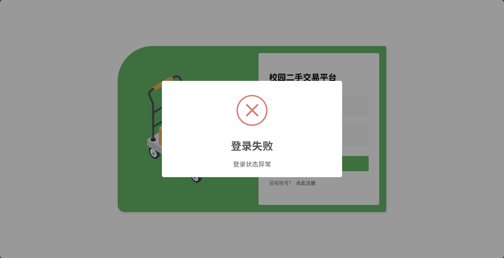 |

###### 2.2.1.2 注册功能

| 用例编号 | 用例标题 | 项目/模块 | 优先级 | 前置条件 | 测试步骤 | 测试数据 | 预期结果 | 实际结果 |
|---------|---------|----------|--------|---------|---------|---------|---------|---------|
| register_001 | 用户注册-成功 | 注册 | P0 | 账号未被占用 | 1. 打开注册页面 2. 填写新账号、用户名、密码、确认密码 3. 点击"立即注册" | 新账号：test001 用户名：测试用户 密码：123456 | 注册成功，可跳转登录页 | 成功。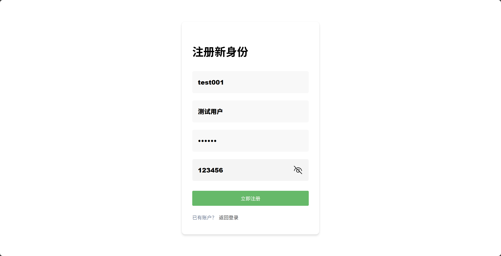   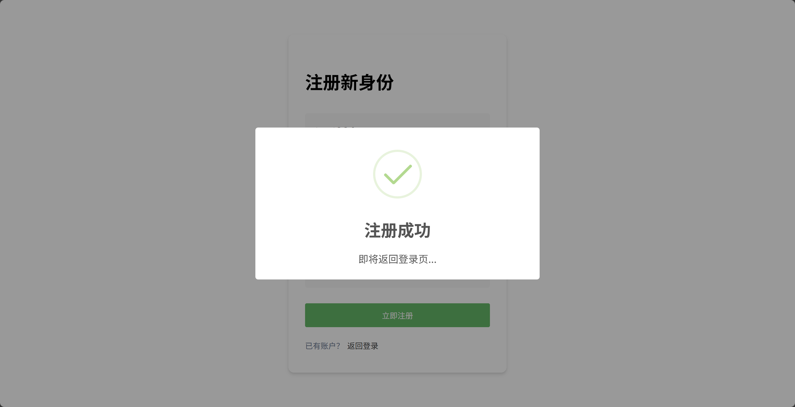   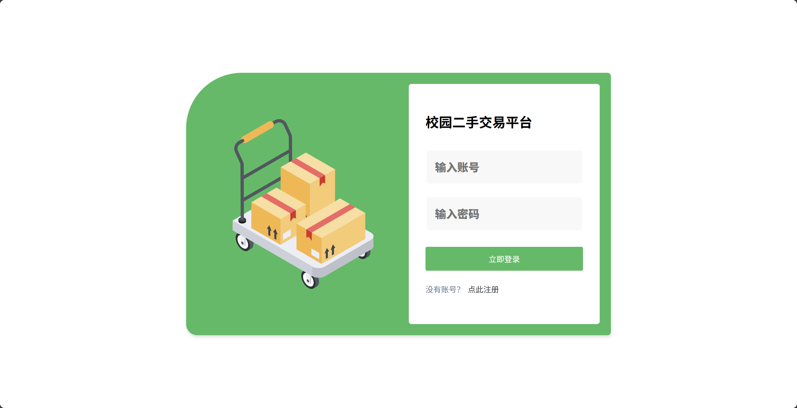 |
| register_002 | 注册-账号已存在 | 注册 | P1 | 账号admin已存在 | 1. 打开注册页面 2. 填写已存在的账号 3. 填写其他信息 4. 点击"立即注册" | 账号：admin 用户名：新用户 密码：123456 | 提示"账号不可用" | 成功。   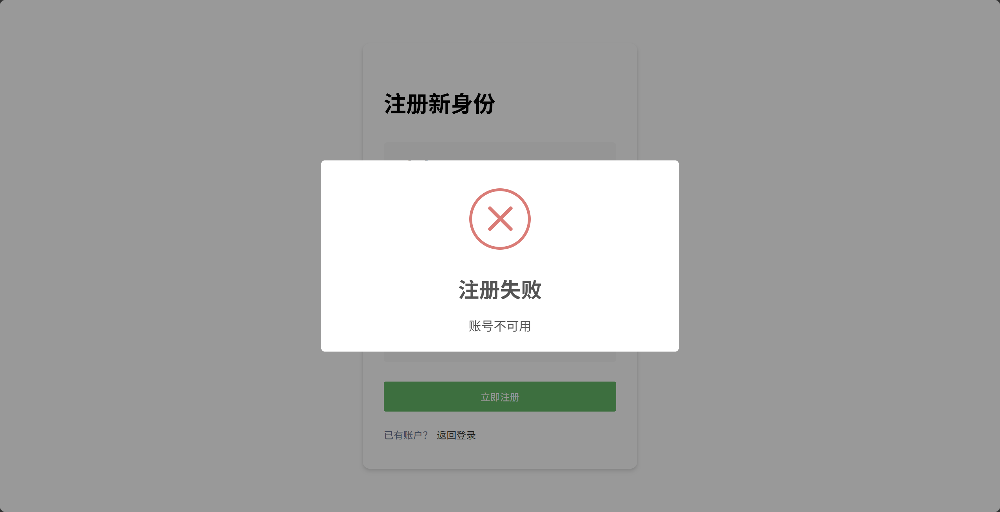 |
| register_003 | 注册-表单字段为空 | 注册 | P2 | 无 | 1. 打开注册页面 2. 不填或漏填必填项 3. 点击"立即注册" | 账号/用户名/密码为空 | 前端提示"账户或密码或用户名不能为空" | 成功。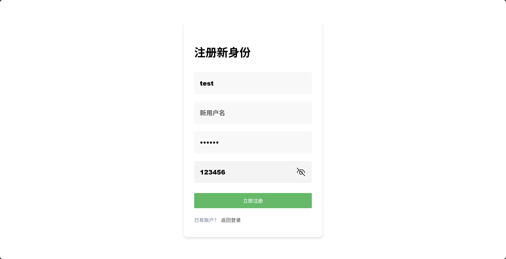   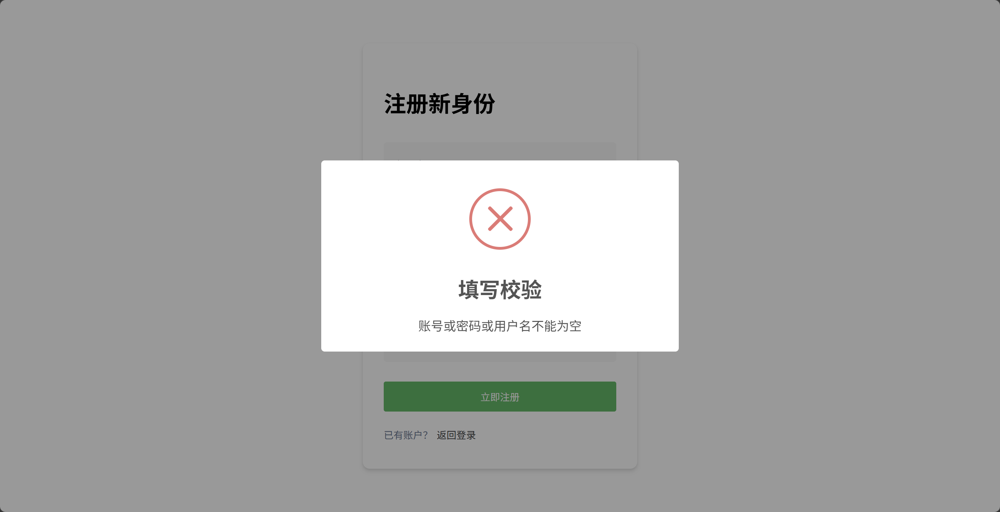 |

###### 2.2.1.3 商品浏览与搜索（普通用户）

| 用例编号 | 用例标题 | 项目/模块 | 优先级 | 前置条件 | 测试步骤 | 测试数据 | 预期结果 | 实际结果 |
|---------|---------|----------|--------|---------|---------|---------|---------|---------|
| product_001 | 首页浏览全部商品 | 商品浏览 | P0 | 数据库有商品数据 | 1. 普通用户登录进入首页 2. 查看商品列表 | 无 | 显示所有上架商品（封面、价格、名称、卖家信息、想要人数） | 成功。 |
| product_002 | 按商品分类筛选 | 商品浏览 | P1 | 分类数据存在且有对应商品 | 1. 进入商品列表页面 2. 点击某个分类标签 | 分类：手机 | 仅显示手机分类的商品 | 成功。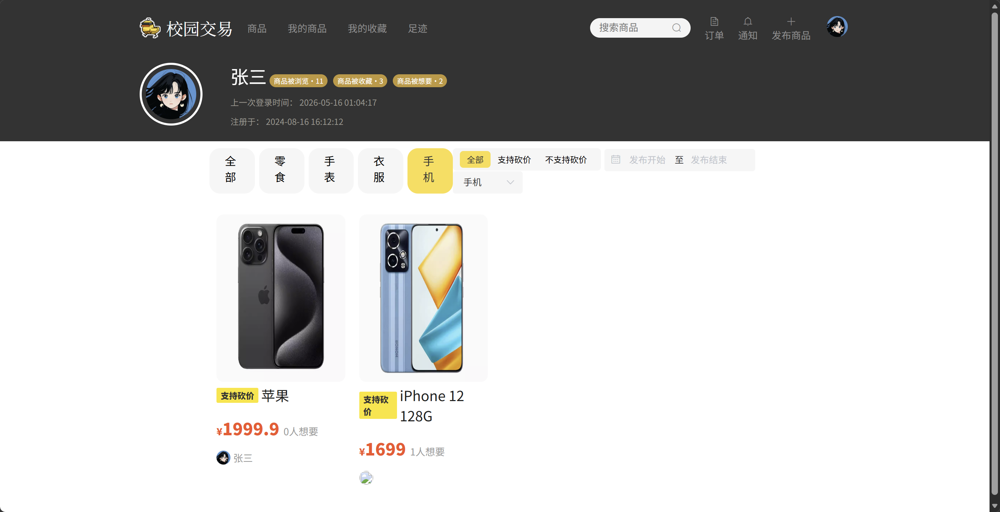 |
| product_003 | 按砍价状态筛选 | 商品浏览 | P2 | 存在支持/不支持砍价商品 | 1. 进入商品列表页面 2. 点击"支持砍价"或"不支持砍价"标签 | 筛选：支持砍价 | 仅显示支持砍价的商品 | 成功。 |
| product_004 | 按发布时间范围筛选 | 商品浏览 | P2 | 商品数据存在 | 1. 进入商品列表页面 2. 选择日期范围 | 日期：2024-12-10 至 2024-12-20 | 仅显示该时间范围内发布的商品 | 成功。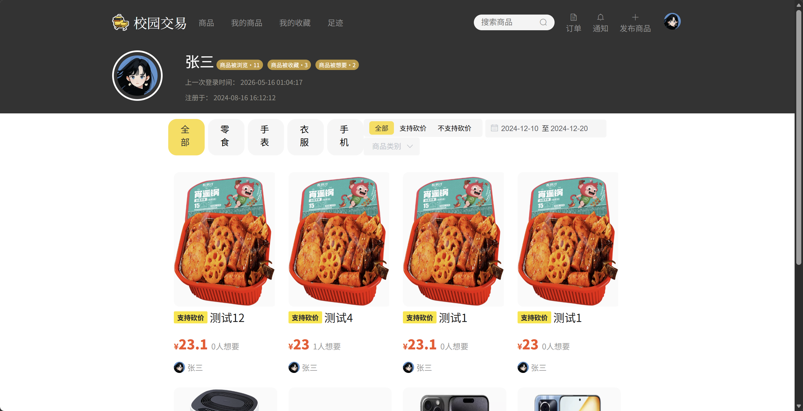 |
| product_005 | 按商品类别下拉筛选 | 商品浏览 | P1 | 商品类别数据存在 | 1. 进入商品列表页面 2. 在右侧下拉框选择商品类别 | 类别：手机 | 仅显示手机类别的商品 | 成功。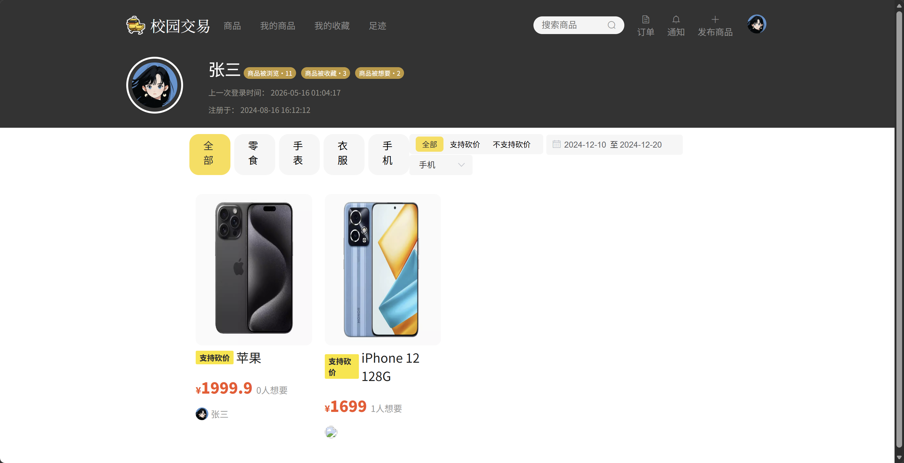 |
| product_006 | 搜索商品-按名称 | 商品搜索 | P0 | 商品数据存在 | 1. 进入搜索页 2. 输入商品名称关键字 3. 点击搜索 | 搜索词：iPhone | 显示包含"iPhone"的商品列表 | 成功。 |
| product_007 | 搜索商品-无结果 | 商品搜索 | P2 | 无匹配商品 | 1. 进入搜索页 2. 输入不存在的商品名 3. 点击搜索 | 搜索词：xxxxx | 显示"暂无商品信息" | 成功。 |

###### 2.2.1.4 商品详情与互动

| 用例编号 | 用例标题 | 项目/模块 | 优先级 | 前置条件 | 测试步骤 | 测试数据 | 预期结果 | 实际结果 |
|---------|---------|----------|--------|---------|---------|---------|---------|---------|
| detail_001 | 查看商品详情 | 商品详情 | P0 | 商品数据存在且用户已登录 | 1. 在商品列表点击某个商品 2. 查看详情页面 | 商品ID：1（iPhone 12） | 显示商品大图、价格、分类、卖家、新旧程度、库存、商品描述、互动数据（浏览/收藏/想要数） | 成功。 |
| detail_002 | 商品图片切换 | 商品详情 | P1 | 商品有多张图片 | 1. 进入商品详情页 2. 点击左右箭头或小图切换 | 商品有多张封面图 | 大图切换显示对应的图片 | 成功。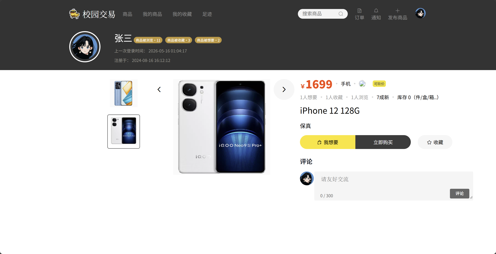 |
| collect_001 | 收藏商品 | 互动 | P0 | 用户已登录，商品非自己发布 | 1. 进入商品详情页 2. 点击"收藏"按钮 | 商品：苹果 | 按钮变为"取消收藏"，互动记录新增收藏 | 成功。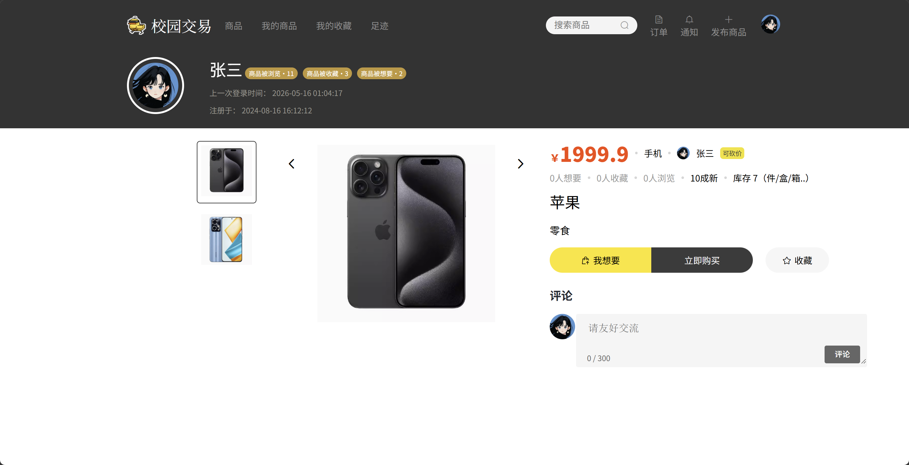   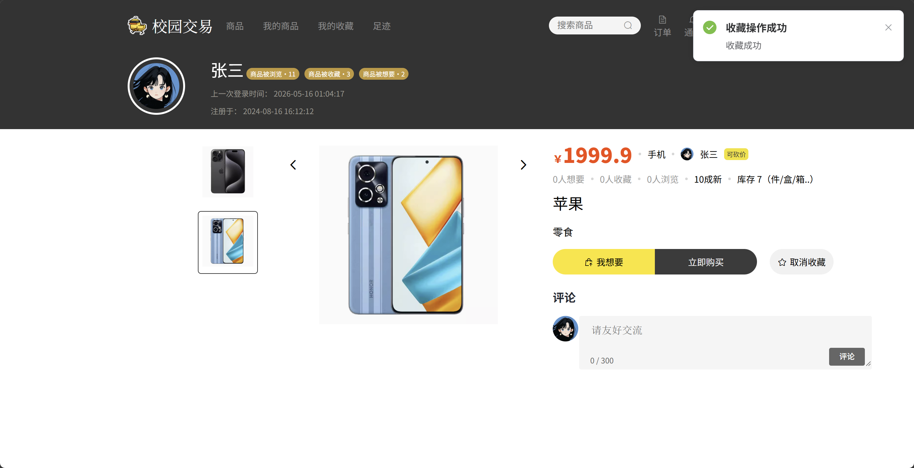 |
| collect_002 | 取消收藏 | 互动 | P1 | 用户已收藏该商品 | 1. 进入商品详情页 2. 点击"取消收藏"按钮 | 同上商品 | 按钮恢复为"收藏"，收藏记录被删除 | 成功。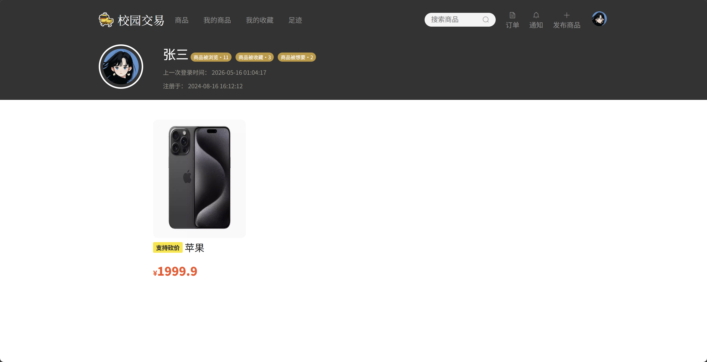   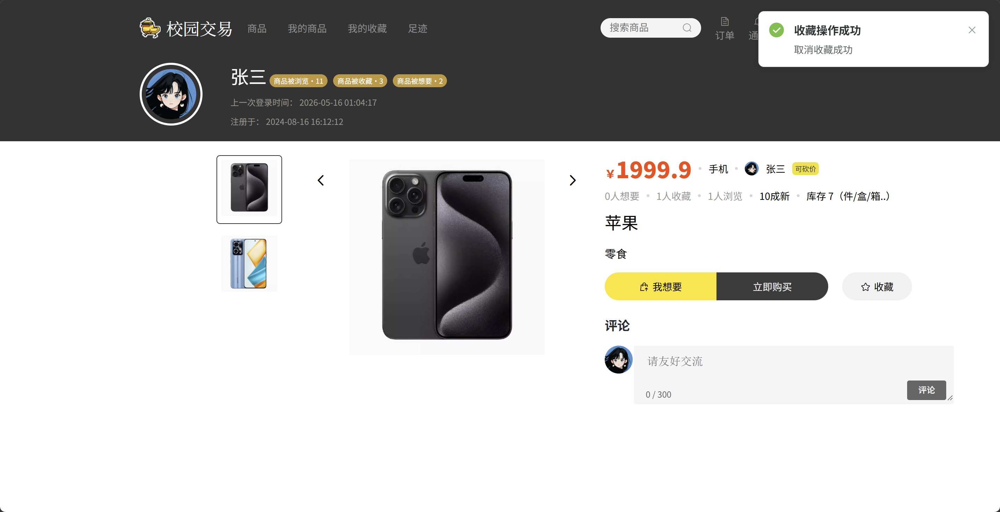   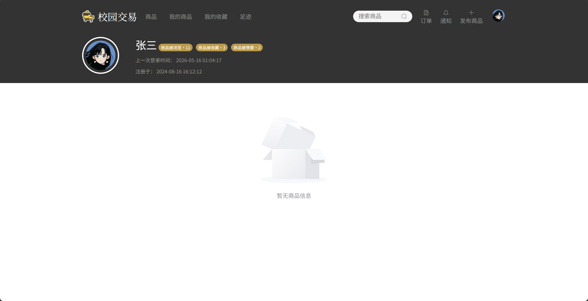 |
| collect_003 | 查看我的收藏列表 | 互动 | P1 | 用户有收藏的商品 | 1. 点击"我的收藏"菜单 2. 查看收藏列表 | 无 | 显示当前用户收藏的全部商品 | 成功。 |
| like_001 | "我想要"商品-成功 | 互动 | P0 | 用户已登录，商品不是自己发布的 | 1. 进入商品详情页 2. 点击"我想要"按钮 | 商品：自热火锅，卖家为zhangsan | 提示"卖家已感受到你的热情，快下单吧!"，给商品发布者发送消息通知 | 成功。 |
| like_002 | "我想要"自己的商品 | 互动 | P1 | 用户浏览自己发布的商品 | 1. 进入自己发布的商品详情页 2. 点击"我想要"按钮 | 商品发布者为当前用户 | 提示"别自卖自夸!" | 成功。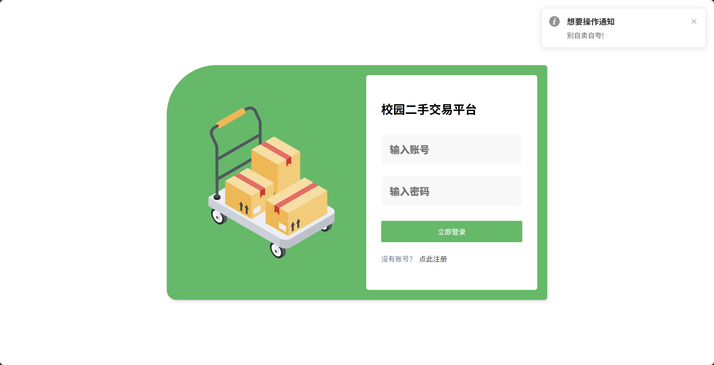 |
| like_003 | "我想要"不能重复操作 | 互动 | P2 | 用户已对该商品点过"我想要" | 1. 再次点击"我想要"按钮 | 同一商品 | 提示"请勿重复操作" | 成功。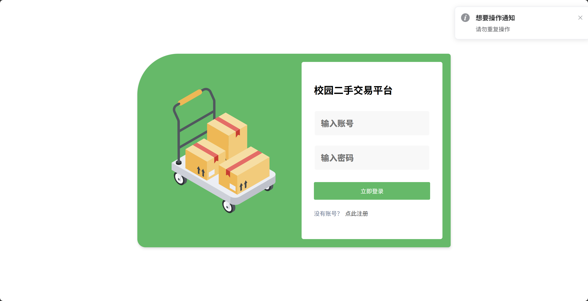 |
| view_001 | 商品浏览记录 | 互动 | P1 | 用户已登录 | 1. 浏览任意商品详情页 2. 在"我的足迹"页面查看 | 无 | 浏览过的商品出现在"我的足迹"列表中 | 成功。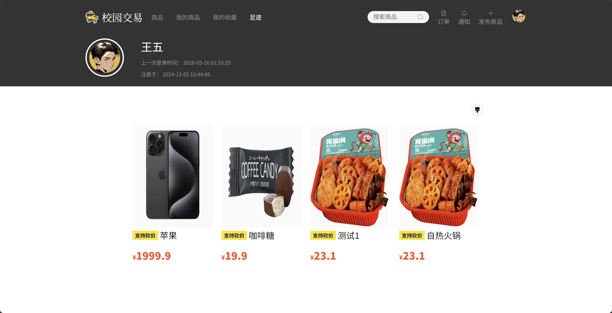 |
| view_002 | 清空浏览记录 | 互动 | P2 | 用户有浏览记录 | 1. 进入"我的足迹"页面 2. 点击清空浏览记录 | 无 | 浏览记录全部清空 | 成功。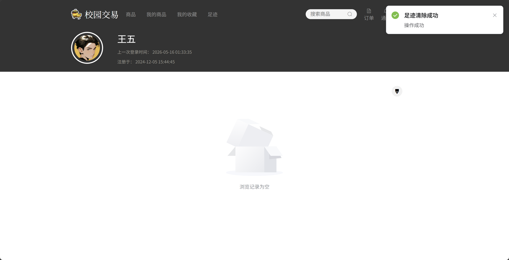 |

###### 2.2.1.5 商品发布与管理（普通用户）

| 用例编号 | 用例标题 | 项目/模块 | 优先级 | 前置条件 | 测试步骤 | 测试数据 | 预期结果 | 实际结果 |
|---------|---------|----------|--------|---------|---------|---------|---------|---------|
| publish_001 | 发布商品-成功 | 商品管理 | P0 | 用户已登录 | 1. 点击"发布商品" 2. 填写商品信息（名称、价格、分类、新旧程度、库存、是否砍价、详情描述） 3. 上传商品图片 4. 点击"发布商品" | 名称：测试手机 价格：999 分类：手机 新旧：9成新 库存：5 支持砍价 | 发布成功，商品出现在商品列表和"我的商品"中 | |
| publish_002 | 发布商品-上传图片 | 商品管理 | P1 | 用户已登录 | 1. 进入发布商品页 2. 点击上传图片区域 3. 选择图片文件 | 选择 test.png | 图片上传成功，显示缩略图 | |
| myproduct_001 | 查看我的商品列表 | 商品管理 | P1 | 用户已登录且有发布商品 | 1. 点击"我的商品"菜单 | 无 | 显示当前用户发布的所有商品 | |
| myproduct_002 | 编辑我的商品 | 商品管理 | P1 | 用户有已发布的商品 | 1. 在"我的商品"列表 2. 点击某商品的"编辑"按钮 3. 修改商品信息后提交 | 修改价格、名称等 | 提示"商品修改成功"，信息更新 | |
| myproduct_003 | 删除我的商品 | 商品管理 | P1 | 用户有已发布的商品 | 1. 在"我的商品"列表 2. 点击某商品的"删除"按钮 3. 确认删除 | 无 | 提示"商品删除成功"，商品从列表中消失 | |

###### 2.2.1.6 购物订单功能（普通用户-买家视角）

| 用例编号 | 用例标题 | 项目/模块 | 优先级 | 前置条件 | 测试步骤 | 测试数据 | 预期结果 | 实际结果 |
|---------|---------|----------|--------|---------|---------|---------|---------|---------|
| buy_001 | 商品下单购买-成功 | 订单 | P0 | 用户已登录，商品库存充足 | 1. 进入商品详情页 2. 点击"立即购买" 3. 填写购买数量和备注 4. 提交下单 | 商品ID：15（自热火锅，库存1） 数量：1 备注：尽快发货 | 下单成功，订单在"购物订单"列表中，库存减少 | |
| buy_002 | 下单-库存不足 | 订单 | P1 | 商品库存为0 | 1. 进入库存为0的商品详情 2. 点击"立即购买" | 商品ID：1（库存0） | 提示"商品库存不足" | |
| buy_003 | 确认交易（支付下单） | 订单 | P1 | 存在未支付的订单 | 1. 进入"购物订单" 2. 查看未支付的订单 3. 点击"下单"按钮 | 选择未支付的订单 | 交易状态变为"已支付"，记录支付时间 | |
| buy_004 | 申请退款 | 订单 | P1 | 已支付的订单 | 1. 进入"购物订单" 2. 查看已支付的订单 3. 点击"申请退款" | 选择已支付的订单 | 提示"申请退款成功，请等待卖家审核"，退款状态为已申请 | |
| buy_005 | 按交易状态筛选订单 | 订单 | P2 | 有不同状态的订单 | 1. 进入"购物订单" 2. 点击"已支付"/"未支付"筛选 | 筛选：已支付 | 仅显示已支付的订单 | |
| buy_006 | 按订单号搜索订单 | 订单 | P2 | 有订单数据 | 1. 进入"购物订单" 2. 输入订单号搜索 | 订单号：1734581788694 | 显示匹配的订单 | |

###### 2.2.1.7 卖家订单管理（普通用户-卖家视角）

| 用例编号 | 用例标题 | 项目/模块 | 优先级 | 前置条件 | 测试步骤 | 测试数据 | 预期结果 | 实际结果 |
|---------|---------|----------|--------|---------|---------|---------|---------|---------|
| seller_001 | 查看我收到的订单 | 订单管理 | P1 | 用户发布的商品有被下单 | 1. 进入"订单"页 2. 切换到"我的订单"标签 | 无 | 显示买家对自己商品下的订单列表 | |
| seller_002 | 确认退款（卖家） | 订单管理 | P1 | 买家已申请退款 | 1. 进入"我的订单" 2. 找到已申请退款的订单 3. 点击"确定退款" | 订单：买家已申请退款 | 提示"退款成功"，标记确认退款并记录退款时间 | |
| seller_003 | 删除订单（卖家） | 订单管理 | P2 | 已支付的订单 | 1. 进入"我的订单" 2. 找到已支付的订单 3. 点击删除 | 选择已支付的订单 | 订单被删除 | |

###### 2.2.1.8 评论功能

| 用例编号 | 用例标题 | 项目/模块 | 优先级 | 前置条件 | 测试步骤 | 测试数据 | 预期结果 | 实际结果 |
|---------|---------|----------|--------|---------|---------|---------|---------|---------|
| eval_001 | 发表商品评论 | 评论 | P0 | 用户已登录且未被禁言 | 1. 进入商品详情页 2. 在评论区域输入评论内容 3. 点击发送 | 内容：手机成色很好 | 评论成功，评论出现在下方评论区 | |
| eval_002 | 回复评论 | 评论 | P1 | 存在父级评论 | 1. 在商品详情页评论区 2. 点击某条评论的"回复"按钮 3. 输入回复内容 | 内容：谢谢 | 子评论显示在父评论下方 | |
| eval_003 | 被禁言用户不能评论 | 评论 | P1 | 当前用户为禁言状态(如zhaoliu) | 1. 被禁言用户登录 2. 进入商品详情页 3. 尝试评论 | 用户：zhaoliu（is_word=1） | 提示"账户已被禁言" | |

###### 2.2.1.9 消息功能

| 用例编号 | 用例标题 | 项目/模块 | 优先级 | 前置条件 | 测试步骤 | 测试数据 | 预期结果 | 实际结果 |
|---------|---------|----------|--------|---------|---------|---------|---------|---------|
| msg_001 | 查看我的消息列表 | 消息 | P1 | 用户已登录且有消息 | 1. 点击"消息"菜单 | 用户：zhangsan（有未读消息） | 显示消息列表，含已读/未读状态 | |
| msg_002 | 消息全部标为已读 | 消息 | P2 | 用户有未读消息 | 1. 进入消息页面 2. 点击"全部已读" | 无 | 所有消息变为已读状态 | |

###### 2.2.1.10 个人信息管理

| 用例编号 | 用例标题 | 项目/模块 | 优先级 | 前置条件 | 测试步骤 | 测试数据 | 预期结果 | 实际结果 |
|---------|---------|----------|--------|---------|---------|---------|---------|---------|
| profile_001 | 修改个人信息 | 个人信息 | P1 | 用户已登录 | 1. 点击个人中心 2. 修改头像、昵称、邮箱 3. 点击"修改" | 新昵称：新名字 新邮箱：new@qq.com | 修改成功，信息更新 | |
| pwd_001 | 修改密码-成功 | 个人信息 | P1 | 用户已登录 | 1. 进入修改密码页面 2. 输入旧密码、新密码、确认密码 3. 提交 | 旧密码：123456 新密码：654321 | 密码修改成功 | |
| pwd_002 | 修改密码-旧密码错误 | 个人信息 | P2 | 用户已登录 | 1. 输入错误旧密码 2. 输入新密码和确认密码 | 旧密码：wrong | 提示"原始密码验证失败" | |
| pwd_003 | 修改密码-两次密码不一致 | 个人信息 | P2 | 用户已登录 | 1. 输入正确旧密码 2. 新密码和确认密码不同 | 新密码：abc 确认密码：def | 提示"前后密码输入不一致" | |

###### 2.2.1.11 管理员-仪表盘

| 用例编号 | 用例标题 | 项目/模块 | 优先级 | 前置条件 | 测试步骤 | 测试数据 | 预期结果 | 实际结果 |
|---------|---------|----------|--------|---------|---------|---------|---------|---------|
| dash_001 | 查看仪表盘统计数据 | 仪表盘 | P1 | 管理员已登录，系统有数据 | 1. 管理员登录后进入首页 2. 查看仪表盘 | 无 | 显示用户数、商品数、订单数、消息数、互动数、评论数的统计卡片 | |
| dash_002 | 查看商品上架趋势图 | 仪表盘 | P2 | 商品数据存在 | 1. 在仪表盘页面 2. 查看趋势图表 | 无 | 显示商品上架趋势折线图或柱状图 | |

###### 2.2.1.12 管理员-用户管理

| 用例编号 | 用例标题 | 项目/模块 | 优先级 | 前置条件 | 测试步骤 | 测试数据 | 预期结果 | 实际结果 |
|---------|---------|----------|--------|---------|---------|---------|---------|---------|
| usermgmt_001 | 分页查看用户列表 | 用户管理 | P0 | 管理员已登录 | 1. 点击"用户管理"菜单 | 无 | 显示所有用户列表（头像、名称、账号、邮箱、角色、封号状态、禁言状态）并可分页 | |
| usermgmt_002 | 按登录状态筛选用户 | 用户管理 | P1 | 存在被封号的用户 | 1. 在用户管理页面 2. 选择登录状态下拉筛选 | 筛选：已封号 | 仅显示被封号的用户 | |
| usermgmt_003 | 按禁言状态筛选用户 | 用户管理 | P1 | 存在被禁言的用户 | 1. 在用户管理页面 2. 选择禁言状态下拉筛选 | 筛选：已禁言 | 仅显示被禁言的用户 | |
| usermgmt_004 | 按时间范围筛选用户 | 用户管理 | P2 | 用户数据存在 | 1. 在用户管理页面 2. 选择注册时间范围 | 日期筛选 | 仅显示该时间段注册的用户 | |
| usermgmt_005 | 按用户名搜索用户 | 用户管理 | P1 | 用户数据存在 | 1. 在用户管理页面 2. 输入用户名搜索 | 搜索：张三 | 显示匹配的用户 | |
| usermgmt_006 | 新增用户（管理员） | 用户管理 | P1 | 管理员已登录 | 1. 在用户管理页面 2. 点击"新增用户" 3. 填写账号、用户名、密码 4. 确定新增 | 账号：newuser 用户名：新用户 密码：123456 | 新增成功，用户列表刷新 | |
| usermgmt_007 | 编辑用户（管理员） | 用户管理 | P1 | 管理员已登录 | 1. 在用户列表 2. 点击某用户的"编辑"按钮 3. 修改邮箱、角色等 4. 确认修改 | 修改用户角色 | 修改成功 | |
| usermgmt_008 | 管理账号状态（封号/解封） | 用户管理 | P1 | 管理员已登录 | 1. 在用户列表 2. 点击某用户的"账号状态"按钮 3. 切换封号状态 | 将正常用户封号 | 状态切换，被封号用户无法登录 | |
| usermgmt_009 | 删除用户（管理员） | 用户管理 | P1 | 管理员已登录 | 1. 在用户列表 2. 点击某用户的"删除"按钮 3. 确认删除 | 选择用户 | 用户被删除 | |

###### 2.2.1.13 管理员-商品管理

| 用例编号 | 用例标题 | 项目/模块 | 优先级 | 前置条件 | 测试步骤 | 测试数据 | 预期结果 | 实际结果 |
|---------|---------|----------|--------|---------|---------|---------|---------|---------|
| adminprod_001 | 查看商品列表 | 商品管理 | P0 | 管理员已登录 | 1. 点击"商品管理"菜单 | 无 | 显示所有商品列表（头像、用户名、商品名、类别、价格、库存、新旧程度、是否砍价、发布时间） | |
| adminprod_002 | 按类别筛选商品 | 商品管理 | P1 | 商品类别存在 | 1. 在商品管理页面 2. 类别下拉选择 | 类别：零食 | 仅显示零食商品 | |
| adminprod_003 | 按商品名称搜索 | 商品管理 | P1 | 商品数据存在 | 1. 输入商品名搜索 | 搜索：iPhone | 显示匹配商品 | |
| adminprod_004 | 查看商品详情 | 商品管理 | P1 | 管理员已登录 | 1. 在商品列表 2. 点击某商品的"商品详情"按钮 | 选择商品 | 弹窗显示商品详情和封面图 | |
| adminprod_005 | 删除商品（管理员） | 商品管理 | P1 | 管理员已登录 | 1. 在商品列表 2. 点击某商品的"删除"按钮 3. 确认删除 | 选择商品 | 提示"商品删除成功"，商品被删除 | |

###### 2.2.1.14 管理员-订单管理

| 用例编号 | 用例标题 | 项目/模块 | 优先级 | 前置条件 | 测试步骤 | 测试数据 | 预期结果 | 实际结果 |
|---------|---------|----------|--------|---------|---------|---------|---------|---------|
| adminord_001 | 查看订单列表 | 订单管理 | P0 | 管理员已登录 | 1. 点击"订单管理"菜单 | 无 | 显示所有订单列表（订单号、买家头像、用户名、订单名、价格、数量、创建时间、备注） | |
| adminord_002 | 按交易状态筛选订单 | 订单管理 | P1 | 有不同状态的订单 | 1. 在订单管理页面 2. 点击交易状态标签筛选 | 筛选：已支付 | 仅显示已支付的订单 | |
| adminord_003 | 按退款状态筛选订单 | 订单管理 | P2 | 有申请退款的订单 | 1. 在订单管理页面 2. 点击退款状态标签筛选 | 筛选：已申请 | 仅显示已申请退款的订单 | |
| adminord_004 | 按订单号搜索 | 订单管理 | P2 | 订单数据存在 | 1. 输入订单号搜索 | 订单号：1734581788694 | 显示匹配订单 | |
| adminord_005 | 查看订单详情 | 订单管理 | P1 | 管理员已登录 | 1. 在订单列表 2. 点击某订单的"订单详情"按钮 | 选择订单 | 弹窗显示订单详情（支付状态、退款状态等） | |
| adminord_006 | 删除订单（管理员） | 订单管理 | P1 | 管理员已登录 | 1. 点击某订单的"删除"按钮 2. 确认删除 | 选择订单 | 订单被删除 | |

###### 2.2.1.15 管理员-商品类别管理

| 用例编号 | 用例标题 | 项目/模块 | 优先级 | 前置条件 | 测试步骤 | 测试数据 | 预期结果 | 实际结果 |
|---------|---------|----------|--------|---------|---------|---------|---------|---------|
| category_001 | 查看所有商品类别 | 类别管理 | P1 | 管理员已登录 | 1. 点击"商品类别管理"菜单 | 无 | 显示所有商品类别列表（名称、启用状态） | |
| category_002 | 新增商品类别 | 类别管理 | P1 | 管理员已登录 | 1. 点击"新增"按钮 2. 输入类别名称 3. 设置启用状态 4. 确定 | 名称：数码配件 启用：是 | 新增成功 | |
| category_003 | 编辑商品类别 | 类别管理 | P2 | 管理员已登录 | 1. 点击某分类的"编辑"按钮 2. 修改名称或状态 | 修改名称或启用/禁用 | 修改成功 | |
| category_004 | 删除商品类别 | 类别管理 | P1 | 管理员已登录 | 1. 点击某分类的"删除"按钮 2. 确认删除 | 选择类别 | 类别被删除 | |
| category_005 | 启用/禁用商品类别 | 类别管理 | P2 | 类别数据存在 | 1. 修改类别的启用状态 2. 保存 | 将类别设为禁用 | 禁用后，前端商品列表中不再显示该类别的商品 | |

###### 2.2.1.16 管理员-评论管理

| 用例编号 | 用例标题 | 项目/模块 | 优先级 | 前置条件 | 测试步骤 | 测试数据 | 预期结果 | 实际结果 |
|---------|---------|----------|--------|---------|---------|---------|---------|---------|
| admineval_001 | 查看评论列表 | 评论管理 | P1 | 管理员已登录 | 1. 点击"评论管理"菜单 | 无 | 显示所有评论列表 | |
| admineval_002 | 删除评论（管理员） | 评论管理 | P1 | 管理员已登录 | 1. 点击某评论的"删除"按钮 2. 确认删除 | 选择评论 | 评论被删除 | |

###### 2.2.1.17 管理员-消息管理

| 用例编号 | 用例标题 | 项目/模块 | 优先级 | 前置条件 | 测试步骤 | 测试数据 | 预期结果 | 实际结果 |
|---------|---------|----------|--------|---------|---------|---------|---------|---------|
| adminmsg_001 | 查看消息列表 | 消息管理 | P1 | 管理员已登录 | 1. 点击"消息管理"菜单 | 无 | 显示全平台所有消息列表 | |
| adminmsg_002 | 删除消息（管理员） | 消息管理 | P2 | 管理员已登录 | 1. 点击某消息的"删除"按钮 2. 确认删除 | 选择消息 | 消息被删除 | |

###### 2.2.1.18 管理员-互动管理

| 用例编号 | 用例标题 | 项目/模块 | 优先级 | 前置条件 | 测试步骤 | 测试数据 | 预期结果 | 实际结果 |
|---------|---------|----------|--------|---------|---------|---------|---------|---------|
| adminint_001 | 查看互动数据列表 | 互动管理 | P1 | 管理员已登录 | 1. 点击"互动管理"菜单 | 无 | 显示所有用户互动行为记录列表 | |
| adminint_002 | 删除互动记录（管理员） | 互动管理 | P2 | 管理员已登录 | 1. 点击某记录的"删除"按钮 2. 确认删除 | 选择记录 | 互动记录被删除 | |

###### 2.2.1.19 管理员-操作日志管理

| 用例编号 | 用例标题 | 项目/模块 | 优先级 | 前置条件 | 测试步骤 | 测试数据 | 预期结果 | 实际结果 |
|---------|---------|----------|--------|---------|---------|---------|---------|---------|
| log_001 | 查看操作日志列表 | 日志管理 | P1 | 管理员已登录 | 1. 点击"日志管理"菜单 | 无 | 显示所有操作日志（用户、操作描述、时间） | |
| log_002 | 删除操作日志（管理员） | 日志管理 | P2 | 管理员已登录 | 1. 点击某日志的"删除"按钮 2. 确认删除 | 选择日志 | 日志被删除 | |

###### 2.2.1.20 权限与退出

| 用例编号 | 用例标题 | 项目/模块 | 优先级 | 前置条件 | 测试步骤 | 测试数据 | 预期结果 | 实际结果 |
|---------|---------|----------|--------|---------|---------|---------|---------|---------|
| auth_001 | 未登录访问需登录页面 | 权限 | P0 | 未登录 | 1. 清除token 2. 直接访问需要登录的页面路径 | 访问 `/orders` | 自动跳转到登录页面 | |
| auth_002 | 普通用户访问管理后台 | 权限 | P1 | 普通用户已登录 | 1. 普通用户登录 2. 直接访问 `/admin` 路径 | 访问管理后台 | 无权限，无法访问或跳转 | |
| auth_003 | 退出登录 | 退出 | P1 | 用户已登录 | 1. 点击退出按钮或链接 | 无 | token被清除，跳转到登录页面 | |

##### 2.2.2 Bug记录表

| Bug编号 | 关联用例 | 模块 | 问题描述 | 严重程度 | 复现步骤 | 状态 |
|--------|--------|------|---------|---------|---------|------|
| BUG-001 | login_002 | 登录 | 普通用户登录后白屏，未跳转到用户首页 | 高 | 1. 打开登录页面 2. 输入账号zhangsan，密码123456 3. 点击“立即登录” | 待修复 |
| BUG-002 | Admin_002 | 仪表盘 | 选择“7天内”后，未显示近7天上架数据的折线图 | 中 | 1. 管理员admin登录 2. 进入仪表盘 3. 在趋势图上方的日期选择器中选择“7天内” | 待修复 |
| BUG-003 | Admin_006 | 用户管理 | 删除用户时提示“商品类别信息删除异常”，实际应为用户删除 | 高 | 1. 管理员登录 2. 点击左侧“用户管理” 3. 确定要删除的用户，点击“删除”并确认 | 待修复 |
| BUG-004 | Admin_007 | 商品管理 | 商品图片均无显示，且左侧边栏宽度有问题 | 中 | 1. 管理员登录 2. 点击左侧“商品管理” | 待修复 |
| BUG-005 | Admin_012 | 商品类别管理 | 删除商品类别时提示“商品类别信息删除异常” | 高 | 1. 管理员登录 2. 点击左侧“商品类别管理” 3. 选择分类，点击“删除” | 待修复 |
| BUG-006 | Admin_014 | 消息管理 | 删除消息时提示“消息信息删除异常” | 中 | 1. 管理员登录 2. 点击左侧“消息管理” 3. 选择消息，点击“删除” | 待修复 |
| BUG-007 | Admin_016 | 互动管理 | 删除互动记录时提示“互动信息删除异常” | 中 | 1. 管理员登录 2. 点击左侧“互动管理” 3. 选择互动，点击“删除” | 待修复 |
| BUG-008 | Admin_018 | 日志管理 | 删除操作日志时提示“操作日志信息删除异常” | 中 | 1. 管理员登录 2. 点击左侧“日志管理” 3. 选择日志记录，点击“删除” | 待修复 |
| BUG-009 | Admin_020 | 评论管理 | 删除评论时系统无弹窗、无响应 | 高 | 1. 管理员登录 2. 点击左侧“评论管理” 3. 选择评论，点击“删除” | 待修复 |

#### 2.3 说明

1. **前置条件**：确保后端已启动（端口21090）、前端已启动（端口21091）、数据库已初始化
2. **测试账号**：
   - 管理员：`admin` / `123456`
   - 普通用户A：`zhangsan` / `123456`
   - 普通用户B：`lisi` / `123456`
3. **测试标记**：在"实际结果"列填写实际情况
4. **发现Bug**：在Bug记录表中记录，包含操作步骤和截图
5. **数据依赖**：某些用例依赖前置用例产生的数据（如产生订单后，TC-F-002才能测试退款）